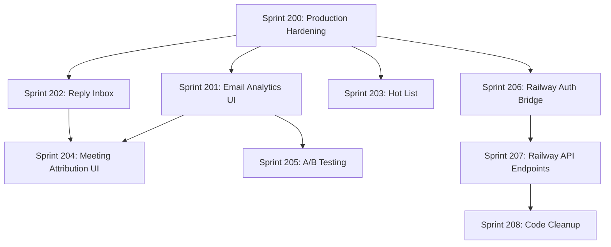

# YardFlow GTM Hub - Sprint Plan V13: COMPREHENSIVE ROADMAP

> **Last Updated:** January 31, 2026  
> **North Star:** Maximize meetings booked per day through automated, tracked email sequences
> **Review Status:** ✅ Reviewed by subagent, improvements incorporated

---

## Executive Summary

### Current State ✅

| Component | Status | Evidence |
|-----------|--------|----------|
| Email Sending | ✅ Complete | Vercel/SendGrid path works, 2687 tests passing |
| Webhooks | ✅ Complete | sendgrid.ts, inbound.ts, calendly.ts |
| Crons | ✅ Complete | execute-sequences, process-queue @5min |
| Sequence Enrollment | ✅ Complete | useSequenceEnrollment hook, SequenceManagerPanel |
| Warmup | ✅ Complete | WarmupDashboard with real API |
| Auth Bridge | ✅ Exists | AuthBridge.ts (dual-auth support) |
| Meeting Attribution | ✅ Exists | MeetingAttributionService.ts |
| Error Tracking | ✅ Exists | ErrorTracking.ts with Sentry |

### What's Missing/Incomplete

| Gap | Priority | Sprint |
|-----|----------|--------|
| Production hardening (rate limiting, alerting) | P0 | 200 |
| Pagination for Firestore queries | P0 | 200 |
| Email analytics UI (exists partially) | P1 | 201 |
| Reply inbox UI | P1 | 202 |
| Hot list / daily briefing | P1 | 203 |
| Meeting attribution UI | P1 | 204 |
| A/B testing framework | P2 | 205 |
| Railway Auth Bridge (Firebase → NextAuth) | P2 | 206 |
| Railway API Endpoints (build on Hitlist repo) | P2 | 207 |
| Code cleanup | P3 | 208 |
| Production monitoring | P3 | 209 |

---

## Sprint Dependency Graph



**Parallel Execution:**
- S201, S202, S203 can run in parallel after S200
- S206 can start alongside S201-S203 (cross-repo)
- S204, S205 can run after S201/S202 complete

---

## Phase 1: Production Hardening (Sprint 200)

### Sprint 200: Production Hardening & Scale Prep

**Goal:** Jake can use the app without hitting rate limits or experiencing data loss at scale
**Dependencies:** None (foundational sprint)
**Estimated Duration:** 2.5 days

> ⚠️ **IMPORTANT**: Vercel serverless functions have isolated memory. In-memory rate limiting won't work across function invocations. Use Vercel KV or consolidate with existing rate limit headers.

---

#### T200.1: Consolidate Rate Limiting with Vercel KV [M - 2h]
**Files:** `api/_middleware.ts`, `lib/rateLimiter.ts` (new)

**Description:** 
Rate limiting already exists in `api/railway/[...path].ts` (lines 35-60) but is header-only.
Create a consolidated rate limiter using Vercel KV for serverless compatibility.

**Implementation:**
```typescript
// lib/rateLimiter.ts
import { kv } from '@vercel/kv';

export async function rateLimit(
  identifier: string, 
  limit: number = 100, 
  windowSeconds: number = 60
): Promise<{ allowed: boolean; remaining: number }> {
  const key = `ratelimit:${identifier}`;
  const now = Math.floor(Date.now() / 1000);
  const windowStart = now - windowSeconds;
  
  // Use sorted set with timestamps as scores
  await kv.zremrangebyscore(key, 0, windowStart);
  const count = await kv.zcard(key);
  
  if (count >= limit) {
    return { allowed: false, remaining: 0 };
  }
  
  await kv.zadd(key, { score: now, member: `${now}-${Math.random()}` });
  await kv.expire(key, windowSeconds);
  
  return { allowed: true, remaining: limit - count - 1 };
}
```

**Environment Setup:**
- Add `KV_REST_API_URL` and `KV_REST_API_TOKEN` to Vercel (or use `vercel link` for auto-setup)

**Validation:**
- [ ] Unit test: rateLimit returns `allowed: false` after limit exceeded
- [ ] Integration test: API returns 429 when rate limited
- [ ] Test persistence: rate limit survives across function invocations

**Commit:** `feat(api): add rate limiting with Vercel KV for serverless`

---

#### T200.2: Add Pagination to Firestore Queries [M - 2h]
**Files:** `src/services/FirestoreService.ts`, `src/hooks/useProspects.ts`

**Description:**
Current Firestore queries fetch ALL documents. Add cursor-based pagination.

**Implementation:**
```typescript
// Add to FirestoreService.ts
export async function getPaginatedProspects(
  userId: string,
  pageSize: number = 50,
  startAfterDoc?: DocumentSnapshot
): Promise<{ prospects: Prospect[]; lastDoc: DocumentSnapshot | null; hasMore: boolean }> {
  let q = query(
    collection(db, 'prospects'),
    where('userId', '==', userId),
    orderBy('updatedAt', 'desc'),
    limit(pageSize + 1) // Fetch one extra to check hasMore
  );
  
  if (startAfterDoc) {
    q = query(q, startAfter(startAfterDoc));
  }
  
  const snapshot = await getDocs(q);
  const hasMore = snapshot.docs.length > pageSize;
  const docs = hasMore ? snapshot.docs.slice(0, -1) : snapshot.docs;
  
  return {
    prospects: docs.map(d => ({ id: d.id, ...d.data() } as Prospect)),
    lastDoc: docs[docs.length - 1] ?? null,
    hasMore,
  };
}
```

**Validation:**
- [ ] Unit test: pagination returns correct page size
- [ ] Unit test: hasMore is false when fewer docs than pageSize
- [ ] Integration test: load more button fetches next page

**Commit:** `feat(firestore): add cursor-based pagination for prospects`

---

#### T200.3: Add useInfiniteScroll Hook [S - 1h]
**Files:** `src/hooks/useInfiniteScroll.ts` (new), `src/hooks/useProspects.ts`

**Description:**
Create reusable infinite scroll hook that triggers data fetch when near bottom.

**Implementation:**
```typescript
// src/hooks/useInfiniteScroll.ts
export function useInfiniteScroll(
  callback: () => void,
  hasMore: boolean,
  loading: boolean,
  threshold: number = 100
) {
  const observerRef = useRef<IntersectionObserver | null>(null);
  const sentinelRef = useRef<HTMLDivElement | null>(null);

  useEffect(() => {
    if (loading || !hasMore) return;

    observerRef.current = new IntersectionObserver(
      entries => {
        if (entries[0].isIntersecting) {
          callback();
        }
      },
      { rootMargin: `${threshold}px` }
    );

    if (sentinelRef.current) {
      observerRef.current.observe(sentinelRef.current);
    }

    return () => observerRef.current?.disconnect();
  }, [callback, hasMore, loading, threshold]);

  return { sentinelRef };
}
```

**Validation:**
- [ ] Unit test: callback fires when sentinel intersects viewport
- [ ] Unit test: callback doesn't fire when loading=true
- [ ] Manual test: scroll to bottom loads more prospects

**Commit:** `feat(hooks): add useInfiniteScroll for paginated lists`

---

#### T200.4: Add Cron Failure Alerting [M - 2h]
**Files:** `api/cron/execute-sequences.ts`, `api/cron/process-queue.ts`, `lib/alerting.ts` (new)

**Description:**
Create alerting service that sends notifications when crons fail.
Start with logging to Firestore `cron_alerts` collection, later add email/Slack.

**Implementation:**
```typescript
// lib/alerting.ts
interface Alert {
  type: 'cron_failure' | 'rate_limit_exceeded' | 'webhook_error';
  source: string;
  message: string;
  severity: 'info' | 'warning' | 'critical';
  timestamp: string;
  metadata?: Record<string, unknown>;
}

export async function sendAlert(alert: Omit<Alert, 'timestamp'>): Promise<void> {
  const db = getAdminDb();
  if (!db) {
    console.error('[Alert] Firebase not configured:', alert);
    return;
  }
  
  await db.collection('cron_alerts').add({
    ...alert,
    timestamp: new Date().toISOString(),
    acknowledged: false,
  });
  
  // Future: Add Slack/email notification here
  console.log(`[ALERT] ${alert.severity.toUpperCase()}: ${alert.message}`);
}
```

**Validation:**
- [ ] Unit test: sendAlert writes to Firestore
- [ ] Integration test: cron failure creates alert document
- [ ] Manual test: trigger cron error, verify alert in Firebase console

**Commit:** `feat(cron): add failure alerting to cron jobs`

---

#### T200.5: Add Health Check Dashboard Page [M - 2h]
**Files:** `src/components/HealthDashboard.tsx` (new), `src/App.tsx`

**Description:**
Create admin-only page showing system health: API status, cron status, queue depth.

**Implementation:**
```typescript
// src/components/HealthDashboard.tsx
import { useAuth } from '../hooks/useAuth';

const ADMIN_EMAILS = ['jake@yardflow.io', 'casey@freightroll.com'];

export function HealthDashboard() {
  const { user } = useAuth();
  const [health, setHealth] = useState<HealthStatus | null>(null);
  
  // Auth guard - admin only
  if (!user || !ADMIN_EMAILS.includes(user.email || '')) {
    return <div className="p-6">Access denied. Admin only.</div>;
  }
  
  useEffect(() => {
    Promise.all([
      fetch('/api/email/health').then(r => r.json()),
      fetch('/api/warmup/status').then(r => r.json()),
    ]).then(([email, warmup]) => {
      setHealth({ email, warmup, timestamp: new Date().toISOString() });
    });
  }, []);
  
  return (
    <div className="p-6">
      <h1>System Health</h1>
      <HealthCard title="Email" status={health?.email?.status} />
      <HealthCard title="Warmup" data={health?.warmup} />
      <CronLogsTable />
    </div>
  );
}
```

**Validation:**
- [ ] Component renders without errors
- [ ] Shows email health status
- [ ] Shows warmup status
- [ ] Returns "Access denied" for non-admin users
- [ ] Admin emails can access

**Commit:** `feat(admin): add health check dashboard with admin auth guard`

---

#### T200.6a: Write E2E Test for Auth Flow [M - 1.5h]
**Files:** `e2e/auth-critical.spec.ts` (new)

**Description:**
Create Playwright test that validates login and auth state.

**Implementation:**
```typescript
// e2e/auth-critical.spec.ts
import { test, expect } from '@playwright/test';

test.describe('Auth Critical Path', () => {
  test('user can login with Firebase', async ({ page }) => {
    await page.goto('/');
    await page.click('[data-testid="login-button"]');
    // Auth flow...
    await expect(page.locator('[data-testid="user-menu"]')).toBeVisible();
  });
});
```

**Validation:**
- [ ] Test passes in CI
- [ ] Covers login flow

**Commit:** `test(e2e): add auth critical path test`

---

#### T200.6b: Write E2E Test for Prospect Selection [M - 1.5h]
**Files:** `e2e/prospect-critical.spec.ts` (new)

**Description:**
Test that prospects load and can be selected.

**Validation:**
- [ ] Test passes in CI
- [ ] Covers prospect display and selection

**Commit:** `test(e2e): add prospect selection critical path test`

---

#### T200.6c: Write E2E Test for Email Compose [M - 1.5h]
**Files:** `e2e/email-critical.spec.ts` (new)

**Description:**
Test that email can be composed and sent.

**Validation:**
- [ ] Test passes in CI
- [ ] Covers email compose and send

**Commit:** `test(e2e): add email compose critical path test`

---

#### T200.7: Add Firestore Indexes for New Queries [S - 30min]
**Files:** `firestore.indexes.json`

**Description:**
Add composite indexes required for Sprint 201-203 queries.

**Implementation:**
```json
{
  "indexes": [
    {
      "collectionGroup": "email_events",
      "queryScope": "COLLECTION",
      "fields": [
        { "fieldPath": "userId", "order": "ASCENDING" },
        { "fieldPath": "timestamp", "order": "DESCENDING" }
      ]
    },
    {
      "collectionGroup": "prospects",
      "queryScope": "COLLECTION",
      "fields": [
        { "fieldPath": "needsResponse", "order": "ASCENDING" },
        { "fieldPath": "lastReplyAt", "order": "DESCENDING" }
      ]
    }
  ]
}
```

**Validation:**
- [ ] `firebase deploy --only firestore:indexes` succeeds
- [ ] Indexes show in Firebase Console

**Commit:** `chore(firestore): add composite indexes for analytics queries`

---

### Sprint 200 Definition of Done
- [ ] All 9 tasks complete (T200.1-T200.7, split T200.6)
- [ ] Rate limiting enforced via Vercel KV (429 responses working)
- [ ] Pagination working in UI
- [ ] Cron alerting operational
- [ ] Health dashboard accessible (admin only)
- [ ] E2E tests passing (3 critical path tests)
- [ ] Firestore indexes deployed
- [ ] No TypeScript errors
- [ ] All tests pass

---

## Phase 2: Analytics & Visibility (Sprints 201-204)

### Sprint 201: Email Analytics Dashboard

**Goal:** Jake can see email performance metrics (sent, delivered, opened, clicked, bounced) on a dashboard
**Dependencies:** Sprint 200 (pagination for large datasets, Firestore indexes)
**Estimated Duration:** 2 days

---

#### T201.0: Create DateRangePicker Component [S - 1h]
**Files:** `src/components/DateRangePicker.tsx` (new)

**Description:**
Reusable date range picker for analytics filtering.

**Implementation:**
```typescript
// src/components/DateRangePicker.tsx
interface DateRange {
  start: Date;
  end: Date;
}

interface Props {
  value: DateRange;
  onChange: (range: DateRange) => void;
  presets?: Array<{ label: string; range: DateRange }>;
}

export function DateRangePicker({ value, onChange, presets }: Props) {
  const defaultPresets = [
    { label: 'Last 7 days', range: { start: subDays(new Date(), 7), end: new Date() } },
    { label: 'Last 30 days', range: { start: subDays(new Date(), 30), end: new Date() } },
    { label: 'This month', range: { start: startOfMonth(new Date()), end: new Date() } },
  ];
  
  return (
    <div className="flex gap-2">
      {(presets || defaultPresets).map(preset => (
        <button key={preset.label} onClick={() => onChange(preset.range)}>
          {preset.label}
        </button>
      ))}
      {/* Custom date inputs */}
    </div>
  );
}
```

**Validation:**
- [ ] Component renders presets
- [ ] Clicking preset calls onChange
- [ ] Custom date inputs work

**Commit:** `feat(components): add DateRangePicker for analytics`

---

#### T201.1: Create /api/email/stats Endpoint [M - 2h]
**Files:** `api/email/stats.ts` (new)

**Description:**
Aggregate email_events collection by event type and date range with timezone handling.

**Implementation:**
```typescript
// api/email/stats.ts
import { VercelRequest, VercelResponse } from '@vercel/node';
import { getAdminDb } from '../../lib/firebaseAdmin';

export default async function handler(req: VercelRequest, res: VercelResponse) {
  const { startDate, endDate, timezone = 'UTC' } = req.query;
  
  // Validate date params
  if (!startDate || !endDate) {
    return res.status(400).json({ error: 'startDate and endDate required' });
  }
  
  const start = new Date(startDate as string);
  const end = new Date(endDate as string);
  
  if (isNaN(start.getTime()) || isNaN(end.getTime())) {
    return res.status(400).json({ error: 'Invalid date format. Use ISO 8601.' });
  }
  
  const db = getAdminDb();
  if (!db) {
    return res.status(500).json({ error: 'Database not configured' });
  }
  
  const events = await db.collection('email_events')
    .where('timestamp', '>=', start.toISOString())
    .where('timestamp', '<=', end.toISOString())
    .get();
  
  const stats = events.docs.reduce((acc, doc) => {
    const type = doc.data().eventType;
    acc[type] = (acc[type] || 0) + 1;
    return acc;
  }, {} as Record<string, number>);
  
  return res.json({
    sent: stats.processed || 0,
    delivered: stats.delivered || 0,
    opened: stats.open || 0,
    clicked: stats.click || 0,
    bounced: (stats.bounce || 0) + (stats.dropped || 0),
    complained: stats.spamreport || 0,
    dateRange: { startDate, endDate },
    timezone,
  });
}
```

**Validation:**
- [ ] Returns correct aggregated counts
- [ ] Returns 400 for missing dates
- [ ] Returns 400 for invalid date format
- [ ] Returns 200 on success

**Commit:** `feat(api): add email stats aggregation endpoint with validation`

---

#### T201.2: Create useEmailStats Hook [S - 1h]
**Files:** `src/hooks/useEmailStats.ts` (new)

**Description:**
React hook to fetch and cache email stats with date range support.

**Implementation:**
```typescript
// src/hooks/useEmailStats.ts
export function useEmailStats(dateRange?: { start: Date; end: Date }) {
  const [stats, setStats] = useState<EmailStats | null>(null);
  const [loading, setLoading] = useState(true);
  const [error, setError] = useState<string | null>(null);
  
  useEffect(() => {
    const params = new URLSearchParams();
    if (dateRange) {
      params.set('startDate', dateRange.start.toISOString());
      params.set('endDate', dateRange.end.toISOString());
    }
    
    fetch(`/api/email/stats?${params}`)
      .then(r => r.json())
      .then(setStats)
      .catch(e => setError(e.message))
      .finally(() => setLoading(false));
  }, [dateRange?.start?.getTime(), dateRange?.end?.getTime()]);
  
  return { stats, loading, error };
}
```

**Validation:**
- [ ] Hook fetches stats on mount
- [ ] Hook refetches when dateRange changes
- [ ] Error state set on fetch failure

**Commit:** `feat(hooks): add useEmailStats hook`

---

#### T201.3: Create EmailAnalyticsDashboard Component [M - 2h]
**Files:** `src/components/analytics/EmailAnalyticsDashboard.tsx` (new)

**Description:**
Dashboard showing KPI cards for each email metric with trend indicators.

**Implementation:**
- KPI cards for: Sent, Delivered, Opened, Clicked, Bounced
- Open rate calculation (opened / delivered * 100)
- Click rate calculation (clicked / opened * 100)
- Bounce rate calculation (bounced / sent * 100)
- Color coding: green (good), yellow (warning), red (bad)

**Validation:**
- [ ] All 5 KPI cards render
- [ ] Rates calculated correctly
- [ ] Loading state shows skeleton
- [ ] Error state shows message

**Commit:** `feat(analytics): add email analytics dashboard component`

---

#### T201.4: Create EmailTrendChart Component [M - 2h]
**Files:** `src/components/charts/EmailTrendChart.tsx` (new)

**Description:**
Line chart showing email volume over time using recharts (already in dependencies).

**Implementation:**
```typescript
// Uses existing recharts dependency
import { LineChart, Line, XAxis, YAxis, Tooltip, ResponsiveContainer } from 'recharts';

export function EmailTrendChart({ data }: { data: DailyStats[] }) {
  return (
    <ResponsiveContainer width="100%" height={300}>
      <LineChart data={data}>
        <XAxis dataKey="date" />
        <YAxis />
        <Tooltip />
        <Line type="monotone" dataKey="sent" stroke="#3B82F6" name="Sent" />
        <Line type="monotone" dataKey="opened" stroke="#10B981" name="Opened" />
        <Line type="monotone" dataKey="clicked" stroke="#F59E0B" name="Clicked" />
      </LineChart>
    </ResponsiveContainer>
  );
}
```

**Validation:**
- [ ] Chart renders with sample data
- [ ] Lines show correct values on hover
- [ ] Responsive to container width

**Commit:** `feat(charts): add email trend line chart`

---

#### T201.5: Add Email Analytics Tab to Dashboard [S - 1h]
**Files:** `src/App.tsx` or `src/components/DashboardLayout.tsx`

**Description:**
Add "Email Analytics" tab to main navigation, route to EmailAnalyticsDashboard.

**Validation:**
- [ ] Tab visible in navigation
- [ ] Clicking tab shows analytics dashboard
- [ ] URL updates to /analytics/email

**Commit:** `feat(nav): add email analytics tab to dashboard`

---

#### T201.6: Write Tests for Email Analytics [M - 2h]
**Files:** `src/__tests__/hooks/useEmailStats.test.ts`, `src/__tests__/components/EmailAnalyticsDashboard.test.tsx`

**Description:**
Unit tests for hook and component.

**Validation:**
- [ ] useEmailStats test covers loading, success, error states
- [ ] EmailAnalyticsDashboard test covers rendering with mock data
- [ ] All tests pass

**Commit:** `test(analytics): add tests for email analytics`

---

### Sprint 201 Definition of Done
- [ ] All 6 tasks complete
- [ ] Email stats API returns correct data
- [ ] Dashboard shows KPI cards
- [ ] Trend chart renders
- [ ] Tab accessible from navigation
- [ ] Tests passing

---

### Sprint 202: Reply Detection & Inbox UI

**Goal:** Jake can see a list of prospects who replied and needs response
**Dependencies:** Sprint 200 (pagination, Firestore indexes)
**Estimated Duration:** 2 days

> ⚠️ **IMPORTANT**: The `inbound.ts` webhook currently writes to `email_replies` collection, not directly to `prospects`. We need to sync reply status to prospect records.

---

#### T202.1: Sync Reply Status to Prospect Record [M - 2h]
**Files:** `api/webhooks/inbound.ts`

**Description:**
Update the inbound webhook to ALSO update the prospect record when a reply is detected.
Currently writes to `email_replies` collection - we need to add prospect update.

**Implementation:**
```typescript
// In inbound.ts, after storing reply in email_replies:

// Also update prospect record for easier querying
if (prospectId) {
  await db.collection('prospects').doc(prospectId).update({
    lastReplyAt: new Date().toISOString(),
    needsResponse: true,
    replyCount: FieldValue.increment(1),
  });
  
  console.log(`[Inbound] Updated prospect ${prospectId} with reply status`);
}
```

**Validation:**
- [ ] Inbound email updates BOTH email_replies AND prospects collections
- [ ] needsResponse field set to true on prospect
- [ ] replyCount increments on prospect
- [ ] Existing email_replies logic unchanged

**Commit:** `feat(webhook): sync reply status to prospect record`

---

#### T202.1b: Add Firestore Index for needsResponse Query [S - 30min]
**Files:** `firestore.indexes.json`

**Description:**
Add composite index for querying prospects with `needsResponse === true`.

**Implementation:**
```json
{
  "collectionGroup": "prospects",
  "queryScope": "COLLECTION",
  "fields": [
    { "fieldPath": "userId", "order": "ASCENDING" },
    { "fieldPath": "needsResponse", "order": "ASCENDING" },
    { "fieldPath": "lastReplyAt", "order": "DESCENDING" }
  ]
}
```

**Validation:**
- [ ] Index deployed to Firebase
- [ ] Query in T202.2 works without errors

**Commit:** `chore(firestore): add index for needsResponse queries`

---

#### T202.2: Create useInboxReplies Hook [M - 2h]
**Files:** `src/hooks/useInboxReplies.ts` (new)

**Description:**
Fetch prospects where `needsResponse === true`, ordered by `lastReplyAt` desc.

**Implementation:**
```typescript
export function useInboxReplies() {
  const [replies, setReplies] = useState<ProspectReply[]>([]);
  const [loading, setLoading] = useState(true);
  
  useEffect(() => {
    const db = getDb();
    if (!db) return;
    
    const q = query(
      collection(db, 'prospects'),
      where('needsResponse', '==', true),
      orderBy('lastReplyAt', 'desc'),
      limit(50)
    );
    
    return onSnapshot(q, snapshot => {
      setReplies(snapshot.docs.map(d => ({ id: d.id, ...d.data() })));
      setLoading(false);
    });
  }, []);
  
  return { replies, loading, unreadCount: replies.length };
}
```

**Validation:**
- [ ] Returns prospects needing response
- [ ] Real-time updates when new reply comes in
- [ ] unreadCount matches array length

**Commit:** `feat(hooks): add useInboxReplies for reply tracking`

---

#### T202.3: Create InboxPanel Component [M - 2h]
**Files:** `src/components/InboxPanel.tsx` (new)

**Description:**
Panel showing list of replies with prospect name, company, reply preview.

**Implementation:**
- List of reply cards
- Each card shows: prospect name, company, reply preview (first 100 chars)
- Click to navigate to prospect detail
- "Mark as Handled" button to clear needsResponse

**Validation:**
- [ ] Renders list of replies
- [ ] Click navigates to prospect
- [ ] Mark as Handled clears needsResponse

**Commit:** `feat(inbox): add inbox panel for replies`

---

#### T202.4: Add Inbox Badge to Header [S - 1h]
**Files:** `src/components/DashboardLayout.tsx` or header component

**Description:**
Show badge with unread reply count next to "Inbox" in navigation.

**Implementation:**
```tsx
const { unreadCount } = useInboxReplies();

<NavLink to="/inbox">
  Inbox
  {unreadCount > 0 && (
    <Badge className="ml-2 bg-red-500">{unreadCount}</Badge>
  )}
</NavLink>
```

**Validation:**
- [ ] Badge shows when unreadCount > 0
- [ ] Badge hidden when unreadCount === 0
- [ ] Badge count updates in real-time

**Commit:** `feat(nav): add inbox badge with reply count`

---

#### T202.5: Add Mark Reply Handled Action [S - 1h]
**Files:** `src/services/FirestoreService.ts`, `src/components/InboxPanel.tsx`

**Description:**
Function to mark prospect as no longer needing response.

**Implementation:**
```typescript
export async function markReplyHandled(prospectId: string): Promise<void> {
  const db = getDb();
  if (!db) throw new Error('Firebase not configured');
  
  await updateDoc(doc(db, 'prospects', prospectId), {
    needsResponse: false,
    handledAt: new Date().toISOString(),
  });
}
```

**Validation:**
- [ ] Function updates Firestore
- [ ] UI removes prospect from inbox after marking

**Commit:** `feat(inbox): add mark reply handled action`

---

#### T202.6: Write Tests for Inbox [M - 2h]
**Files:** `src/__tests__/hooks/useInboxReplies.test.ts`, `src/__tests__/components/InboxPanel.test.tsx`

**Validation:**
- [ ] Hook tests cover all states
- [ ] Component tests cover rendering and actions
- [ ] All tests pass

**Commit:** `test(inbox): add tests for inbox functionality`

---

### Sprint 202 Definition of Done
- [ ] All 6 tasks complete
- [ ] Replies visible in inbox
- [ ] Badge shows unread count
- [ ] Mark as handled works
- [ ] Real-time updates working
- [ ] Tests passing

---

### Sprint 203: Hot List & Daily Briefing

**Goal:** Jake sees top 10 priority prospects each morning
**Dependencies:** Sprint 200 (pagination)
**Estimated Duration:** 1.5 days

---

#### T203.1: Create HotListScoringService [M - 2h]
**Files:** `src/services/HotListScoringService.ts` (new)

**Description:**
Score prospects based on: tier, engagement, recency, meeting likelihood.

**Implementation:**
```typescript
// src/services/HotListScoringService.ts

export interface HotListScore {
  prospectId: string;
  score: number;
  reasons: string[];
}

const MS_PER_DAY = 24 * 60 * 60 * 1000;

export function calculateHotListScore(prospect: Prospect): HotListScore {
  let score = 0;
  const reasons: string[] = [];
  
  // Tier bonus
  if (prospect.tier === 'Tier 1') { score += 30; reasons.push('Tier 1 account'); }
  else if (prospect.tier === 'Tier 2') { score += 20; reasons.push('Tier 2 account'); }
  else if (prospect.tier === 'Tier 3') { score += 10; reasons.push('Tier 3 account'); }
  
  // Engagement bonus
  if (prospect.emailOpened) { score += 15; reasons.push('Opened email'); }
  if (prospect.emailClicked) { score += 25; reasons.push('Clicked link'); }
  
  // Recency bonus (contacted in last 7 days)
  const daysSinceContact = prospect.lastContactedAt
    ? Math.floor((Date.now() - new Date(prospect.lastContactedAt).getTime()) / MS_PER_DAY)
    : 999; // Never contacted = very old
    
  if (daysSinceContact < 7) { score += 10; reasons.push('Recent activity'); }
  else if (daysSinceContact < 14) { score += 5; reasons.push('Active in 2 weeks'); }
  
  // Needs response is highest priority
  if (prospect.needsResponse) { score += 50; reasons.push('⚡ Replied - needs response!'); }
  
  // Has upcoming meeting (negative - already engaged)
  if (prospect.upcomingMeetingAt) { score -= 20; reasons.push('Meeting scheduled'); }
  
  return { prospectId: prospect.id, score, reasons };
}

// Export for use in both client and server
export function getTopProspects(prospects: Prospect[], limit: number = 10): HotListScore[] {
  return prospects
    .map(calculateHotListScore)
    .sort((a, b) => b.score - a.score)
    .slice(0, limit);
}
```

**Validation:**
- [ ] Tier 1 prospects score higher than Tier 2
- [ ] Engaged prospects (opened/clicked) score higher
- [ ] Prospects needing response score highest
- [ ] daysSinceContact calculates correctly for all cases

**Commit:** `feat(hotlist): add hot list scoring service`

---

#### T203.2: Create /api/dashboard/briefing Endpoint [M - 2h]
**Files:** `api/dashboard/briefing.ts` (new)

**Description:**
Return daily briefing: top 10 hot prospects, pending replies, scheduled emails today.

> ⚠️ **Note:** We import shared scoring logic from a lib file, not the React service directly.

**Implementation:**
```typescript
// api/dashboard/briefing.ts
import { VercelRequest, VercelResponse } from '@vercel/node';
import { getAdminDb } from '../../lib/firebaseAdmin';

// Duplicate scoring logic for server-side (or create shared lib/)
function calculateScore(prospect: any): number {
  let score = 0;
  if (prospect.tier === 'Tier 1') score += 30;
  else if (prospect.tier === 'Tier 2') score += 20;
  if (prospect.emailOpened) score += 15;
  if (prospect.emailClicked) score += 25;
  if (prospect.needsResponse) score += 50;
  return score;
}

export default async function handler(req: VercelRequest, res: VercelResponse) {
  const db = getAdminDb();
  if (!db) {
    return res.status(500).json({ error: 'Database not configured' });
  }
  
  // TODO: Get userId from auth
  const userId = req.headers['x-user-id'] as string;
  
  // Get all prospects for user
  const prospectsSnap = await db.collection('prospects')
    .where('userId', '==', userId)
    .limit(500) // Cap for performance
    .get();
  
  // Score and sort
  const scored = prospectsSnap.docs
    .map(d => ({ id: d.id, ...d.data(), score: calculateScore(d.data()) }))
    .sort((a, b) => b.score - a.score)
    .slice(0, 10);
  
  // Get pending replies count
  const repliesSnap = await db.collection('prospects')
    .where('userId', '==', userId)
    .where('needsResponse', '==', true)
    .count()
    .get();
  
  // Get scheduled emails today
  const today = new Date().toISOString().split('T')[0];
  const scheduledSnap = await db.collection('sequenceEnrollments')
    .where('userId', '==', userId)
    .where('nextSendAt', '>=', `${today}T00:00:00`)
    .where('nextSendAt', '<=', `${today}T23:59:59`)
    .count()
    .get();
  
  return res.json({
    hotList: scored,
    pendingReplies: repliesSnap.data().count,
    scheduledToday: scheduledSnap.data().count,
    generatedAt: new Date().toISOString(),
  });
}
```

**Validation:**
- [ ] Returns top 10 prospects sorted by score
- [ ] Returns pending replies count
- [ ] Returns scheduled emails count
- [ ] Handles empty data gracefully

**Commit:** `feat(api): add daily briefing endpoint`

---

#### T203.3: Create HotListPanel Component [M - 2h]
**Files:** `src/components/HotListPanel.tsx` (new)

**Description:**
Card-based panel showing top 10 prospects with score reasons.

**Implementation:**
- Card for each prospect
- Score badge (color-coded)
- Reasons as tags/chips
- Quick actions: View, Email, Skip

**Validation:**
- [ ] Shows 10 prospects
- [ ] Score reasons visible
- [ ] Actions work

**Commit:** `feat(hotlist): add hot list panel component`

---

#### T203.4: Create DailyBriefingModal [M - 2h]
**Files:** `src/components/DailyBriefingModal.tsx` (new)

**Description:**
Modal that shows on first login each day with summary stats.

**Implementation:**
- Show automatically if `lastBriefingAt < today`
- Store `lastBriefingAt` in localStorage
- Summary: "You have X replies waiting, Y emails scheduled today, and Z hot prospects"
- "Let's Go" button dismisses and navigates to hot list

**Validation:**
- [ ] Shows on first login of day
- [ ] Doesn't show again same day
- [ ] Navigates to hot list on dismiss

**Commit:** `feat(briefing): add daily briefing modal`

---

#### T203.5: Add Hot List Tab to Dashboard [S - 1h]
**Files:** `src/components/DashboardLayout.tsx`

**Description:**
Add "Hot List" to navigation, make it default landing page.

**Validation:**
- [ ] Hot List tab visible
- [ ] Clicking shows HotListPanel
- [ ] Is default route after login

**Commit:** `feat(nav): add hot list tab as default landing`

---

#### T203.6: Write Tests for Hot List [M - 2h]
**Files:** `src/__tests__/services/HotListScoringService.test.ts`

**Validation:**
- [ ] Scoring algorithm tests
- [ ] Edge cases covered
- [ ] All tests pass

**Commit:** `test(hotlist): add tests for hot list scoring`

---

### Sprint 203 Definition of Done
- [ ] All 6 tasks complete
- [ ] Hot list shows top 10 prospects
- [ ] Daily briefing modal works
- [ ] Scoring reasons visible
- [ ] Tests passing

---

### Sprint 204: Meeting Attribution Dashboard

**Goal:** Jake sees which sequences and templates generate meetings
**Dependencies:** Sprint 201 (email analytics patterns)
**Estimated Duration:** 1 day

---

#### T204.1: Create /api/analytics/meetings Endpoint [M - 2h]
**Files:** `api/analytics/meetings.ts` (new)

**Description:**
Aggregate meetings by sequence and template using MeetingAttributionService data.

**Implementation:**
```typescript
export default async function handler(req: VercelRequest, res: VercelResponse) {
  const db = getAdminDb();
  
  // Get all meetings with attribution
  const meetings = await db.collection('meetings')
    .where('userId', '==', userId)
    .get();
  
  // Aggregate by sequence
  const bySequence = meetings.docs.reduce((acc, doc) => {
    const seqId = doc.data().attributedSequenceId;
    if (seqId) {
      acc[seqId] = (acc[seqId] || 0) + 1;
    }
    return acc;
  }, {});
  
  // Aggregate by template
  const byTemplate = meetings.docs.reduce((acc, doc) => {
    const templateId = doc.data().attributedTemplateId;
    if (templateId) {
      acc[templateId] = (acc[templateId] || 0) + 1;
    }
    return acc;
  }, {});
  
  return res.json({ bySequence, byTemplate, total: meetings.size });
}
```

**Validation:**
- [ ] Returns meetings by sequence
- [ ] Returns meetings by template
- [ ] Returns total count

**Commit:** `feat(api): add meeting attribution analytics endpoint`

---

#### T204.2: Create MeetingAttributionDashboard Component [M - 2h]
**Files:** `src/components/analytics/MeetingAttributionDashboard.tsx` (new)

**Description:**
Show meetings per sequence and per template with bar charts.

**Implementation:**
- Bar chart: meetings by sequence
- Bar chart: meetings by template
- KPI: total meetings this period
- Trend: meetings over time

**Validation:**
- [ ] Charts render
- [ ] Data loads from API
- [ ] Handles empty state

**Commit:** `feat(analytics): add meeting attribution dashboard`

---

#### T204.3: Create useMeetingStats Hook [S - 1h]
**Files:** `src/hooks/useMeetingStats.ts` (new)

**Description:**
Hook to fetch meeting analytics with date range support.

**Validation:**
- [ ] Fetches data on mount
- [ ] Supports date range filtering
- [ ] Handles errors

**Commit:** `feat(hooks): add useMeetingStats hook`

---

#### T204.4: Add Meeting Analytics Tab [S - 1h]
**Files:** `src/components/DashboardLayout.tsx`

**Description:**
Add "Meetings" sub-tab under Analytics.

**Validation:**
- [ ] Tab visible under Analytics
- [ ] Shows MeetingAttributionDashboard

**Commit:** `feat(nav): add meetings analytics tab`

---

#### T204.5: Write Tests [M - 2h]
**Files:** `src/__tests__/hooks/useMeetingStats.test.ts`

**Validation:**
- [ ] Hook tests pass
- [ ] All assertions correct

**Commit:** `test(analytics): add tests for meeting stats hook`

---

#### T204.6: Add Component Tests for MeetingAttributionDashboard [M - 2h]
**Files:** `src/__tests__/components/MeetingAttributionDashboard.test.tsx` (new)

**Description:**
Test component rendering with various states.

**Implementation:**
```typescript
// src/__tests__/components/MeetingAttributionDashboard.test.tsx
import { render, screen } from '@testing-library/react';
import { MeetingAttributionDashboard } from '../../components/analytics/MeetingAttributionDashboard';

describe('MeetingAttributionDashboard', () => {
  it('shows loading state', () => {
    render(<MeetingAttributionDashboard />);
    expect(screen.getByTestId('loading-skeleton')).toBeInTheDocument();
  });
  
  it('shows empty state when no meetings', async () => {
    // Mock useMeetingStats to return empty
    render(<MeetingAttributionDashboard />);
    expect(await screen.findByText(/no meetings/i)).toBeInTheDocument();
  });
  
  it('renders charts with meeting data', async () => {
    // Mock useMeetingStats with data
    render(<MeetingAttributionDashboard />);
    expect(await screen.findByTestId('sequence-chart')).toBeInTheDocument();
    expect(await screen.findByTestId('template-chart')).toBeInTheDocument();
  });
});
```

**Validation:**
- [ ] Tests cover loading state
- [ ] Tests cover empty state
- [ ] Tests cover data rendering
- [ ] All tests pass

**Commit:** `test(analytics): add component tests for MeetingAttributionDashboard`

---

### Sprint 204 Definition of Done
- [ ] All 6 tasks complete
- [ ] Meeting analytics visible
- [ ] Attribution by sequence working
- [ ] Attribution by template working
- [ ] Tests passing

---

## Phase 3: Advanced Features (Sprints 205-207)

### Sprint 205: Template A/B Testing Framework

**Goal:** Jake can split-test subject lines and see which performs better
**Dependencies:** Sprint 201 (email analytics)
**Estimated Duration:** 2 days

---

#### T205.1: Add Variant Schema to Email Templates [S - 1h]
**Files:** `src/types/emailSequence.ts`, Firestore rules

**Description:**
Extend template type to support variants.

**Implementation:**
```typescript
interface EmailTemplateVariant {
  id: string;
  parentTemplateId: string;
  name: string; // e.g., "Variant A", "Variant B"
  subject: string;
  body: string;
  traffic: number; // percentage 0-100
}
```

**Validation:**
- [ ] Types compile
- [ ] Firestore can store variant documents

**Commit:** `feat(types): add email template variant schema`

---

#### T205.2: Create ABTestingService [M - 2h]
**Files:** `src/services/ABTestingService.ts` (new)

**Description:**
Service to assign variants to recipients.

**Implementation:**
```typescript
export function assignVariant(
  templateId: string,
  variants: EmailTemplateVariant[],
  recipientEmail: string
): EmailTemplateVariant {
  // Use deterministic hash for consistent assignment
  const hash = hashCode(recipientEmail);
  const normalized = Math.abs(hash) % 100;
  
  let cumulative = 0;
  for (const variant of variants) {
    cumulative += variant.traffic;
    if (normalized < cumulative) {
      return variant;
    }
  }
  
  return variants[0]; // Fallback to first variant
}
```

**Validation:**
- [ ] Same recipient always gets same variant
- [ ] Distribution matches traffic percentages

**Commit:** `feat(ab): add A/B testing service`

---

#### T205.3: Track Variant in Email Events [S - 1h]
**Files:** `api/email/send.ts`

**Description:**
Include variantId in email metadata for tracking.

**Implementation:**
Add `variantId` to email_events document when sending.

**Validation:**
- [ ] Variant ID stored with email event
- [ ] Queryable for analytics

**Commit:** `feat(tracking): track variant ID in email events`

---

#### T205.4: Create ABTestingDashboard Component [M - 2h]
**Files:** `src/components/analytics/ABTestingDashboard.tsx` (new)

**Description:**
Show performance comparison between variants with statistical significance.

**Implementation:**
```typescript
// src/components/analytics/ABTestingDashboard.tsx

interface VariantStats {
  id: string;
  name: string;
  sends: number;
  opens: number;
  clicks: number;
  replies: number;
}

// Z-test for proportion comparison (95% confidence when z > 1.96)
function calculateSignificance(a: VariantStats, b: VariantStats, metric: 'opens' | 'clicks' | 'replies'): {
  significant: boolean;
  confidence: number;
  winner: 'A' | 'B' | null;
} {
  const p1 = a[metric] / a.sends;
  const p2 = b[metric] / b.sends;
  
  // Need minimum sample size
  if (a.sends < 30 || b.sends < 30) {
    return { significant: false, confidence: 0, winner: null };
  }
  
  const p = (a[metric] + b[metric]) / (a.sends + b.sends);
  const se = Math.sqrt(p * (1 - p) * (1/a.sends + 1/b.sends));
  
  if (se === 0) return { significant: false, confidence: 0, winner: null };
  
  const z = Math.abs(p1 - p2) / se;
  
  // Convert z-score to confidence percentage
  const confidence = z > 2.58 ? 99 : z > 1.96 ? 95 : z > 1.645 ? 90 : Math.round(z * 50);
  
  return {
    significant: z > 1.96,
    confidence,
    winner: z > 1.96 ? (p1 > p2 ? 'A' : 'B') : null,
  };
}

export function ABTestingDashboard() {
  const { variants, loading } = useABTestStats();
  
  if (loading) return <LoadingSkeleton />;
  if (!variants || variants.length < 2) return <EmptyState />;
  
  const [variantA, variantB] = variants;
  const openSignificance = calculateSignificance(variantA, variantB, 'opens');
  const clickSignificance = calculateSignificance(variantA, variantB, 'clicks');
  
  return (
    <div>
      <h2>A/B Test Results</h2>
      
      <ComparisonTable variants={[variantA, variantB]} />
      
      {openSignificance.significant && (
        <Alert type="success">
          Open rate: Variant {openSignificance.winner} wins with {openSignificance.confidence}% confidence
        </Alert>
      )}
      
      {clickSignificance.significant && (
        <Alert type="success">
          Click rate: Variant {clickSignificance.winner} wins with {clickSignificance.confidence}% confidence
        </Alert>
      )}
      
      {!openSignificance.significant && !clickSignificance.significant && (
        <Alert type="info">
          Not enough data yet. Need ~{Math.max(30 - Math.min(variantA.sends, variantB.sends), 0)} more sends per variant.
        </Alert>
      )}
    </div>
  );
}
```

**Validation:**
- [ ] Table shows variant comparison
- [ ] Significance calculated correctly (95% at z > 1.96)
- [ ] Winner declared when significant
- [ ] Shows "need more data" when insufficient sample

**Commit:** `feat(ab): add A/B testing dashboard with significance testing`

---

#### T205.5: Create Variant Editor UI [M - 2h]
**Files:** `src/components/SequenceBuilder.tsx`

**Description:**
UI to create/edit variants in sequence builder.

**Implementation:**
- "Add Variant" button on template step
- Variant name, subject, body fields
- Traffic split slider

**Validation:**
- [ ] Can create variant
- [ ] Can set traffic split
- [ ] Saves to Firestore

**Commit:** `feat(ab): add variant editor to sequence builder`

---

#### T205.6: Write Tests [M - 2h]
**Files:** `src/__tests__/services/ABTestingService.test.ts`

**Validation:**
- [ ] Assignment is deterministic
- [ ] Traffic distribution matches
- [ ] All tests pass

**Commit:** `test(ab): add tests for A/B testing service`

---

### Sprint 205 Definition of Done
- [ ] All 6 tasks complete
- [ ] Variants can be created
- [ ] Tracking works
- [ ] Dashboard shows comparison
- [ ] Tests passing

---

### Sprint 206: Railway Auth Bridge

**Goal:** Enable Railway API calls with Firebase users (cross-repo)
**Dependencies:** Sprint 200 (production hardening)
**Estimated Duration:** 2.5 days
**Repos:** GTM-YardFlow + YardFlow-Hitlist

> 🚂 **CROSS-REPO SPRINT**: Tasks T206.0-T206.2 are in YardFlow-Hitlist. Tasks T206.3-T206.8 are in GTM-YardFlow.

---

### Cross-Repo Coordination Protocol

#### Environment Variables Setup

| Repo | Variable | Value |
|------|----------|-------|
| **YardFlow-Hitlist** | `FIREBASE_SERVICE_ACCOUNT_KEY` | JSON (base64 encoded in Railway) |
| **GTM-YardFlow** | Already has `RAILWAY_API_URL` | No changes needed |

#### Handoff Checkpoints

```
┌────────────────────────────────────────────────────────────────┐
│  T206.0, T206.1, T206.2 (Railway)                              │
│  ↓                                                              │
│  ⏸️ CHECKPOINT: Deploy to Railway staging                       │
│  ⏸️ VERIFY: curl staging/api/auth/bridge returns 401 (not 404) │
│  ↓                                                              │
│  T206.3, T206.4, T206.5 (Vercel)                               │
│  ↓                                                              │
│  ⏸️ CHECKPOINT: Integration test against Railway staging        │
│  ↓                                                              │
│  T206.6a, T206.6b, T206.6c (Tests)                             │
│  ↓                                                              │
│  T206.7, T206.8 (Error handling)                               │
│  ↓                                                              │
│  🚀 DEPLOY: Both repos to production together                   │
└────────────────────────────────────────────────────────────────┘
```

---

#### T206.0: Document Auth Bridge API Contract [S - 30min]
**Repo:** GTM-YardFlow (shared documentation)
**Files:** `docs/api/AUTH_BRIDGE_CONTRACT.md` (new)

**Description:**
Document the API contract before implementing.

**Contents:**
```markdown
# Auth Bridge API Contract

## Endpoint
`POST /api/auth/bridge`

## Request
```json
{
  "firebaseToken": "eyJhbGciOiJSUzI1NiIs..."
}
```

## Response (Success - 200)
```json
{
  "sessionToken": "railway_session_xxx",
  "expiresAt": "2026-01-31T12:00:00.000Z",
  "user": {
    "id": "user_123",
    "email": "jake@yardflow.io"
  }
}
```

## Response (Error - 401)
```json
{
  "error": "Invalid or expired Firebase token"
}
```

## Response (Error - 500)
```json
{
  "error": "Internal server error"
}
```
```

**Validation:**
- [ ] Contract document created
- [ ] Request/response schemas defined
- [ ] Error cases documented

**Commit:** `docs(api): add auth bridge API contract`

---

#### T206.1: Create Auth Bridge Endpoint on Railway [M - 2h]
**Repo:** YardFlow-Hitlist
**Files:** `app/api/auth/bridge/route.ts` (new)

**Description:**
Endpoint that exchanges Firebase token for Railway session.

**Implementation:**
```typescript
// In YardFlow-Hitlist repo
export async function POST(req: Request) {
  const { firebaseToken } = await req.json();
  
  // Verify Firebase token
  const decoded = await verifyFirebaseToken(firebaseToken);
  if (!decoded) {
    return Response.json({ error: 'Invalid token' }, { status: 401 });
  }
  
  // Find or create user in Railway
  let user = await prisma.user.findUnique({ where: { email: decoded.email } });
  if (!user) {
    user = await prisma.user.create({
      data: {
        email: decoded.email,
        name: decoded.name || decoded.email,
        firebaseUid: decoded.uid,
      },
    });
  }
  
  // Create Railway session
  const session = await createSession(user.id);
  
  return Response.json({ sessionToken: session.token, expiresAt: session.expiresAt });
}
```

**Validation:**
- [ ] Valid Firebase token returns session
- [ ] Invalid token returns 401
- [ ] New users are created

**Commit:** `feat(auth): add Firebase to Railway auth bridge endpoint`

---

#### T206.2: Create Firebase Token Verification on Railway [S - 1h]
**Repo:** YardFlow-Hitlist
**Files:** `lib/firebase-admin.ts` (new)

**Description:**
Add firebase-admin SDK to verify tokens.

**Implementation:**
```typescript
import { initializeApp, cert, getApps } from 'firebase-admin/app';
import { getAuth } from 'firebase-admin/auth';

export async function verifyFirebaseToken(token: string) {
  const app = getApps().length ? getApps()[0] : initializeApp({
    credential: cert(JSON.parse(process.env.FIREBASE_SERVICE_ACCOUNT_KEY!)),
  });
  
  try {
    return await getAuth(app).verifyIdToken(token);
  } catch {
    return null;
  }
}
```

**Validation:**
- [ ] Valid token decoded correctly
- [ ] Invalid token returns null
- [ ] Environment variable used

**Commit:** `feat(auth): add Firebase token verification to Railway`

---

#### T206.3: Update AuthBridge.ts on Vercel [M - 2h]
**Repo:** GTM-YardFlow
**Files:** `src/services/AuthBridge.ts`

**Description:**
Enhance existing AuthBridge to call Railway bridge endpoint.

**Implementation:**
```typescript
export async function getOrCreateRailwaySession(): Promise<string | null> {
  const auth = getAuth();
  const user = auth.currentUser;
  if (!user) return null;
  
  // Check cached session
  const cached = sessionStorage.getItem('railway_session');
  if (cached) {
    const parsed = JSON.parse(cached);
    if (new Date(parsed.expiresAt) > new Date()) {
      return parsed.sessionToken;
    }
  }
  
  // Get Firebase token
  const firebaseToken = await user.getIdToken();
  
  // Exchange for Railway session
  const response = await fetch('/api/railway/auth/bridge', {
    method: 'POST',
    headers: { 'Content-Type': 'application/json' },
    body: JSON.stringify({ firebaseToken }),
  });
  
  if (!response.ok) return null;
  
  const session = await response.json();
  sessionStorage.setItem('railway_session', JSON.stringify(session));
  
  return session.sessionToken;
}
```

**Validation:**
- [ ] Session cached in sessionStorage
- [ ] Expired session refreshed
- [ ] Returns null if not logged in

**Commit:** `feat(auth): enhance AuthBridge with Railway session exchange`

---

#### T206.4: Update Railway API Client [M - 2h]
**Repo:** GTM-YardFlow
**Files:** `src/services/RailwayApiClient.ts`

**Description:**
Use Railway session token for authenticated requests.

**Implementation:**
```typescript
export async function railwayFetch(path: string, options: RequestInit = {}) {
  const session = await getOrCreateRailwaySession();
  
  const headers = new Headers(options.headers);
  if (session) {
    headers.set('Authorization', `Bearer ${session}`);
  }
  
  return fetch(`/api/railway${path}`, { ...options, headers });
}
```

**Validation:**
- [ ] Adds Authorization header when session exists
- [ ] Falls back to unauthenticated when no session

**Commit:** `feat(api): update Railway client to use auth bridge`

---

#### T206.5: Add Railway Bridge Route to Proxy [S - 1h]
**Repo:** GTM-YardFlow
**Files:** `api/railway/[...path].ts`

**Description:**
Allow `/api/railway/auth/bridge` in proxy ALLOWED_PATHS.

**Validation:**
- [ ] Bridge endpoint accessible through proxy
- [ ] Other auth endpoints blocked

**Commit:** `feat(proxy): add auth bridge to allowed paths`

---

#### T206.6a: Write Auth Bridge Unit Tests [M - 2h]
**Files:** `src/__tests__/services/AuthBridge.test.ts`

**Description:**
Unit tests for AuthBridge service.

**Validation:**
- [ ] Tests token exchange logic
- [ ] Tests cache hit/miss
- [ ] Tests error handling
- [ ] All tests pass

**Commit:** `test(auth): add AuthBridge unit tests`

---

#### T206.6b: Write Session Caching Tests [S - 1h]
**Files:** `src/__tests__/services/AuthBridge.test.ts`

**Description:**
Tests specifically for session caching behavior.

**Validation:**
- [ ] Tests session storage
- [ ] Tests expiry detection
- [ ] Tests refresh trigger

**Commit:** `test(auth): add session caching tests`

---

#### T206.6c: Write E2E Integration Test [M - 2h]
**Files:** `e2e/auth-bridge.spec.ts` (new)

**Description:**
End-to-end test for full auth bridge flow.

**Validation:**
- [ ] Tests Firebase login → Railway session → API call
- [ ] Works against staging environment
- [ ] All assertions pass

**Commit:** `test(e2e): add auth bridge integration test`

---

#### T206.7: Add Session Refresh Middleware [M - 2h]
**Repo:** GTM-YardFlow
**Files:** `src/services/AuthBridge.ts`

**Description:**
Add automatic session refresh when session is near expiry.

**Implementation:**
```typescript
// Add to AuthBridge.ts
const SESSION_REFRESH_THRESHOLD_MS = 5 * 60 * 1000; // 5 minutes

export async function ensureValidSession(): Promise<string | null> {
  const cached = getCachedSession();
  
  if (cached) {
    const expiresAt = new Date(cached.expiresAt).getTime();
    const now = Date.now();
    
    // If more than 5 minutes remaining, use cached
    if (expiresAt - now > SESSION_REFRESH_THRESHOLD_MS) {
      return cached.sessionToken;
    }
    
    // Less than 5 minutes - refresh proactively
    console.log('[AuthBridge] Session expiring soon, refreshing...');
  }
  
  // Get fresh session
  return getOrCreateRailwaySession();
}
```

**Validation:**
- [ ] Session refreshes when < 5 min remaining
- [ ] No unnecessary refreshes when session valid
- [ ] Handles refresh failures gracefully

**Commit:** `feat(auth): add proactive session refresh`

---

#### T206.8: Add Railway Health Check Before Auth [S - 1h]
**Repo:** GTM-YardFlow
**Files:** `src/services/AuthBridge.ts`

**Description:**
Check if Railway is available before attempting auth bridge.

**Implementation:**
```typescript
async function isRailwayAvailable(): Promise<boolean> {
  try {
    const response = await fetch('/api/railway/health', {
      method: 'GET',
      signal: AbortSignal.timeout(3000), // 3 second timeout
    });
    return response.ok;
  } catch {
    return false;
  }
}

export async function getOrCreateRailwaySession(): Promise<string | null> {
  // Check Railway health first
  if (!await isRailwayAvailable()) {
    console.log('[AuthBridge] Railway unavailable, skipping session exchange');
    return null;
  }
  
  // ... rest of implementation
}
```

**Validation:**
- [ ] Skips auth when Railway is down
- [ ] Uses 3s timeout to prevent hanging
- [ ] Falls back to Firebase-only mode

**Commit:** `feat(auth): add Railway health check before auth bridge`

---

### Sprint 206 Definition of Done
- [ ] All 6 tasks complete (across both repos)
- [ ] Firebase user can get Railway session
- [ ] Session cached and refreshed
- [ ] Railway API calls work with auth
- [ ] Tests passing

---

### Sprint 207: Railway API Endpoints

**Goal:** Complete CRUD API on Railway for prospects and enrollments
**Dependencies:** Sprint 206 (auth bridge)
**Estimated Duration:** 3.5 days
**Repo:** YardFlow-Hitlist

> 🚂 **CROSS-REPO SPRINT**: All tasks are in YardFlow-Hitlist repository.
> ⚠️ **SECURITY**: All endpoints must include Zod input validation.

---

#### T207.0: Add Zod Validation Middleware [M - 2h]
**Repo:** YardFlow-Hitlist
**Files:** `lib/validation.ts` (new), `middleware.ts`

**Description:**
Create shared validation middleware for all API endpoints.

**Implementation:**
```typescript
// lib/validation.ts
import { z } from 'zod';
import { NextRequest, NextResponse } from 'next/server';

export function validateBody<T extends z.ZodSchema>(schema: T) {
  return async (req: NextRequest) => {
    try {
      const body = await req.json();
      return { success: true, data: schema.parse(body) };
    } catch (error) {
      if (error instanceof z.ZodError) {
        return {
          success: false,
          response: NextResponse.json(
            { error: 'Validation failed', details: error.errors },
            { status: 400 }
          ),
        };
      }
      throw error;
    }
  };
}

// Common schemas
export const prospectSchema = z.object({
  name: z.string().min(1).max(100),
  email: z.string().email(),
  company: z.string().optional(),
  title: z.string().optional(),
  tier: z.enum(['Tier 1', 'Tier 2', 'Tier 3']).optional(),
});

export const enrollmentSchema = z.object({
  prospectId: z.string().uuid(),
  sequenceId: z.string().uuid(),
});
```

**Validation:**
- [ ] Validation middleware works
- [ ] Returns 400 with details on invalid input
- [ ] Schemas defined for all entities

**Commit:** `feat(api): add Zod validation middleware`

---

#### T207.1: Create /api/prospects GET [M - 2h]
**Repo:** YardFlow-Hitlist
**Files:** `app/api/prospects/route.ts`

**Description:**
List prospects with pagination and filtering.

**Implementation:**
```typescript
import { NextRequest, NextResponse } from 'next/server';
import { prisma } from '@/lib/prisma';
import { getServerSession } from 'next-auth';

export async function GET(req: NextRequest) {
  const session = await getServerSession();
  if (!session?.user) {
    return NextResponse.json({ error: 'Unauthorized' }, { status: 401 });
  }
  
  const { searchParams } = new URL(req.url);
  const page = parseInt(searchParams.get('page') || '1');
  const limit = Math.min(parseInt(searchParams.get('limit') || '50'), 100);
  const search = searchParams.get('search') || '';
  const tier = searchParams.get('tier');
  
  const where = {
    userId: session.user.id,
    ...(search && {
      OR: [
        { name: { contains: search, mode: 'insensitive' } },
        { email: { contains: search, mode: 'insensitive' } },
        { company: { contains: search, mode: 'insensitive' } },
      ],
    }),
    ...(tier && { tier }),
  };
  
  const [prospects, total] = await Promise.all([
    prisma.prospect.findMany({
      where,
      skip: (page - 1) * limit,
      take: limit,
      orderBy: { updatedAt: 'desc' },
    }),
    prisma.prospect.count({ where }),
  ]);
  
  return NextResponse.json({
    prospects,
    pagination: {
      page,
      limit,
      total,
      totalPages: Math.ceil(total / limit),
    },
  });
}
```

**Validation:**
- [ ] Returns paginated list
- [ ] Supports search query
- [ ] Supports tier filter
- [ ] Respects user scope (can't see other users' data)

**Commit:** `feat(api): add GET /api/prospects with pagination`

---

#### T207.2: Create /api/prospects POST [M - 2h]
**Repo:** YardFlow-Hitlist
**Files:** `app/api/prospects/route.ts`

**Description:**
Create new prospect with validation.

**Validation:**
- [ ] Creates prospect in database
- [ ] Validates required fields
- [ ] Returns created prospect

**Commit:** `feat(api): add POST /api/prospects endpoint`

---

#### T207.3: Create /api/prospects/[id] GET/PUT/DELETE [M - 2h]
**Repo:** YardFlow-Hitlist
**Files:** `app/api/prospects/[id]/route.ts`

**Description:**
Single prospect CRUD operations.

**Validation:**
- [ ] GET returns prospect by ID
- [ ] PUT updates prospect
- [ ] DELETE removes prospect

**Commit:** `feat(api): add single prospect CRUD endpoints`

---

#### T207.4: Create /api/enrollments CRUD [M - 2h]
**Repo:** YardFlow-Hitlist
**Files:** `app/api/enrollments/route.ts`, `app/api/enrollments/[id]/route.ts`

**Description:**
Enrollment management endpoints.

**Validation:**
- [ ] List enrollments by prospect or sequence
- [ ] Create enrollment
- [ ] Pause/resume enrollment

**Commit:** `feat(api): add enrollment management endpoints`

---

#### T207.5: Create /api/email/queue/status [M - 2h]
**Repo:** YardFlow-Hitlist
**Files:** `app/api/email/queue/status/route.ts`

**Description:**
Return email queue status and depth.

**Validation:**
- [ ] Returns queue depth
- [ ] Returns processing rate
- [ ] Returns error count

**Commit:** `feat(api): add email queue status endpoint`

---

#### T207.6a: Write Tests for /api/prospects [M - 2h]
**Repo:** YardFlow-Hitlist
**Files:** `__tests__/api/prospects.test.ts`

**Description:**
API tests for prospect CRUD operations.

**Validation:**
- [ ] GET pagination works
- [ ] POST creates prospect
- [ ] PUT updates prospect
- [ ] DELETE removes prospect
- [ ] Auth required for all endpoints
- [ ] User scoping works

**Commit:** `test(api): add tests for /api/prospects`

---

#### T207.6b: Write Tests for /api/enrollments [M - 2h]
**Repo:** YardFlow-Hitlist
**Files:** `__tests__/api/enrollments.test.ts`

**Description:**
API tests for enrollment management.

**Validation:**
- [ ] List enrollments works
- [ ] Pause/resume works
- [ ] Auth required

**Commit:** `test(api): add tests for /api/enrollments`

---

#### T207.6c: Write Tests for /api/email/queue [S - 1h]
**Repo:** YardFlow-Hitlist
**Files:** `__tests__/api/email-queue.test.ts`

**Description:**
API tests for email queue status endpoint.

**Validation:**
- [ ] Status returns queue depth
- [ ] Auth required

**Commit:** `test(api): add tests for /api/email/queue`

---

### Sprint 207 Definition of Done
- [ ] All 9 tasks complete (T207.0-T207.6c)
- [ ] All endpoints have Zod validation
- [ ] All endpoints require authentication
- [ ] User scoping enforced (can't see other users' data)
- [ ] All tests passing
- [ ] Documentation updated

---

## Phase 4: Optimization (Sprints 208-209)

### Sprint 208: Code Cleanup & Performance

**Goal:** Reduce bundle size and improve code organization
**Dependencies:** Sprints 200-207 complete
**Estimated Duration:** 1.5 days

---

#### T208.1: Split App.tsx into Modules [L - 4h]
**Files:** `src/App.tsx`, `src/routes/*` (new)

**Description:**
Extract route components and logic into separate modules.

**Validation:**
- [ ] App.tsx under 500 lines
- [ ] Routes in separate files
- [ ] Build still works

**Commit:** `refactor(app): split App.tsx into route modules`

---

#### T208.2: Add React.lazy for Heavy Components [M - 2h]
**Files:** `src/App.tsx`, various components

**Description:**
Lazy load analytics, sequence builder, and other heavy components.

**Implementation:**
```typescript
const SequenceBuilder = lazy(() => import('./components/SequenceBuilder'));
const AnalyticsDashboard = lazy(() => import('./components/analytics/AnalyticsDashboard'));
```

**Validation:**
- [ ] Initial bundle reduced
- [ ] Lazy components load on demand
- [ ] Suspense fallbacks work

**Commit:** `perf(bundle): add lazy loading for heavy components`

---

#### T208.3: Remove Unused Services [M - 2h]
**Files:** `src/services/*`

**Description:**
Identify and remove services with no imports.

**Process:**
1. Run: `npx knip --reporter compact`
2. Review unused exports
3. Remove dead code

**Validation:**
- [ ] No unused service files
- [ ] Build passes
- [ ] Tests pass

**Commit:** `refactor(services): remove unused service files`

---

#### T208.4: Optimize Firestore Queries [M - 2h]
**Files:** `src/hooks/*.ts`

**Description:**
Add query limits and projections to reduce data transfer.

**Validation:**
- [ ] All queries have limits
- [ ] Only needed fields selected
- [ ] Performance improved

**Commit:** `perf(firestore): optimize queries with limits and projections`

---

#### T208.5: Run Bundle Analysis [S - 1h]
**Files:** `vite.config.ts`

**Description:**
Generate bundle analysis report, identify largest chunks.

**Process:**
1. Run: `npm run build -- --analyze`
2. Review largest dependencies
3. Document findings

**Validation:**
- [ ] Report generated
- [ ] Findings documented
- [ ] Main bundle < 300KB gzipped

**Commit:** `docs(perf): add bundle analysis findings`

---

#### T208.6: Update Documentation [M - 2h]
**Files:** `docs/ARCHITECTURE.md`, `README.md`

**Description:**
Update documentation to reflect current architecture.

**Validation:**
- [ ] Architecture diagram current
- [ ] README setup instructions work
- [ ] All major features documented

**Commit:** `docs: update architecture and README`

---

### Sprint 208 Definition of Done
- [ ] All 6 tasks complete
- [ ] App.tsx simplified
- [ ] Bundle size reduced
- [ ] Dead code removed
- [ ] Documentation updated

---

### Sprint 209: Production Monitoring & Runbook

**Goal:** Full production observability and incident response
**Dependencies:** All prior sprints
**Estimated Duration:** 1.5 days

---

#### T209.1: Add Structured Logging [M - 2h]
**Files:** `lib/logger.ts`

**Description:**
Enhance logger with structured JSON output for log aggregation.

**Implementation:**
```typescript
export function log(level: 'info' | 'warn' | 'error', message: string, context?: Record<string, unknown>) {
  const entry = {
    timestamp: new Date().toISOString(),
    level,
    message,
    ...context,
  };
  console[level](JSON.stringify(entry));
}
```

**Validation:**
- [ ] Logs are JSON formatted
- [ ] Context included
- [ ] Works in Vercel

**Commit:** `feat(logging): add structured JSON logging`

---

#### T209.2: Add Error Boundary with Reporting [M - 2h]
**Files:** `src/components/ErrorBoundary.tsx`

**Description:**
Enhance error boundary to report errors to Sentry/logging.

**Validation:**
- [ ] Errors caught and displayed
- [ ] Errors reported to Sentry
- [ ] User can recover

**Commit:** `feat(errors): enhance error boundary with reporting`

---

#### T209.3: Create Runbook Document [M - 2h]
**Files:** `docs/RUNBOOK.md` (new)

**Description:**
Document common issues and how to resolve them.

**Contents:**
- How to check cron status
- How to retry failed emails
- How to clear dead letter queue
- How to check Railway health
- Emergency procedures

**Validation:**
- [ ] All common issues documented
- [ ] Procedures tested
- [ ] Contact information included

**Commit:** `docs: add production runbook`

---

#### T209.4: Add Uptime Monitoring [S - 1h]
**Files:** `api/health.ts` (new)

**Description:**
Create health endpoint for external uptime monitoring.

**Implementation:**
```typescript
export default async function handler(req: VercelRequest, res: VercelResponse) {
  return res.json({
    status: 'ok',
    version: process.env.VERCEL_GIT_COMMIT_SHA?.slice(0, 7),
    timestamp: new Date().toISOString(),
  });
}
```

**Validation:**
- [ ] Returns 200 OK
- [ ] Can be pinged by UptimeRobot/similar

**Commit:** `feat(health): add public health endpoint`

---

#### T209.5: Create Deployment Checklist [S - 1h]
**Files:** `docs/DEPLOYMENT.md` (new)

**Description:**
Document deployment process and pre/post checks.

**Contents:**
- Pre-deployment checklist
- Deployment steps
- Post-deployment verification
- Rollback procedure

**Validation:**
- [ ] Checklist complete
- [ ] Procedures tested

**Commit:** `docs: add deployment checklist`

---

#### T209.6: Final E2E Smoke Test [M - 2h]
**Files:** `e2e/smoke.spec.ts` (new)

**Description:**
Quick smoke test that validates core functionality.

**Tests:**
1. App loads
2. Login works
3. Prospects display
4. Email can be composed

**Validation:**
- [ ] All smoke tests pass
- [ ] Can run in CI
- [ ] Takes < 2 minutes

**Commit:** `test(e2e): add production smoke tests`

---

### Sprint 209 Definition of Done
- [ ] All 6 tasks complete
- [ ] Logging structured
- [ ] Errors tracked
- [ ] Runbook complete
- [ ] Monitoring configured
- [ ] Deployment documented

---

## Appendix A: Quick Reference

### Sprint Summary

| Sprint | Theme | Tasks | Duration | Repo |
|--------|-------|-------|----------|------|
| 200 | Production Hardening | 9 | 2.5 days | GTM-YardFlow |
| 201 | Email Analytics | 7 | 2 days | GTM-YardFlow |
| 202 | Reply Inbox | 7 | 2 days | GTM-YardFlow |
| 203 | Hot List | 6 | 1.5 days | GTM-YardFlow |
| 204 | Meeting Analytics | 6 | 1.5 days | GTM-YardFlow |
| 205 | A/B Testing | 6 | 2 days | GTM-YardFlow |
| 206 | Railway Auth | 11 | 2.5 days | Both |
| 207 | Railway API | 9 | 3.5 days | YardFlow-Hitlist |
| 208 | Code Cleanup | 6 | 1.5 days | GTM-YardFlow |
| 209 | Monitoring | 6 | 1.5 days | GTM-YardFlow |
| **TOTAL** | | **73 tasks** | **~21 days** | |

### Cross-Repo Tasks

| Sprint | Task | Repo |
|--------|------|------|
| 206 | T206.0 | GTM-YardFlow (docs) |
| 206 | T206.1, T206.2 | YardFlow-Hitlist |
| 206 | T206.3-T206.8 | GTM-YardFlow |
| 207 | T207.0-T207.6c | YardFlow-Hitlist |

### Key Files by Feature

| Feature | Key Files |
|---------|-----------|
| Rate Limiting | `lib/rateLimiter.ts`, `api/_middleware.ts` |
| Email Analytics | `api/email/stats.ts`, `src/hooks/useEmailStats.ts` |
| Reply Inbox | `src/hooks/useInboxReplies.ts`, `src/components/InboxPanel.tsx` |
| Hot List | `src/services/HotListScoringService.ts`, `api/dashboard/briefing.ts` |
| A/B Testing | `src/services/ABTestingService.ts` |
| Auth Bridge | `src/services/AuthBridge.ts`, Railway: `app/api/auth/bridge/route.ts` |

---

## Appendix B: Definition of Done (Global)

### Per Task
- [ ] Code compiles (TypeScript clean)
- [ ] Unit tests written and passing
- [ ] Manual verification complete
- [ ] Code reviewed (if team)
- [ ] Committed with conventional commit message

### Per Sprint
- [ ] All tasks complete
- [ ] All tests passing (unit + E2E)
- [ ] Demo works
- [ ] Documentation updated
- [ ] Deployed to staging

### Per Phase
- [ ] All sprints in phase complete
- [ ] Integration testing complete
- [ ] Performance acceptable
- [ ] Ready for production

---

## Appendix C: Success Metrics

| Metric | Current | Target | Sprint |
|--------|---------|--------|--------|
| Time to see reply | Manual check | < 1 min (real-time) | 202 |
| Time to find hot prospect | Browse all | < 5 sec | 203 |
| Email analytics visibility | None | Full dashboard | 201 |
| Meeting attribution | Manual | Automatic | 204 |
| A/B test capability | None | Full framework | 205 |
| Railway auth integration | Blocked | Working | 206 |
| Bundle size (gzip) | 473KB | < 300KB | 208 |
| Cron failure detection | None | < 5 min alert | 200 |

---

## Changelog

| Date | Version | Changes |
|------|---------|---------|
| 2026-01-31 | V13.1 | Subagent review incorporated: split large tasks, added cross-repo coordination, fixed security gaps, added validation |
| 2026-01-31 | V13.0 | Initial comprehensive roadmap |

---

## Subagent Review Summary

The following improvements were incorporated based on subagent review (Grade: B+ → A-):

### P0 Changes (Blocking)
- ✅ Fixed T200.1: Rate limiting now uses Vercel KV instead of in-memory (serverless compatible)
- ✅ Fixed T202.1: Added sync from `email_replies` to `prospects` collection
- ✅ Added T200.7: Firestore indexes for new queries
- ✅ Added cross-repo checkpoints in Sprint 206-207

### P1 Changes (Before Sprint Start)
- ✅ Split T200.6 into T200.6a/b/c (Auth, Prospect, Email E2E tests)
- ✅ Split T206.6 into T206.6a/b/c (Unit, Caching, E2E tests)
- ✅ Split T207.6 into T207.6a/b/c (Prospects, Enrollments, Queue tests)
- ✅ Added T204.6 component tests (Sprint 204 had only 5 tasks)
- ✅ Added T200.5 admin auth guard for health dashboard
- ✅ Added T207.0 Zod validation middleware

### P2 Changes (Fixed During Review)
- ✅ Added T201.0 DateRangePicker component
- ✅ Added T205.4 statistical significance algorithm
- ✅ Fixed T203.1 daysSinceContact calculation
- ✅ Added T206.0 API contract documentation
- ✅ Added T206.7 session refresh middleware
- ✅ Added T206.8 Railway health check before auth
