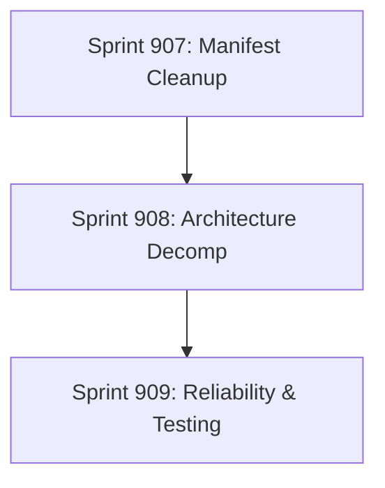

# Sprint Plan V19: Manifest Dashboard & Platform Hardening

**Created**: February 2, 2026
**Status**: Ready for Review
**Previous Phase**: Sprint 906 (Manifest Dashboard) - *Completed*
**Focus**: **Production Readiness, Code Quality, & Architectural Health**

---

## Executive Summary

### Context
Sprint 906 successfully delivered the **Manifest Dashboard** features:
1.  `ROICalculator`: Interactive value logic.
2.  `FacilityInferenceService`: Firmographic enrichment.
3.  `Manifest` email templates & routing.

However, this rapid feature development has exacerbated existing technical debt, specifically in `App.tsx` (now ~3,800 lines) and test coverage gaps for the new logic.

### Critical Blockers to Scale
| Issue | Severity | Impact |
|-------|----------|--------|
| `App.tsx` Size | 🔴 **CRITICAL** | 3,765 lines. Any change risks breaking unrelated features. Slow dev server. |
| ROI Persistence | 🟠 **HIGH** | Calculator state resets on navigation. Pitch data lost during demos. |
| Missing Tests | 🟠 **HIGH** | `FacilityInferenceService` and `ROICalculator` have 0 tests. Logic is unverified. |
| Hardcoded Strings | 🟡 **MEDIUM** | Meeting links & Templates embedded in components. Hard to update on the fly. |

---

## Sprint Roadmap

| Sprint | Goal | Key Deliverables |
|--------|------|------------------|
| **907** | **Manifest Polish** | Persistence for ROI, Extract Constants, Unit/Comp Tests. |
| **908** | **Decomposition** | **Split `App.tsx`**. Extract `ProspectList`, `ChatPanel`, `DetailView`. |
| **909** | **Reliability** | Webhook Integration Tests, Playwright E2E for Manifest flow. |

---

## Sprint 907: Manifest Polish & Persistence (Immediate)

**Goal**: Ensure the new features are robust, tested, and user data matches expectations (persistence).

### T907.1: Persist ROI Calculator State
**Problem**: When a user calculates ROI for "Coca-Cola" and switches tabs, the calculation is lost.
**Solution**: LocalStorage persistence (global default) + Optional Firestore persistence (per-prospect).
**Implementation**:
1.  Modify `ROICalculator.tsx` to accept `initialValues` prop.
2.  Create `useROICalculator({ prospectId })` hook.
3.  Load/Save inputs to `localStorage` key `yard-flow-roi-defaults`.
4.  *(Bonus)* Save to `prospect.roiInputs` in Firestore.
**Validation**:
*   Change slider -> Refresh page -> Values remain.

### T907.2: Unit Tests for Facility Inference
**Problem**: Critical lead scoring logic is untested.
**Solution**: Create `src/services/FacilityInferenceService.test.ts`.
**Test Cases**:
*   `inferFacilities(p, 1000)` -> Returns 5 (1000/200).
*   `inferFacilities(p, 50)` -> Returns 1 or 2 depending on logic.
*   `isAssetBasedShipper(p)` -> Returns true for "Director of Logistics".
**Validation**: `npm test src/services/FacilityInferenceService.test.ts` passes.

### T907.3: Extract Hardcoded Constants
**Problem**: `MEETING_LINK_LONG`, `TEMPLATES`, and `Generic SaaS Savings` are hardcoded in `App.tsx` and `ROICalculator.tsx`.
**Solution**:
1.  Create `src/config/constants.ts` (Links, Limits).
2.  Create `src/config/templates.ts` (Email Templates).
3.  Create `src/config/roiDefaults.ts` (ROI magic numbers).
**Validation**: No string literals for URLs or business logic in components.

### T907.4: Component Tests for ROI Calculator
**Problem**: No verification that the math works in the UI.
**Solution**: Create `src/components/panels/ROICalculator.test.tsx`.
**Test Cases**:
*   Renders all 3 sliders.
*   Updating facilities count updates the Total ROI text.
*   Snapshot test for layout.
**Validation**: Vitest execution.

---

## Sprint 908: The Great App.tsx Decomposition (Critical)

**Goal**: Reduce `App.tsx` from ~3,800 lines to <500 lines. Focus on composition.
**Strategy**: "Lift and Shift" sections into self-contained Feature Panels.

### T908.1: Extract `ProspectListPanel`
**Problem**: Virtualization, sorting, filtering, and row rendering take up ~1000 lines.
**Files**: `src/components/panels/ProspectListPanel.tsx`.
**Props needed**: `prospects`, `isLoading`, `onSelect`, `selectedId`.
**Validation**: Hitlist tab works exactly as before.

### T908.2: Extract `ChatPanel` (AI Brain)
**Problem**: Gemini logic, chat history, and rendering take up ~500 lines.
**Files**: `src/components/panels/ChatPanel.tsx`.
**Details**: Move `chatHistory`, `isGenerating`, `handleSendMessage` inside.
**Validation**: "Brain" tab works exactly as before.

### T908.3: Extract `CampaignDashboard`
**Problem**: The analytic dashboard render logic (charts, KPI cards) is mixed in.
**Files**: `src/components/panels/CampaignDashboard.tsx`.
**Validation**: "Dashboard" tab works exactly as before.

### T908.4: Extract `GlobalProviders`
**Problem**: `App.tsx` handles Auth, Toast, QueryClient, and Theme context setup.
**Files**: `src/providers/GlobalProviders.tsx`.
**Validation**: App boots correctly.

---

## Sprint 909: Reliability & E2E

**Goal**: "Click all the buttons" automatically.

### T909.1: Playwright Spec for Manifest Flow
**Problem**: No automated test for the specific Manifest demo flow.
**File**: `e2e/manifest-demo.spec.ts`.
**Steps**:
1.  Login.
2.  Navigate to ROI Calculator.
3.  Adjust sliders -> Verify ROI > $0.
4.  Navigate to Hitlist.
5.  Search "Coca-Cola".
6.  Click "Generate Email".
7.  Verify template contains "Manifest".
**Validation**: `npx playwright test manifest` passes.

### T909.2: Webhook Sync Tests (From V18)
**File**: `src/__tests__/api/webhook-integration-calendly.test.ts`.
**Goal**: Verify endpoint logic (mocked).

---

## Technical Debt Ledger (To be addressed)
*   **Tier Types**: `T1` vs `Tier 1` string mismatch in `tierAdapter`.
*   **Environment Validation**: `validateEnv()` needs to be stricter for `VITE_RAILWAY_URL`.

