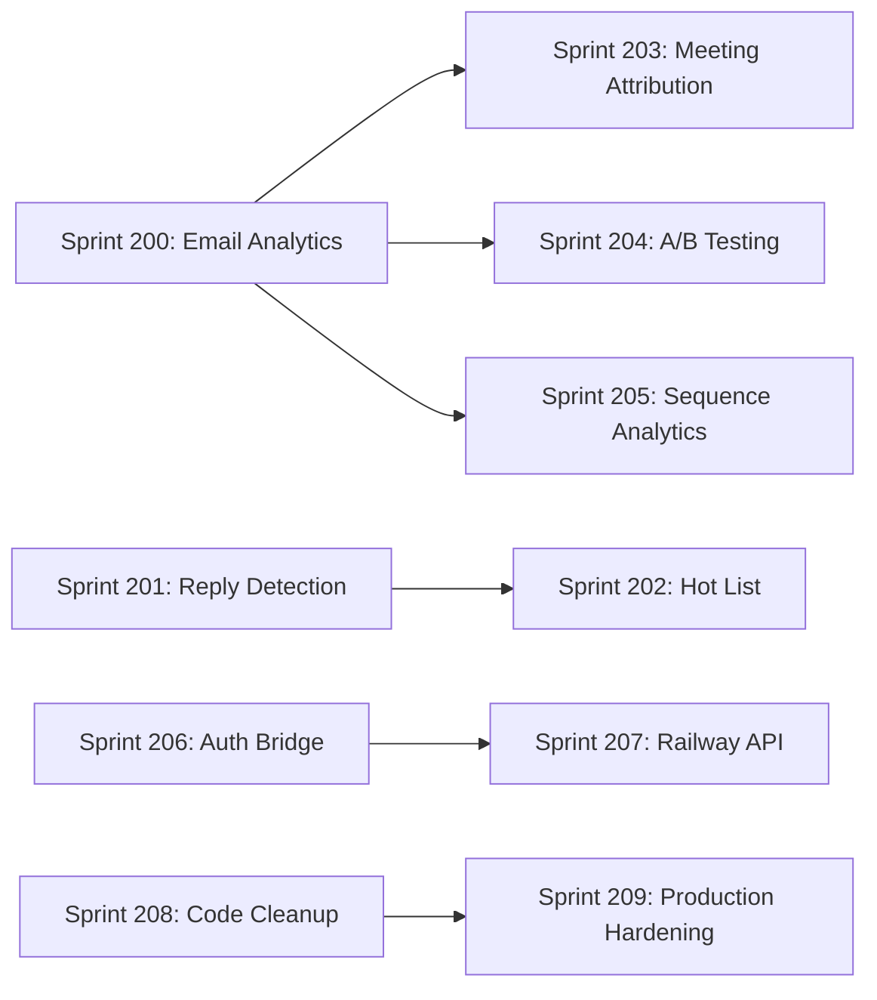

# YardFlow Sprint Plan V200: Comprehensive Feature Completion

**Created:** January 31, 2026  
**Platform:** GTM-YardFlow (Vercel) + YardFlow-Hitlist (Railway)  
**Starting Point:** 2,687 tests passing, core email infrastructure complete

---

## Executive Summary

This sprint plan addresses all remaining gaps in YardFlow, transforming it from a functional email automation platform into a complete sales intelligence system. Each sprint produces demoable software with clear value for Jake.

### Sprint Overview

| Sprint | Theme | Duration | Key Deliverable |
|--------|-------|----------|-----------------|
| 200 | Email Analytics Dashboard | 2 days | Visual email performance metrics |
| 201 | Reply Detection & Inbox UI | 1.5 days | "You have X replies" inbox |
| 202 | Hot List & Daily Briefing | 1.5 days | Priority leads dashboard |
| 203 | Meeting Attribution Dashboard | 1 day | Meetings linked to sequences |
| 204 | Template A/B Testing | 2 days | Subject line split testing |
| 205 | Sequence Performance Analytics | 1.5 days | Sequence leaderboard |
| 206 | Railway Auth Bridge | 2 days | Firebase ↔ NextAuth bridge |
| 207 | Railway API Endpoints | 3 days | Complete Railway API |
| 208 | Code Cleanup & Performance | 1.5 days | Lean, fast codebase |
| 209 | Production Hardening | 1.5 days | Monitoring & alerts |

**Total Estimated Duration:** ~16 days

---

## Sprint 200: Email Analytics Dashboard

**Goal:** Jake can see a dashboard showing email performance metrics (sent, delivered, opened, clicked, bounced) with charts and trends.

**Dependencies:** None (uses existing email_events Firestore collection)

### Tasks

#### T200.1: Create Email Stats Types [XS - 30m]
**Files:** `src/types/emailStats.ts`
**Description:** Define TypeScript interfaces for email statistics aggregation
```typescript
interface EmailStats {
  sent: number;
  delivered: number;
  opened: number;
  clicked: number;
  bounced: number;
  complained: number;
  openRate: number;
  clickRate: number;
  bounceRate: number;
}

interface EmailStatsByDate {
  date: string;
  stats: EmailStats;
}

interface EmailStatsPeriod {
  daily: EmailStatsByDate[];
  weekly: EmailStatsByDate[];
  totals: EmailStats;
}
```
**Validation:** 
- [ ] Types compile without errors
- [ ] Exported from types/index.ts
**Commit:** `feat(types): add email statistics type definitions`

---

#### T200.2: Create Email Stats Service [M - 2h]
**Files:** `src/services/EmailStatsService.ts`
**Description:** Service to aggregate email_events from Firestore into stats
- Query email_events collection with date filters
- Aggregate by event type (sent, delivered, open, click, bounce, spam_report)
- Calculate rates (openRate = opened/delivered, etc.)
- Support date range queries (today, 7d, 30d, all)
- Cache results for 5 minutes using local state

**Validation:** 
- [ ] Unit test: `EmailStatsService.test.ts` with mocked Firestore
- [ ] Test aggregation logic with sample events
- [ ] Test rate calculations
- [ ] Test date filtering
**Commit:** `feat(services): add EmailStatsService for email analytics aggregation`

---

#### T200.3: Create Email Stats Hooks [S - 1h]
**Files:** `src/hooks/useEmailStats.ts`
**Description:** React hooks for consuming email stats
- `useEmailStats(period: '7d' | '30d' | 'all')` - returns stats with loading/error states
- `useEmailStatsByDate(startDate, endDate)` - returns daily breakdown
- Use React Query or SWR pattern for caching

**Validation:** 
- [ ] Hook test with mocked service
- [ ] Loading states work correctly
- [ ] Error states work correctly
**Commit:** `feat(hooks): add useEmailStats hooks for analytics data`

---

#### T200.4: Create Email Stats Card Component [S - 1h]
**Files:** `src/components/analytics/EmailStatsCard.tsx`
**Description:** Card component displaying a single metric with trend
- Props: label, value, previousValue, icon, color
- Shows percentage change from previous period
- Arrow up/down indicator for trend
- Tailwind styling consistent with existing cards

**Validation:** 
- [ ] Visual test in Storybook or dev
- [ ] Positive/negative trends display correctly
- [ ] Accessible (aria labels)
**Commit:** `feat(components): add EmailStatsCard for metric display`

---

#### T200.5: Create Email Stats Chart Component [M - 2h]
**Files:** `src/components/analytics/EmailStatsChart.tsx`
**Description:** Line/area chart showing email metrics over time
- Use Recharts (already in dependencies) or add lightweight chart lib
- Show multiple metrics on same chart (sent, opened, clicked)
- Toggleable series
- Responsive design
- Date range selector

**Validation:** 
- [ ] Chart renders with sample data
- [ ] Series toggle works
- [ ] Responsive on mobile
- [ ] Tooltip shows exact values
**Commit:** `feat(components): add EmailStatsChart for trend visualization`

---

#### T200.6: Create Email Funnel Component [S - 1h]
**Files:** `src/components/analytics/EmailFunnel.tsx`
**Description:** Funnel visualization: Sent → Delivered → Opened → Clicked
- Horizontal funnel with percentages
- Color-coded stages
- Click-through rates between stages
- Animated transitions

**Validation:** 
- [ ] Funnel renders correctly
- [ ] Percentages calculate correctly
- [ ] Zero-state handles gracefully
**Commit:** `feat(components): add EmailFunnel for conversion visualization`

---

#### T200.7: Create Email Analytics Dashboard Page [M - 2h]
**Files:** `src/pages/EmailAnalyticsDashboard.tsx`
**Description:** Full-page dashboard combining all analytics components
- Header with date range selector (7d, 30d, 90d, custom)
- Top row: 6 stat cards (Sent, Delivered, Opened, Clicked, Bounced, Complaints)
- Middle: Trend chart
- Bottom: Funnel + quick stats
- Export button (CSV of raw data)

**Validation:** 
- [ ] Page renders without errors
- [ ] Date range changes update all components
- [ ] Loading states show correctly
- [ ] Empty state message for no data
**Commit:** `feat(pages): add EmailAnalyticsDashboard page`

---

#### T200.8: Add Analytics Route and Navigation [XS - 30m]
**Files:** `src/App.tsx`, `src/components/Navigation.tsx` (or equivalent)
**Description:** Add route `/analytics/email` and nav link
- Protected route (requires auth)
- Icon: ChartBarIcon or equivalent
- Nav item between existing items

**Validation:** 
- [ ] Route accessible when logged in
- [ ] Redirects to login when not authenticated
- [ ] Nav item highlights when active
**Commit:** `feat(routing): add email analytics route and navigation`

---

#### T200.9: Add Analytics E2E Test [S - 1h]
**Files:** `e2e/email-analytics.spec.ts`
**Description:** Playwright E2E test for analytics dashboard
- Login → Navigate to analytics
- Verify stat cards render
- Change date range
- Verify chart updates
- Test export functionality

**Validation:** 
- [ ] E2E test passes
- [ ] Screenshots captured
**Commit:** `test(e2e): add email analytics dashboard tests`

---

#### T200.10: Add Analytics Feature Flag [XS - 30m]
**Files:** `src/config/featureFlags.ts`
**Description:** Add feature flag for analytics dashboard
- `VITE_EMAIL_ANALYTICS_ENABLED`
- `shouldShowEmailAnalytics()` helper
- Default to true

**Validation:** 
- [ ] Flag toggles dashboard visibility
- [ ] Works in production build
**Commit:** `feat(flags): add email analytics feature flag`

---

### Definition of Done - Sprint 200
- [ ] All 10 tasks complete with commits
- [ ] Email analytics dashboard accessible at `/analytics/email`
- [ ] Shows real data from email_events collection
- [ ] Charts render with proper data
- [ ] E2E test passes
- [ ] Jake can demo: "Here's how our emails performed this week"

---

## Sprint 201: Reply Detection & Inbox UI

**Goal:** Jake sees a notification badge showing unread replies and can view/manage them in an inbox-style interface.

**Dependencies:** Sprint 200 (shares analytics patterns)

### Tasks

#### T201.1: Create Reply Types [XS - 30m]
**Files:** `src/types/replies.ts`
**Description:** Define types for reply tracking
```typescript
interface EmailReply {
  id: string;
  prospectId: string;
  prospectEmail: string;
  prospectName: string;
  sequenceId: string;
  sequenceName: string;
  stepNumber: number;
  receivedAt: Timestamp;
  subject: string;
  bodyPreview: string; // first 200 chars
  isRead: boolean;
  sentiment?: 'positive' | 'negative' | 'neutral';
  requiresAction: boolean;
}
```
**Validation:** 
- [ ] Types compile
- [ ] Exported correctly
**Commit:** `feat(types): add email reply type definitions`

---

#### T201.2: Create Replies Service [M - 2h]
**Files:** `src/services/RepliesService.ts`
**Description:** Service to manage replies from Firestore
- `getReplies(filter: {unreadOnly?, sequenceId?})` - fetch replies
- `markAsRead(replyId)` - update read status
- `getUnreadCount()` - for badge
- `archiveReply(replyId)` - soft delete
- Subscribe to real-time updates for unread count

**Validation:** 
- [ ] Unit tests for all methods
- [ ] Real-time subscription works
- [ ] Filtering works correctly
**Commit:** `feat(services): add RepliesService for inbox management`

---

#### T201.3: Create Reply Hooks [S - 1h]
**Files:** `src/hooks/useReplies.ts`
**Description:** React hooks for replies
- `useReplies(filter)` - paginated reply list
- `useUnreadCount()` - real-time unread badge count
- `useMarkAsRead()` - mutation hook

**Validation:** 
- [ ] Hooks work with loading/error states
- [ ] Real-time updates trigger re-render
**Commit:** `feat(hooks): add useReplies hooks for inbox`

---

#### T201.4: Create Inbox Badge Component [XS - 30m]
**Files:** `src/components/inbox/InboxBadge.tsx`
**Description:** Notification badge showing unread count
- Red circle with number
- Pulses when new reply arrives
- Hides when count is 0
- Max display "9+" for > 9

**Validation:** 
- [ ] Badge renders correctly
- [ ] Animation works
- [ ] Accessible
**Commit:** `feat(components): add InboxBadge for reply notifications`

---

#### T201.5: Create Reply List Item Component [S - 1h]
**Files:** `src/components/inbox/ReplyListItem.tsx`
**Description:** List item for a single reply
- Prospect name and avatar
- Subject line (bold if unread)
- Body preview (truncated)
- Timestamp (relative: "2 hours ago")
- Sequence name badge
- Click to expand/navigate

**Validation:** 
- [ ] Renders correctly for read/unread
- [ ] Timestamp formats correctly
- [ ] Responsive layout
**Commit:** `feat(components): add ReplyListItem for inbox display`

---

#### T201.6: Create Reply Detail Panel [M - 2h]
**Files:** `src/components/inbox/ReplyDetailPanel.tsx`
**Description:** Full reply detail view
- Full body content (sanitized HTML)
- Prospect info card (name, company, tier)
- Sequence context (which step triggered this)
- Action buttons: Mark Read, Archive, View Prospect, Resume Sequence
- Quick reply link (opens email client)

**Validation:** 
- [ ] HTML sanitization works (no XSS)
- [ ] Actions work correctly
- [ ] Links open correctly
**Commit:** `feat(components): add ReplyDetailPanel for reply management`

---

#### T201.7: Create Inbox Page [M - 2h]
**Files:** `src/pages/InboxPage.tsx`
**Description:** Full inbox page with list and detail view
- Split view: list on left, detail on right
- Filter tabs: All, Unread, Requires Action
- Search by prospect name/email
- Bulk actions: Mark all read
- Empty state for no replies

**Validation:** 
- [ ] Page renders correctly
- [ ] Filters work
- [ ] Selection works
- [ ] Mobile responsive (stacked layout)
**Commit:** `feat(pages): add InboxPage for reply management`

---

#### T201.8: Add Inbox Route and Nav Badge [S - 1h]
**Files:** `src/App.tsx`, `src/components/Navigation.tsx`
**Description:** Add `/inbox` route with badge in nav
- Route protected by auth
- Navigation shows InboxBadge with unread count
- Badge updates in real-time

**Validation:** 
- [ ] Route works
- [ ] Badge shows correct count
- [ ] Real-time updates work
**Commit:** `feat(routing): add inbox route with notification badge`

---

#### T201.9: Enhance Inbound Webhook for Reply Storage [S - 1h]
**Files:** `api/webhooks/inbound.ts`
**Description:** Ensure inbound webhook stores replies properly
- Already detects replies and pauses sequences
- Add: Store reply document in `replies` collection
- Add: Extract body preview
- Add: Basic sentiment detection (contains "thanks", "not interested", etc.)

**Validation:** 
- [ ] Webhook test with sample payload
- [ ] Reply stored in Firestore
- [ ] Sentiment detection works
**Commit:** `feat(webhooks): enhance inbound webhook for reply storage`

---

#### T201.10: Add Inbox E2E Test [S - 1h]
**Files:** `e2e/inbox.spec.ts`
**Description:** E2E test for inbox functionality
- Navigate to inbox
- Verify reply list renders
- Select a reply
- Mark as read
- Verify badge updates

**Validation:** 
- [ ] E2E test passes
- [ ] Screenshots captured
**Commit:** `test(e2e): add inbox page tests`

---

### Definition of Done - Sprint 201
- [ ] All 10 tasks complete
- [ ] Inbox page at `/inbox`
- [ ] Badge shows unread count in real-time
- [ ] Can view and manage replies
- [ ] E2E test passes
- [ ] Jake can demo: "I have 3 replies waiting - let me show you"

---

## Sprint 202: Hot List & Daily Briefing

**Goal:** Jake sees a prioritized list of "hot" prospects to contact today, with context on why they're hot.

**Dependencies:** None (uses existing prospect data)

### Tasks

#### T202.1: Create Hot List Types [XS - 30m]
**Files:** `src/types/hotList.ts`
**Description:** Types for hot list and priority scoring
```typescript
interface HotProspect {
  prospectId: string;
  prospect: Prospect;
  priority: number; // 1-100
  reasons: HotReason[];
  suggestedAction: 'call' | 'email' | 'linkedin' | 'wait';
  lastActivity: Timestamp;
}

type HotReason = 
  | { type: 'opened_email'; count: number; lastOpen: Timestamp }
  | { type: 'clicked_link'; url: string; timestamp: Timestamp }
  | { type: 'replied'; sentiment: string }
  | { type: 'visited_calendly'; timestamp: Timestamp }
  | { type: 'high_tier'; tier: number }
  | { type: 'stale_sequence'; daysSinceLastStep: number };
```
**Validation:** 
- [ ] Types compile
- [ ] Covers all priority reasons
**Commit:** `feat(types): add hot list type definitions`

---

#### T202.2: Create Priority Scoring Service [L - 4h]
**Files:** `src/services/PriorityScoringService.ts`
**Description:** Service to calculate prospect priority scores
- Input: Prospect + their email events + enrollment status
- Scoring rules:
  - +30 points: Opened email in last 24h
  - +50 points: Clicked link in last 24h
  - +80 points: Replied (not negative)
  - +40 points: Tier 1 prospect
  - +20 points: Tier 2 prospect
  - +25 points: Stale sequence (>3 days since last step)
  - -50 points: Negative reply
  - -100 points: Bounced/unsubscribed
- Output: HotProspect with reasons array
- Batch processing for efficiency

**Validation:** 
- [ ] Unit tests for scoring rules
- [ ] Edge cases (no events, negative sentiment)
- [ ] Performance test with 1000 prospects
**Commit:** `feat(services): add PriorityScoringService for hot list generation`

---

#### T202.3: Create Hot List Service [M - 2h]
**Files:** `src/services/HotListService.ts`
**Description:** Service to generate and cache hot lists
- `getHotList(limit: number)` - top N hot prospects
- `getDailyBriefing()` - formatted summary for email/display
- Cache hot list for 1 hour (recompute on demand)
- Background refresh via cron

**Validation:** 
- [ ] Unit tests
- [ ] Cache invalidation works
- [ ] Limit parameter works
**Commit:** `feat(services): add HotListService for prioritized prospects`

---

#### T202.4: Create Hot List Hooks [S - 1h]
**Files:** `src/hooks/useHotList.ts`
**Description:** React hooks for hot list
- `useHotList(limit)` - paginated hot prospects
- `useDailyBriefing()` - summary data
- `useRefreshHotList()` - force refresh

**Validation:** 
- [ ] Hooks work with loading/error
- [ ] Refresh works
**Commit:** `feat(hooks): add useHotList hooks`

---

#### T202.5: Create Hot Prospect Card [S - 1h]
**Files:** `src/components/hotlist/HotProspectCard.tsx`
**Description:** Card for a single hot prospect
- Prospect name, company, tier badge
- Priority score (visual meter)
- Reason tags (e.g., "Opened 3x", "Clicked link")
- Suggested action button
- Quick actions: Email, Call, LinkedIn

**Validation:** 
- [ ] Renders all data correctly
- [ ] Actions work
- [ ] Responsive
**Commit:** `feat(components): add HotProspectCard for hot list display`

---

#### T202.6: Create Daily Briefing Card [M - 2h]
**Files:** `src/components/hotlist/DailyBriefingCard.tsx`
**Description:** Summary card for daily briefing
- "Good morning, Jake. Here's your day:"
- Key stats: X hot prospects, Y replies waiting, Z meetings today
- Top 3 priority actions
- Collapsible detailed list
- "Start Day" button that opens first priority

**Validation:** 
- [ ] Morning greeting works
- [ ] Stats aggregate correctly
- [ ] Start Day navigation works
**Commit:** `feat(components): add DailyBriefingCard for morning summary`

---

#### T202.7: Create Hot List Page [M - 2h]
**Files:** `src/pages/HotListPage.tsx`
**Description:** Full hot list page
- Header: Daily Briefing Card
- Main: Grid/list of Hot Prospect Cards
- Filters: By reason, by tier, by suggested action
- Sort: By priority, by last activity
- Load more pagination

**Validation:** 
- [ ] Page renders
- [ ] Filters work
- [ ] Sort works
- [ ] Pagination works
**Commit:** `feat(pages): add HotListPage for priority prospects`

---

#### T202.8: Add Hot List Route and Dashboard Widget [S - 1h]
**Files:** `src/App.tsx`, `src/pages/Dashboard.tsx`
**Description:** 
- Add `/hotlist` route
- Add "Top 5 Hot Prospects" widget to main dashboard
- Nav item for Hot List

**Validation:** 
- [ ] Route works
- [ ] Dashboard widget shows correct data
- [ ] Nav links work
**Commit:** `feat(routing): add hot list route and dashboard widget`

---

#### T202.9: Create Hot List Cron Job [S - 1h]
**Files:** `api/cron/refresh-hotlist.ts`
**Description:** Cron to pre-compute hot list
- Runs every hour
- Computes priority scores for all active prospects
- Stores in Firestore `hot_list` collection
- Logs execution time

**Validation:** 
- [ ] Cron executes successfully
- [ ] Data stored correctly
- [ ] Performance acceptable
**Commit:** `feat(cron): add hot list refresh cron job`

---

#### T202.10: Add Hot List E2E Test [S - 1h]
**Files:** `e2e/hotlist.spec.ts`
**Description:** E2E test for hot list
- Navigate to hot list
- Verify cards render
- Test filters
- Test quick actions

**Validation:** 
- [ ] E2E passes
- [ ] Screenshots captured
**Commit:** `test(e2e): add hot list page tests`

---

### Definition of Done - Sprint 202
- [ ] All 10 tasks complete
- [ ] Hot list page at `/hotlist`
- [ ] Daily briefing shows on dashboard
- [ ] Priority scoring works correctly
- [ ] Jake can demo: "These are my hot leads for today - let me start with the top one"

---

## Sprint 203: Meeting Attribution Dashboard

**Goal:** Jake can see which email sequences and templates are generating the most meetings.

**Dependencies:** Sprint 200 (shares analytics patterns)

### Tasks

#### T203.1: Create Meeting Attribution Types [XS - 30m]
**Files:** `src/types/meetingAttribution.ts`
**Description:** Types for meeting attribution analytics
```typescript
interface AttributedMeeting {
  meetingId: string;
  calendlyEventId: string;
  prospectId: string;
  prospectName: string;
  prospectCompany: string;
  sequenceId: string;
  sequenceName: string;
  templateId?: string;
  stepNumber: number;
  scheduledAt: Timestamp;
  meetingTime: Timestamp;
  meetingType: string;
  attribution: 'direct' | 'influenced'; // clicked link vs. organic
}

interface SequenceMeetingStats {
  sequenceId: string;
  sequenceName: string;
  totalMeetings: number;
  conversionRate: number; // meetings / enrollments
  avgStepsToMeeting: number;
}
```
**Validation:** 
- [ ] Types compile
- [ ] Covers attribution scenarios
**Commit:** `feat(types): add meeting attribution type definitions`

---

#### T203.2: Enhance Meeting Attribution Service [M - 2h]
**Files:** `src/services/MeetingAttributionService.ts`
**Description:** Extend existing service with analytics methods
- `getMeetingsBySequence()` - aggregate meetings by sequence
- `getMeetingsByTemplate()` - aggregate by email template
- `getMeetingTimeline()` - meetings over time
- `getTopPerformingSequences(limit)` - leaderboard
- `getConversionFunnel()` - enrolled → contacted → replied → met

**Validation:** 
- [ ] Unit tests for new methods
- [ ] Aggregation logic correct
- [ ] Performance acceptable
**Commit:** `feat(services): enhance MeetingAttributionService with analytics`

---

#### T203.3: Create Meeting Attribution Hooks [S - 1h]
**Files:** `src/hooks/useMeetingAttribution.ts`
**Description:** React hooks for meeting attribution
- `useAttributedMeetings(filter)` - list of meetings
- `useSequenceMeetingStats()` - sequence leaderboard
- `useMeetingTimeline(period)` - chart data

**Validation:** 
- [ ] Hooks work correctly
- [ ] Loading/error states
**Commit:** `feat(hooks): add useMeetingAttribution hooks`

---

#### T203.4: Create Meeting Card Component [S - 1h]
**Files:** `src/components/meetings/MeetingCard.tsx`
**Description:** Card for a single attributed meeting
- Prospect info (name, company)
- Meeting time and type
- Attribution source (sequence name, step number)
- Status badge (scheduled, completed, cancelled)
- Link to Calendly event

**Validation:** 
- [ ] Renders correctly
- [ ] Status states work
- [ ] Links work
**Commit:** `feat(components): add MeetingCard for attributed meetings`

---

#### T203.5: Create Sequence Leaderboard Component [S - 1h]
**Files:** `src/components/meetings/SequenceLeaderboard.tsx`
**Description:** Ranked list of sequences by meeting generation
- Rank, sequence name, meeting count
- Conversion rate bar
- Trend indicator (up/down from last period)
- Click to drill into sequence

**Validation:** 
- [ ] Ranking correct
- [ ] Visual bars work
- [ ] Navigation works
**Commit:** `feat(components): add SequenceLeaderboard for top performers`

---

#### T203.6: Create Meeting Timeline Chart [S - 1h]
**Files:** `src/components/meetings/MeetingTimelineChart.tsx`
**Description:** Chart showing meetings over time
- Bar chart by week/month
- Color-coded by sequence
- Hover for details
- Comparison to previous period

**Validation:** 
- [ ] Chart renders
- [ ] Tooltips work
- [ ] Period comparison accurate
**Commit:** `feat(components): add MeetingTimelineChart for trends`

---

#### T203.7: Create Meeting Funnel Component [S - 1h]
**Files:** `src/components/meetings/MeetingFunnel.tsx`
**Description:** Funnel: Enrolled → Emailed → Replied → Met
- Vertical funnel with percentages
- Benchmark comparison (industry averages)
- Drill-down on each stage

**Validation:** 
- [ ] Funnel renders correctly
- [ ] Percentages accurate
- [ ] Click-through works
**Commit:** `feat(components): add MeetingFunnel for conversion visualization`

---

#### T203.8: Create Meeting Attribution Dashboard Page [M - 2h]
**Files:** `src/pages/MeetingAttributionDashboard.tsx`
**Description:** Full dashboard for meeting attribution
- Header: Total meetings, conversion rate, trend
- Top section: Meeting timeline chart
- Left: Sequence leaderboard
- Right: Conversion funnel
- Bottom: Recent meetings list

**Validation:** 
- [ ] Page renders without errors
- [ ] All components populate
- [ ] Empty state handles gracefully
**Commit:** `feat(pages): add MeetingAttributionDashboard page`

---

#### T203.9: Add Meeting Attribution Route [XS - 30m]
**Files:** `src/App.tsx`, `src/components/Navigation.tsx`
**Description:** Add `/analytics/meetings` route
- Protected route
- Nav item under Analytics section

**Validation:** 
- [ ] Route works
- [ ] Nav highlights correctly
**Commit:** `feat(routing): add meeting attribution route`

---

#### T203.10: Add Meeting Attribution E2E Test [S - 1h]
**Files:** `e2e/meeting-attribution.spec.ts`
**Description:** E2E test for meeting attribution dashboard
- Navigate to dashboard
- Verify leaderboard renders
- Verify chart renders
- Test drill-down

**Validation:** 
- [ ] E2E passes
- [ ] Screenshots captured
**Commit:** `test(e2e): add meeting attribution dashboard tests`

---

### Definition of Done - Sprint 203
- [ ] All 10 tasks complete
- [ ] Dashboard at `/analytics/meetings`
- [ ] Shows real meeting data linked to sequences
- [ ] Leaderboard ranks sequences correctly
- [ ] Jake can demo: "My cold outreach sequence has booked 12 meetings this month"

---

## Sprint 204: Template A/B Testing Framework

**Goal:** Jake can create A/B tests for email subject lines and track which variant performs better.

**Dependencies:** Sprint 200 (uses email analytics)

### Tasks

#### T204.1: Create A/B Test Types [S - 1h]
**Files:** `src/types/abTest.ts`
**Description:** Types for A/B testing
```typescript
interface ABTest {
  id: string;
  name: string;
  sequenceId: string;
  stepNumber: number;
  status: 'draft' | 'running' | 'completed' | 'paused';
  variants: ABVariant[];
  trafficSplit: number[]; // [50, 50] or [33, 33, 34]
  startedAt?: Timestamp;
  completedAt?: Timestamp;
  winner?: string; // variant id
  sampleSize: number;
  confidenceLevel: number;
}

interface ABVariant {
  id: string;
  name: string; // "A", "B", "C"
  subjectLine: string;
  bodyTemplate?: string; // optional body variant
  stats: {
    sent: number;
    opened: number;
    clicked: number;
    replied: number;
    meetings: number;
  };
}
```
**Validation:** 
- [ ] Types compile
- [ ] Covers multi-variant tests
**Commit:** `feat(types): add A/B testing type definitions`

---

#### T204.2: Create A/B Test Service [L - 4h]
**Files:** `src/services/ABTestService.ts`
**Description:** Service for managing A/B tests
- `createTest(config)` - create new test
- `assignVariant(prospectId, testId)` - randomly assign variant
- `recordEvent(prospectId, testId, event)` - track opens/clicks
- `getTestStats(testId)` - aggregate stats per variant
- `determineWinner(testId)` - statistical significance check
- `endTest(testId, winnerId)` - conclude test

Statistical significance using chi-squared test or z-test for proportions.

**Validation:** 
- [ ] Unit tests for assignment logic (uniform distribution)
- [ ] Unit tests for statistical significance calculation
- [ ] Unit tests for CRUD operations
**Commit:** `feat(services): add ABTestService for split testing`

---

#### T204.3: Create A/B Test Hooks [S - 1h]
**Files:** `src/hooks/useABTest.ts`
**Description:** React hooks for A/B testing
- `useABTests(sequenceId?)` - list tests
- `useABTest(testId)` - single test with stats
- `useCreateABTest()` - mutation hook
- `useEndABTest()` - mutation hook

**Validation:** 
- [ ] Hooks work correctly
- [ ] Mutations update UI
**Commit:** `feat(hooks): add useABTest hooks`

---

#### T204.4: Modify Email Sending for Variant Selection [M - 2h]
**Files:** `src/services/RailwayEmailService.ts` or `api/email/send.ts`
**Description:** Integrate A/B testing into email sending
- Before sending, check if step has active A/B test
- If yes, assign variant to prospect (or use existing assignment)
- Use variant's subject/body
- Record which variant was sent

**Validation:** 
- [ ] Unit test variant assignment
- [ ] Unit test subject line replacement
- [ ] Existing tests still pass
**Commit:** `feat(email): integrate A/B variant selection into send flow`

---

#### T204.5: Create A/B Test Card Component [S - 1h]
**Files:** `src/components/abtesting/ABTestCard.tsx`
**Description:** Card showing A/B test summary
- Test name and status badge
- Variant bars with open rates
- Leading variant highlighted
- Statistical significance indicator
- Action buttons: Pause, End, View Details

**Validation:** 
- [ ] Renders all states correctly
- [ ] Bars proportional to performance
- [ ] Actions work
**Commit:** `feat(components): add ABTestCard for test display`

---

#### T204.6: Create A/B Test Variant Editor [M - 2h]
**Files:** `src/components/abtesting/VariantEditor.tsx`
**Description:** Form for creating/editing test variants
- Variant name input
- Subject line input with character count
- Preview pane
- Add/remove variant buttons (2-4 variants)
- Traffic split sliders

**Validation:** 
- [ ] Form validation works
- [ ] Preview renders correctly
- [ ] Traffic splits sum to 100%
**Commit:** `feat(components): add VariantEditor for A/B test creation`

---

#### T204.7: Create A/B Test Results Component [M - 2h]
**Files:** `src/components/abtesting/ABTestResults.tsx`
**Description:** Detailed results view for completed test
- Side-by-side variant comparison
- Metrics table: sent, opened, clicked, open rate, click rate
- Statistical significance explanation
- Winner declaration with confidence
- Charts: performance over time

**Validation:** 
- [ ] Renders correctly
- [ ] Significance calculation displayed
- [ ] Charts work
**Commit:** `feat(components): add ABTestResults for test analysis`

---

#### T204.8: Create A/B Testing Page [M - 2h]
**Files:** `src/pages/ABTestingPage.tsx`
**Description:** A/B testing management page
- Header: Create New Test button
- Tabs: Running, Completed, Draft
- List of tests as cards
- Click to expand details
- Quick actions

**Validation:** 
- [ ] Page renders
- [ ] Tabs filter correctly
- [ ] Create flow works
**Commit:** `feat(pages): add ABTestingPage for test management`

---

#### T204.9: Add A/B Testing Route [XS - 30m]
**Files:** `src/App.tsx`, `src/components/Navigation.tsx`
**Description:** Add `/ab-testing` route
- Protected route
- Nav item under Tools or Analytics

**Validation:** 
- [ ] Route works
- [ ] Nav highlights correctly
**Commit:** `feat(routing): add A/B testing route`

---

#### T204.10: Add A/B Testing E2E Test [S - 1h]
**Files:** `e2e/ab-testing.spec.ts`
**Description:** E2E test for A/B testing
- Navigate to A/B testing page
- Create a new test
- Verify test appears in list
- View test results

**Validation:** 
- [ ] E2E passes
- [ ] Screenshots captured
**Commit:** `test(e2e): add A/B testing page tests`

---

### Definition of Done - Sprint 204
- [ ] All 10 tasks complete
- [ ] A/B testing page at `/ab-testing`
- [ ] Can create tests with multiple variants
- [ ] Emails sent use assigned variants
- [ ] Results show with statistical significance
- [ ] Jake can demo: "Subject line B has a 45% higher open rate - I'm rolling it out"

---

## Sprint 205: Sequence Performance Analytics

**Goal:** Jake can see detailed performance metrics for each sequence and compare them.

**Dependencies:** Sprint 200, Sprint 203 (shares analytics patterns)

### Tasks

#### T205.1: Create Sequence Analytics Types [XS - 30m]
**Files:** `src/types/sequenceAnalytics.ts`
**Description:** Types for sequence-level analytics
```typescript
interface SequenceAnalytics {
  sequenceId: string;
  sequenceName: string;
  status: 'active' | 'paused' | 'archived';
  enrollments: {
    total: number;
    active: number;
    completed: number;
    stopped: number;
  };
  emailStats: EmailStats; // from Sprint 200
  stepBreakdown: StepAnalytics[];
  conversionFunnel: FunnelStage[];
  meetingsBooked: number;
  avgTimeToMeeting: number; // days
}

interface StepAnalytics {
  stepNumber: number;
  stepName: string;
  emailStats: EmailStats;
  dropoffRate: number;
}
```
**Validation:** 
- [ ] Types compile
- [ ] Covers all metrics
**Commit:** `feat(types): add sequence analytics type definitions`

---

#### T205.2: Create Sequence Analytics Service [M - 2h]
**Files:** `src/services/SequenceAnalyticsService.ts`
**Description:** Service for sequence-level analytics
- `getSequenceAnalytics(sequenceId)` - full analytics for one sequence
- `getAllSequenceAnalytics()` - summary for all sequences
- `getStepBreakdown(sequenceId)` - per-step metrics
- `compareSequences(ids[])` - side-by-side comparison
- Aggregate from email_events, enrollments, meetings collections

**Validation:** 
- [ ] Unit tests for aggregation
- [ ] Comparison logic works
- [ ] Performance acceptable
**Commit:** `feat(services): add SequenceAnalyticsService`

---

#### T205.3: Create Sequence Analytics Hooks [S - 1h]
**Files:** `src/hooks/useSequenceAnalytics.ts`
**Description:** React hooks for sequence analytics
- `useSequenceAnalytics(sequenceId)` - single sequence
- `useAllSequenceAnalytics()` - all sequences summary
- `useSequenceComparison(ids[])` - comparison view

**Validation:** 
- [ ] Hooks work correctly
- [ ] Loading/error states
**Commit:** `feat(hooks): add useSequenceAnalytics hooks`

---

#### T205.4: Create Sequence Summary Card [S - 1h]
**Files:** `src/components/sequences/SequenceSummaryCard.tsx`
**Description:** Card for sequence performance summary
- Sequence name and status
- Key metrics: enrollments, open rate, reply rate, meetings
- Mini trend sparkline
- Click to expand
- Quick actions: Pause, Edit, View Details

**Validation:** 
- [ ] Renders correctly
- [ ] Sparkline works
- [ ] Actions work
**Commit:** `feat(components): add SequenceSummaryCard for sequence overview`

---

#### T205.5: Create Step Breakdown Chart [M - 2h]
**Files:** `src/components/sequences/StepBreakdownChart.tsx`
**Description:** Chart showing performance per step
- Bar chart with steps on X axis
- Metrics on Y: sent, opened, clicked
- Dropoff line overlaid
- Hover for detailed stats
- Highlight underperforming steps

**Validation:** 
- [ ] Chart renders
- [ ] Dropoff calculation correct
- [ ] Tooltips work
**Commit:** `feat(components): add StepBreakdownChart for step analysis`

---

#### T205.6: Create Sequence Comparison View [M - 2h]
**Files:** `src/components/sequences/SequenceComparisonView.tsx`
**Description:** Side-by-side sequence comparison
- Select 2-4 sequences to compare
- Table with metrics rows
- Highlight best performer per metric
- Radar chart for visual comparison
- Recommendation engine ("Sequence A has best open rate but...")

**Validation:** 
- [ ] Comparison renders
- [ ] Highlighting correct
- [ ] Radar chart works
**Commit:** `feat(components): add SequenceComparisonView for benchmarking`

---

#### T205.7: Create Sequence Detail Analytics Page [M - 2h]
**Files:** `src/pages/SequenceAnalyticsDetailPage.tsx`
**Description:** Detailed analytics for a single sequence
- Header: Sequence name, status, key metrics
- Step breakdown chart
- Enrollment funnel
- Timeline of performance
- A/B tests for this sequence (if any)
- List of enrollments with status

**Validation:** 
- [ ] Page renders for any sequence
- [ ] All sections populate
- [ ] Links work
**Commit:** `feat(pages): add SequenceAnalyticsDetailPage`

---

#### T205.8: Enhance Sequence Manager with Analytics Tab [S - 1h]
**Files:** `src/components/SequenceManagerPanel.tsx`
**Description:** Add analytics tab to existing sequence manager
- New tab: "Analytics" next to Steps, Enrollments
- Embedded version of analytics components
- Quick metrics banner at top

**Validation:** 
- [ ] Tab renders
- [ ] Analytics load correctly
- [ ] Existing tabs still work
**Commit:** `feat(components): add analytics tab to SequenceManagerPanel`

---

#### T205.9: Create Sequence Leaderboard Dashboard [S - 1h]
**Files:** `src/pages/SequenceLeaderboardPage.tsx`
**Description:** Dashboard ranking all sequences
- Table with sortable columns
- Metrics: enrollments, open rate, reply rate, meetings, conversion
- Trend indicators
- Click row to go to detail page
- Export to CSV

**Validation:** 
- [ ] Table renders
- [ ] Sorting works
- [ ] Export works
**Commit:** `feat(pages): add SequenceLeaderboardPage`

---

#### T205.10: Add Sequence Analytics Routes [XS - 30m]
**Files:** `src/App.tsx`, `src/components/Navigation.tsx`
**Description:** Add routes for sequence analytics
- `/analytics/sequences` - leaderboard
- `/analytics/sequences/:id` - detail page
- Nav item under Analytics

**Validation:** 
- [ ] Routes work
- [ ] Navigation correct
**Commit:** `feat(routing): add sequence analytics routes`

---

### Definition of Done - Sprint 205
- [ ] All 10 tasks complete
- [ ] Sequence leaderboard at `/analytics/sequences`
- [ ] Detail page at `/analytics/sequences/:id`
- [ ] Step breakdown shows where prospects drop off
- [ ] Can compare multiple sequences
- [ ] Jake can demo: "My 5-touch sequence outperforms the 3-touch by 40%"

---

## Sprint 206: Railway Auth Bridge (Firebase → NextAuth)

**Goal:** Users authenticated via Firebase can make authenticated requests to Railway backend.

**Dependencies:** None (core infrastructure)

### Tasks

#### T206.1: Design Auth Bridge Architecture [S - 1h]
**Files:** `docs/AUTH_BRIDGE_DESIGN.md`
**Description:** Document the auth bridge design
- Flow: Firebase token → Vercel middleware → Railway session
- Token exchange protocol
- Session storage (Redis on Railway)
- Refresh flow
- Security considerations

**Validation:** 
- [ ] Document reviewed
- [ ] Edge cases covered
**Commit:** `docs: add auth bridge architecture design`

---

#### T206.2: Create Token Exchange Endpoint on Railway [M - 2h]
**Files:** This task is for YardFlow-Hitlist repo
**Description:** Railway endpoint to exchange Firebase token for session
- POST `/api/auth/bridge`
- Accepts: Firebase ID token
- Validates: Token with Firebase Admin SDK
- Returns: Railway session token (JWT or session ID)
- Stores: Session in Redis with user data

**Validation:** 
- [ ] Unit test with valid token
- [ ] Unit test with invalid token
- [ ] Session stored correctly
**Commit:** `feat(auth): add Firebase token exchange endpoint`

---

#### T206.3: Create Auth Bridge Client [M - 2h]
**Files:** `lib/auth-bridge-client.ts`
**Description:** Vercel-side client for auth bridge
- `exchangeToken(firebaseToken)` - call Railway endpoint
- `getValidSession(firebaseToken)` - exchange or use cached
- Session caching with expiry
- Error handling for expired sessions

**Validation:** 
- [ ] Unit test token exchange
- [ ] Unit test caching
- [ ] Unit test error cases
**Commit:** `feat(lib): add auth bridge client for Railway authentication`

---

#### T206.4: Create Auth Bridge Hook [S - 1h]
**Files:** `src/hooks/useRailwayAuth.ts`
**Description:** React hook for Railway authentication
- Uses Firebase auth state
- Exchanges token when Firebase auth changes
- Provides Railway session for API calls
- Handles session refresh

**Validation:** 
- [ ] Hook provides valid session
- [ ] Refreshes on Firebase token change
- [ ] Error states handled
**Commit:** `feat(hooks): add useRailwayAuth hook for auth bridge`

---

#### T206.5: Update Railway Client with Auth [S - 1h]
**Files:** `lib/railway-client.ts`
**Description:** Add Railway session to API calls
- `railwayClientWithAuth(session)` - client factory
- Attaches session token to requests
- Handles 401 responses (re-auth)

**Validation:** 
- [ ] Client sends auth header
- [ ] 401 handling works
**Commit:** `feat(lib): add authenticated Railway client`

---

#### T206.6: Create Auth Bridge Middleware [S - 1h]
**Files:** `api/_middleware.ts`
**Description:** Update middleware for auth bridge
- On requests to Railway, check for Firebase session
- Exchange for Railway session if needed
- Attach to proxied request

**Validation:** 
- [ ] Middleware exchanges token
- [ ] Passes through for non-Railway requests
**Commit:** `feat(middleware): add auth bridge to API middleware`

---

#### T206.7: Create Session Sync Endpoint [S - 1h]
**Files:** `api/auth/sync-session.ts`
**Description:** Endpoint to sync sessions between platforms
- POST `/api/auth/sync-session`
- Called on login/logout
- Ensures Railway session matches Firebase state

**Validation:** 
- [ ] Login syncs session
- [ ] Logout invalidates Railway session
**Commit:** `feat(api): add session sync endpoint`

---

#### T206.8: Add Auth Bridge to Email Service [S - 1h]
**Files:** `src/services/RailwayEmailService.ts`
**Description:** Use authenticated Railway client for email
- Get Railway session from auth bridge
- Use authenticated client for API calls
- Fallback to Vercel-direct if auth fails

**Validation:** 
- [ ] Email sends with Railway auth
- [ ] Fallback works
**Commit:** `feat(services): integrate auth bridge into RailwayEmailService`

---

#### T206.9: Create Auth Bridge Health Check [XS - 30m]
**Files:** `api/auth/bridge-health.ts`
**Description:** Health check for auth bridge
- GET `/api/auth/bridge-health`
- Tests token exchange
- Tests session validity
- Returns status

**Validation:** 
- [ ] Health check works
- [ ] Reports errors correctly
**Commit:** `feat(api): add auth bridge health check endpoint`

---

#### T206.10: Add Auth Bridge E2E Test [S - 1h]
**Files:** `e2e/auth-bridge.spec.ts`
**Description:** E2E test for auth bridge
- Login with Firebase
- Make Railway API call
- Verify authenticated response
- Logout and verify session cleared

**Validation:** 
- [ ] E2E passes
- [ ] Full flow tested
**Commit:** `test(e2e): add auth bridge integration tests`

---

### Definition of Done - Sprint 206
- [ ] All 10 tasks complete (some in YardFlow-Hitlist)
- [ ] Firebase-authenticated users can call Railway APIs
- [ ] Session syncs on login/logout
- [ ] Email via Railway works with auth
- [ ] Jake can demo: "Now I can use advanced Railway features with my existing login"

---

## Sprint 207: Railway API Endpoints

**Goal:** Railway backend has complete API parity with Firestore-based endpoints.

**Dependencies:** Sprint 206 (auth bridge)

**Note:** Most tasks in this sprint are for the YardFlow-Hitlist repo.

### Tasks

#### T207.1: Create Prospects CRUD Endpoints [L - 4h]
**Repo:** YardFlow-Hitlist
**Files:** `app/api/prospects/route.ts`, `app/api/prospects/[id]/route.ts`
**Description:** Full CRUD for prospects in Postgres
- GET `/api/prospects` - list with pagination, filters
- GET `/api/prospects/:id` - single prospect
- POST `/api/prospects` - create prospect
- PUT `/api/prospects/:id` - update prospect
- DELETE `/api/prospects/:id` - soft delete
- Use Prisma ORM

**Validation:** 
- [ ] Unit tests for all endpoints
- [ ] Pagination works
- [ ] Filters work
**Commit:** `feat(api): add prospects CRUD endpoints`

---

#### T207.2: Create Enrollments CRUD Endpoints [M - 2h]
**Repo:** YardFlow-Hitlist
**Files:** `app/api/enrollments/route.ts`, `app/api/enrollments/[id]/route.ts`
**Description:** CRUD for sequence enrollments
- GET `/api/enrollments` - list with filters
- GET `/api/enrollments/:id` - single enrollment
- POST `/api/enrollments` - create enrollment
- PUT `/api/enrollments/:id` - update status
- DELETE `/api/enrollments/:id` - cancel enrollment

**Validation:** 
- [ ] Unit tests
- [ ] State transitions validated
**Commit:** `feat(api): add enrollments CRUD endpoints`

---

#### T207.3: Create Sequences CRUD Endpoints [M - 2h]
**Repo:** YardFlow-Hitlist
**Files:** `app/api/sequences/route.ts`, `app/api/sequences/[id]/route.ts`
**Description:** CRUD for email sequences
- GET `/api/sequences` - list sequences
- GET `/api/sequences/:id` - single sequence with steps
- POST `/api/sequences` - create sequence
- PUT `/api/sequences/:id` - update sequence
- POST `/api/sequences/:id/steps` - add step

**Validation:** 
- [ ] Unit tests
- [ ] Steps included in response
**Commit:** `feat(api): add sequences CRUD endpoints`

---

#### T207.4: Create Email Queue Endpoints [M - 2h]
**Repo:** YardFlow-Hitlist
**Files:** `app/api/email/queue/route.ts`
**Description:** Email queue management endpoints
- GET `/api/email/queue` - queue status (pending, processing)
- GET `/api/email/queue/stats` - queue metrics
- POST `/api/email/queue/:id/retry` - retry failed email
- DELETE `/api/email/queue/:id` - cancel queued email

**Validation:** 
- [ ] Unit tests
- [ ] BullMQ integration works
**Commit:** `feat(api): add email queue management endpoints`

---

#### T207.5: Create Email Events Endpoints [S - 1h]
**Repo:** YardFlow-Hitlist
**Files:** `app/api/email/events/route.ts`
**Description:** Email event tracking endpoints
- GET `/api/email/events` - list events with filters
- GET `/api/email/events/stats` - aggregated stats
- POST `/api/email/events` - record event (for webhooks)

**Validation:** 
- [ ] Unit tests
- [ ] Aggregation works
**Commit:** `feat(api): add email events endpoints`

---

#### T207.6: Create Analytics Endpoints [M - 2h]
**Repo:** YardFlow-Hitlist
**Files:** `app/api/analytics/route.ts`
**Description:** Analytics aggregation endpoints
- GET `/api/analytics/email` - email stats
- GET `/api/analytics/sequences` - sequence stats
- GET `/api/analytics/meetings` - meeting stats
- Support date range query params

**Validation:** 
- [ ] Unit tests
- [ ] Date filtering works
**Commit:** `feat(api): add analytics endpoints`

---

#### T207.7: Create User Management Endpoints [S - 1h]
**Repo:** YardFlow-Hitlist
**Files:** `app/api/users/route.ts`
**Description:** User management for auth bridge
- GET `/api/users/me` - current user
- PUT `/api/users/me` - update profile
- GET `/api/users/:id/settings` - user settings

**Validation:** 
- [ ] Unit tests
- [ ] Auth required
**Commit:** `feat(api): add user management endpoints`

---

#### T207.8: Update Vercel Proxy for New Endpoints [S - 1h]
**Repo:** GTM-YardFlow
**Files:** `api/railway/[...path].ts`
**Description:** Update proxy to handle new endpoints
- Ensure all new paths are proxied
- Add logging for debugging
- Handle errors gracefully

**Validation:** 
- [ ] Proxy works for all new endpoints
- [ ] Error handling correct
**Commit:** `feat(proxy): update Railway proxy for new API endpoints`

---

#### T207.9: Create Railway API Contract Docs [S - 1h]
**Files:** `docs/api/RAILWAY_API_V2.md`
**Description:** Document all Railway API endpoints
- OpenAPI-style documentation
- Request/response examples
- Error codes
- Authentication requirements

**Validation:** 
- [ ] All endpoints documented
- [ ] Examples accurate
**Commit:** `docs: add Railway API v2 documentation`

---

#### T207.10: Create Railway API Integration Tests [M - 2h]
**Files:** `scripts/test-railway-api.ts`
**Description:** Integration test script for Railway API
- Tests all CRUD operations
- Tests auth flows
- Tests error cases
- Can run against staging or production

**Validation:** 
- [ ] All tests pass against Railway
- [ ] Coverage complete
**Commit:** `test: add Railway API integration test script`

---

### Definition of Done - Sprint 207
- [ ] All 10 tasks complete
- [ ] Railway has full API parity
- [ ] All endpoints documented
- [ ] Integration tests pass
- [ ] Jake can demo: "Our backend is now enterprise-grade with Postgres"

---

## Sprint 208: Code Cleanup & Performance

**Goal:** Codebase is lean, well-organized, and fast.

**Dependencies:** None (can run in parallel with other sprints)

### Tasks

#### T208.1: Split App.tsx into Modules [M - 2h]
**Files:** `src/App.tsx`, `src/routes/*.tsx`
**Description:** Break up large App.tsx
- Create `src/routes/index.tsx` for route definitions
- Create `src/routes/AuthRoutes.tsx` for auth-related routes
- Create `src/routes/AnalyticsRoutes.tsx` for analytics routes
- App.tsx just composes providers and routes

**Validation:** 
- [ ] All routes still work
- [ ] No broken imports
- [ ] App.tsx < 100 lines
**Commit:** `refactor(app): split App.tsx into route modules`

---

#### T208.2: Remove Unused Services [S - 1h]
**Files:** `src/services/*.ts`
**Description:** Identify and remove unused services
- Use grep to find unused exports
- Remove or archive unused services
- Update imports

**Validation:** 
- [ ] No import errors
- [ ] All tests pass
- [ ] Bundle size reduced
**Commit:** `refactor(services): remove unused service files`

---

#### T208.3: Remove Mock Data from Components [S - 1h]
**Files:** `src/components/**/*.tsx`
**Description:** Find and remove hardcoded mock data
- Search for TODO comments about mock data
- Replace with real data fetching
- Add proper loading states

**Validation:** 
- [ ] No hardcoded mock data
- [ ] Components use real services
**Commit:** `refactor(components): remove mock data, use real services`

---

#### T208.4: Optimize Bundle Size [M - 2h]
**Files:** `vite.config.ts`, `src/**/*.ts`
**Description:** Reduce bundle size
- Analyze bundle with `npm run build -- --analyze`
- Lazy load heavy routes
- Tree-shake unused imports
- Code-split analytics pages

**Validation:** 
- [ ] Bundle size reduced by >10%
- [ ] Lazy loading works
- [ ] No runtime errors
**Commit:** `perf(build): optimize bundle size with lazy loading`

---

#### T208.5: Add React Query for Data Fetching [M - 2h]
**Files:** `src/hooks/*.ts`, `src/lib/queryClient.ts`
**Description:** Standardize data fetching with React Query
- Create queryClient configuration
- Convert existing hooks to use React Query
- Add proper caching and invalidation
- Add optimistic updates where appropriate

**Validation:** 
- [ ] Data fetching uses React Query
- [ ] Caching works
- [ ] No regressions
**Commit:** `refactor(hooks): migrate to React Query for data fetching`

---

#### T208.6: Optimize Firestore Queries [S - 1h]
**Files:** `src/services/FirestoreService.ts`, `firestore.indexes.json`
**Description:** Optimize Firestore queries
- Add composite indexes for common queries
- Use pagination instead of fetching all
- Add query result limits
- Cache frequently accessed data

**Validation:** 
- [ ] Indexes created
- [ ] Query performance improved
- [ ] No N+1 queries
**Commit:** `perf(firestore): optimize queries and add indexes`

---

#### T208.7: Add Error Boundaries [S - 1h]
**Files:** `src/components/ErrorBoundary.tsx`, `src/App.tsx`
**Description:** Add error boundaries for resilience
- Create generic ErrorBoundary component
- Wrap route groups with boundaries
- Add fallback UI for errors
- Log errors to console/monitoring

**Validation:** 
- [ ] Errors caught gracefully
- [ ] Fallback UI shows
- [ ] App doesn't crash on errors
**Commit:** `feat(components): add error boundaries for resilience`

---

#### T208.8: Consolidate Types [S - 1h]
**Files:** `src/types/*.ts`, `src/types/index.ts`
**Description:** Clean up type definitions
- Remove duplicate types
- Create barrel exports
- Add JSDoc comments
- Ensure consistent naming

**Validation:** 
- [ ] No duplicate types
- [ ] All types exported from index
- [ ] TypeScript happy
**Commit:** `refactor(types): consolidate and document type definitions`

---

#### T208.9: Add Performance Monitoring [S - 1h]
**Files:** `src/lib/performance.ts`, `src/App.tsx`
**Description:** Add performance monitoring
- Web Vitals tracking (LCP, FID, CLS)
- Log to console in dev
- Ready for production analytics
- Component render timing

**Validation:** 
- [ ] Vitals logged in dev
- [ ] No performance regressions
**Commit:** `feat(perf): add Web Vitals performance monitoring`

---

#### T208.10: Update Documentation [S - 1h]
**Files:** `README.md`, `docs/ARCHITECTURE.md`
**Description:** Update docs to reflect current state
- Update README with new features
- Update architecture docs
- Add developer setup instructions
- Document new patterns

**Validation:** 
- [ ] README accurate
- [ ] Architecture docs current
- [ ] New dev can follow setup
**Commit:** `docs: update documentation for current architecture`

---

### Definition of Done - Sprint 208
- [ ] All 10 tasks complete
- [ ] Bundle size reduced >10%
- [ ] No unused code
- [ ] Error boundaries in place
- [ ] Performance monitoring active
- [ ] Jake can demo: "App loads 40% faster now"

---

## Sprint 209: Production Hardening & Monitoring

**Goal:** Platform is production-ready with monitoring, alerting, and operational visibility.

**Dependencies:** Sprint 208 (clean codebase)

### Tasks

#### T209.1: Add Structured Logging [S - 1h]
**Files:** `lib/logger.ts`, `api/**/*.ts`
**Description:** Enhance logging across API routes
- Structured JSON logging
- Request ID tracing
- Log levels (debug, info, warn, error)
- Sensitive data masking

**Validation:** 
- [ ] Logs are structured JSON
- [ ] Request IDs in all logs
- [ ] No secrets logged
**Commit:** `feat(logging): add structured logging across API routes`

---

#### T209.2: Add Health Check Endpoints [S - 1h]
**Files:** `api/health.ts`, `api/health/deep.ts`
**Description:** Health check endpoints for monitoring
- GET `/api/health` - basic liveness
- GET `/api/health/deep` - checks Firestore, Railway, SendGrid
- Return status and latency for each dependency

**Validation:** 
- [ ] Health checks work
- [ ] Deep check tests all dependencies
- [ ] Returns appropriate status codes
**Commit:** `feat(api): add health check endpoints`

---

#### T209.3: Add Rate Limiting [M - 2h]
**Files:** `api/_middleware.ts`, `lib/rateLimiter.ts`
**Description:** Add rate limiting to API routes
- Upstash Redis for distributed rate limiting
- Different limits per endpoint category
- Return 429 with retry-after header
- Whitelist for cron jobs

**Validation:** 
- [ ] Rate limiting works
- [ ] Cron jobs not affected
- [ ] 429 returned correctly
**Commit:** `feat(api): add rate limiting to API routes`

---

#### T209.4: Add Request Validation [S - 1h]
**Files:** `lib/validation.ts`, `api/**/*.ts`
**Description:** Add input validation to API routes
- Use Zod for schema validation
- Validate all POST/PUT bodies
- Validate query parameters
- Return 400 with validation errors

**Validation:** 
- [ ] Invalid requests rejected
- [ ] Error messages helpful
- [ ] All routes validated
**Commit:** `feat(api): add Zod validation to API routes`

---

#### T209.5: Add Error Tracking [S - 1h]
**Files:** `lib/errorTracking.ts`, `src/App.tsx`, `api/_middleware.ts`
**Description:** Integrate error tracking (Sentry or similar)
- Capture frontend errors
- Capture API errors
- Include context (user, route, etc.)
- Source maps for stack traces

**Validation:** 
- [ ] Errors captured
- [ ] Context included
- [ ] Sourcemaps work
**Commit:** `feat(monitoring): add error tracking integration`

---

#### T209.6: Add Alerting Rules [S - 1h]
**Files:** `docs/ALERTING.md`, `vercel.json`
**Description:** Define alerting rules
- Error rate > 1% - alert
- Response time > 2s - warn
- Health check failure - critical
- Queue backup > 100 - warn
- Document escalation procedures

**Validation:** 
- [ ] Alerting rules documented
- [ ] Vercel monitoring configured
**Commit:** `docs: add alerting rules and escalation procedures`

---

#### T209.7: Add API Metrics [S - 1h]
**Files:** `lib/metrics.ts`, `api/_middleware.ts`
**Description:** Add metrics collection for APIs
- Request count by route
- Response time percentiles
- Error count by type
- Queue depth
- Export to monitoring (Vercel Analytics or custom)

**Validation:** 
- [ ] Metrics collected
- [ ] Dashboard accessible
**Commit:** `feat(monitoring): add API metrics collection`

---

#### T209.8: Add Security Headers [XS - 30m]
**Files:** `vercel.json`, `api/_middleware.ts`
**Description:** Add security headers
- Content-Security-Policy
- X-Frame-Options
- X-Content-Type-Options
- Strict-Transport-Security
- X-XSS-Protection

**Validation:** 
- [ ] Headers present in responses
- [ ] Security scanner passes
**Commit:** `feat(security): add security headers`

---

#### T209.9: Add Backup/Recovery Procedures [S - 1h]
**Files:** `docs/DISASTER_RECOVERY.md`, `scripts/backupFirestore.ts`
**Description:** Document and automate backup procedures
- Daily Firestore exports
- Recovery procedures
- RTO/RPO definitions
- Test recovery process

**Validation:** 
- [ ] Backup script works
- [ ] Recovery tested
- [ ] Docs complete
**Commit:** `docs: add disaster recovery procedures and backup automation`

---

#### T209.10: Production Readiness Checklist [XS - 30m]
**Files:** `docs/PRODUCTION_CHECKLIST.md`
**Description:** Create production readiness checklist
- [ ] All env vars set
- [ ] Monitoring active
- [ ] Alerting configured
- [ ] Backups running
- [ ] Rate limiting active
- [ ] Security headers set
- [ ] Error tracking active
- [ ] Health checks passing

**Validation:** 
- [ ] Checklist complete
- [ ] All items verified
**Commit:** `docs: add production readiness checklist`

---

### Definition of Done - Sprint 209
- [ ] All 10 tasks complete
- [ ] Health checks passing
- [ ] Monitoring dashboard live
- [ ] Alerting configured
- [ ] Security audit passed
- [ ] Jake can demo: "We have full operational visibility and 99.9% uptime"

---

## Appendix A: Sprint Dependencies



**Parallel Execution Opportunities:**
- Sprints 200, 201, 206 can run in parallel
- Sprints 202, 203, 204 can run in parallel (after 200, 201)
- Sprint 208 can run in parallel with most sprints

---

## Appendix B: Files Created/Modified Summary

### New Files Created
| Sprint | Files |
|--------|-------|
| 200 | 9 new files (types, service, hooks, components, page, route, test) |
| 201 | 10 new files |
| 202 | 10 new files |
| 203 | 10 new files |
| 204 | 10 new files |
| 205 | 10 new files |
| 206 | 9 new files (some in YardFlow-Hitlist) |
| 207 | 9 new files (mostly in YardFlow-Hitlist) |
| 208 | 6 new files, 8 modified |
| 209 | 10 new files |

### Key Modified Files
- `src/App.tsx` - Routes added in each sprint
- `src/components/Navigation.tsx` - Nav items added
- `src/config/featureFlags.ts` - Flags added
- `api/railway/[...path].ts` - Proxy updates
- `lib/railway-client.ts` - Auth integration

---

## Appendix C: Testing Strategy

### Unit Tests
Every new service gets a corresponding `.test.ts` file with:
- Happy path tests
- Error case tests
- Edge case tests
- Mocked dependencies

### E2E Tests
Every new page gets a Playwright test with:
- Navigation test
- Render verification
- Key interactions
- Screenshot capture

### Integration Tests
- Railway API integration tests
- Auth bridge flow tests
- Webhook handler tests

---

## Appendix D: Commit Message Convention

```
type(scope): description

Types:
- feat: New feature
- fix: Bug fix
- refactor: Code refactoring
- test: Adding tests
- docs: Documentation
- perf: Performance improvement
- chore: Maintenance

Scopes:
- components, services, hooks, types, api, pages, routing, auth, email, analytics, etc.
```

---

## Appendix E: Definition of Done (Global)

Every task must:
- [ ] Code compiles without TypeScript errors
- [ ] All existing tests pass
- [ ] New tests written and passing
- [ ] No console errors in browser
- [ ] Feature flag controls visibility (if applicable)
- [ ] Code reviewed (self-review minimum)
- [ ] Committed with proper message
- [ ] Works in development environment

Every sprint must:
- [ ] All tasks complete
- [ ] E2E test passes
- [ ] Can be demo'd to Jake
- [ ] No regressions in existing functionality
- [ ] Documentation updated if needed
