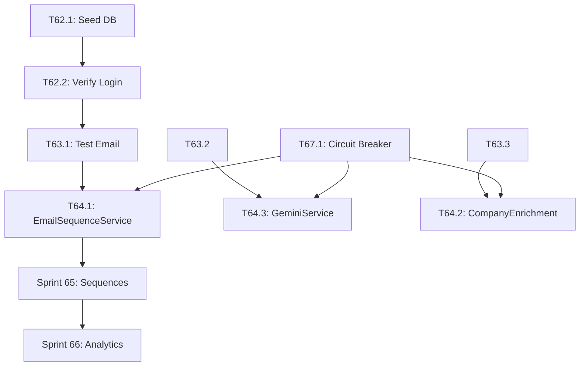

# YardFlow Platform Unification - Sprint Plan V8

## Executive Summary

YardFlow consists of **two platforms** that need to work together seamlessly:

| Platform | Repository | Deployment | Purpose |
|----------|------------|------------|---------|
| **GTM-YardFlow** | GTM-YardFlow | Vercel | Frontend React app with Firebase |
| **YardFlow-Hitlist** | YardFlow-Hitlist | Railway | Full backend with Postgres, Redis, SendGrid |

### Current State (2026-01-30)

**✅ Working:**
- Railway API proxy deployed (`/api/railway/*`)
- Health check passes (DB 2ms, Redis 0ms)
- Admin seed UI deployed (`/api/admin/seed`)
- Security fixes (P0) implemented

**🔄 In Progress:**
- Database seeding (need AUTH_SECRET)
- Login credential verification

**❌ Not Yet Done:**
- End-to-end email sending test
- Full platform integration testing
- Unified authentication flow

---

## Phase 1: Platform Stabilization (Sprints 62-64)

### Sprint 62: Database Seeding & Authentication
**Goal:** Establish working login credentials and verify authentication flow.
**Demo:** Login successfully at Railway app with seeded credentials.

#### T62.1: Seed Database via Admin UI [S - 15min]
**Validation:** 
- Navigate to https://gtm-yard-flow.vercel.app/api/admin/seed
- Enter first 16 chars of AUTH_SECRET from Railway Variables
- Verify response shows `"status": "success"`
**Test:** `curl https://yardflow-hitlist-production-2f41.up.railway.app/api/admin/seed` returns `users: 2`

#### T62.2: Verify Login Flow [S - 15min]
**Validation:**
- Navigate to https://yardflow-hitlist-production-2f41.up.railway.app/login
- Login with `casey@freightroll.com` / `FreightRoll2026!`
- Verify redirect to dashboard
**Test:** Session cookie is set, `/api/auth/session` returns user data

#### T62.3: Document Authentication Architecture [M - 2h]
**Files:** `docs/AUTH_ARCHITECTURE.md`
**Content:**
- NextAuth configuration in Railway
- Firebase Auth in Vercel
- Session handling differences
- Cookie/token flow between platforms
**Validation:** Document reviewed and committed

---

### Sprint 63: Email Infrastructure Verification
**Goal:** Verify emails can be sent end-to-end through Railway.
**Demo:** Send a test email and verify it arrives with tracking.

#### T63.1: Test Email Endpoint via Proxy [M - 1h]
**Files:** Create `scripts/test-email.ts`
**Steps:**
1. Login to Railway app (get session cookie)
2. Create a test outreach record
3. Call `/api/railway/outreach/send-email`
4. Verify SendGrid processes it
**Validation:** 
- Email received in inbox
- Open tracking pixel fires
- Click tracking works

#### T63.2: Test AI Content Generation [M - 1h]
**Files:** Create `scripts/test-ai-content.ts`
**Steps:**
1. Call `/api/railway/ai/content/generate`
2. Verify OpenAI returns content
3. Test with different personas/contexts
**Validation:** Content generated matches expected format

#### T63.3: Test Email Enrichment [M - 1h]
**Files:** Create `scripts/test-enrichment.ts`
**Steps:**
1. Call `/api/railway/enrichment/smart-guess`
2. Verify email patterns are detected
3. Test batch enrichment
**Validation:** Email addresses generated for known companies

#### T63.4: Verify Queue Processing [M - 1h]
**Steps:**
1. Check queue status at `/api/railway/health`
2. Enqueue a test job
3. Verify worker picks it up
**Validation:** Job completes, no jobs stuck in queue

---

### Sprint 64: Frontend Integration Points
**Goal:** Connect frontend features to Railway backend.
**Demo:** Use email/outreach features from GTM-YardFlow UI.

#### T64.1: Update EmailSequenceService to Use Railway [M - 2h]
**Files:** `src/services/EmailSequenceService.ts`
**Changes:**
- Replace Firebase-based email logic with RailwayEmailService
- Update sequence enrollment to use Railway API
- Add error handling for Railway failures
**Tests:** Unit tests for Railway API calls
**Validation:** Sequence enrollment works from UI

#### T64.2: Update CompanyEnrichmentService [M - 2h]
**Files:** `src/services/CompanyEnrichmentService.ts`
**Changes:**
- Add Railway enrichment as primary source
- Fall back to existing methods if Railway fails
- Cache enrichment results
**Tests:** Mock Railway responses, verify fallback
**Validation:** Company enrichment works from UI

#### T64.3: Update GeminiService to Use Railway AI [M - 2h]
**Files:** `src/services/GeminiService.ts`
**Changes:**
- Add Railway AI as alternative to Gemini
- Route AI content requests through Railway
- Handle rate limits gracefully
**Tests:** Mock Railway AI responses
**Validation:** AI-generated content appears in UI

#### T64.4: Create Integration Health Dashboard [L - 4h]
**Files:** `src/components/IntegrationHealth.tsx`
**Features:**
- Real-time Railway health status
- Queue depth monitoring
- Email sending stats
- Last sync timestamps
**Tests:** Component tests with mocked data
**Validation:** Dashboard shows accurate health data

---

## Phase 2: Feature Completion (Sprints 65-67)

### Sprint 65: Sequence Automation
**Goal:** Full outreach sequence automation with Railway backend.
**Demo:** Create sequence, enroll contacts, watch automated emails send.

#### T65.1: Sequence Creation UI [M - 3h]
**Files:** `src/components/SequenceBuilder.tsx`
**Features:**
- Multi-step sequence builder
- Channel selection (Email, LinkedIn, Phone)
- Delay configuration
- Template selection
**Validation:** Sequence saved to Railway DB

#### T65.2: Contact Enrollment Flow [M - 3h]
**Files:** `src/components/SequenceEnrollment.tsx`
**Features:**
- Bulk enrollment from hitlist
- Enrollment status display
- Pause/resume enrollment
- Unenroll contacts
**Validation:** Enrollments visible in Railway

#### T65.3: Sequence Analytics Dashboard [M - 3h]
**Files:** `src/components/SequenceAnalytics.tsx`
**Features:**
- Open/click rates per step
- Conversion funnel
- Best performing templates
- A/B test results
**Validation:** Analytics match Railway data

#### T65.4: Cron Job for Sequence Processing [M - 2h]
**Files:** `api/cron/process-sequences.ts`
**Features:**
- Trigger Railway sequence processor
- Handle CRON_SECRET authentication
- Log processing results
**Validation:** Sequences process on schedule

---

### Sprint 66: Advanced Analytics
**Goal:** Unified analytics across both platforms.
**Demo:** View comprehensive campaign analytics dashboard.

#### T66.1: Campaign Performance API [M - 2h]
**Files:** `api/analytics/campaigns.ts`
**Features:**
- Aggregate Railway + Firebase data
- Calculate ROI metrics
- Export analytics data
**Validation:** Analytics endpoint returns merged data

#### T66.2: Real-time Activity Feed [M - 3h]
**Files:** `src/components/ActivityFeed.tsx`
**Features:**
- Stream Railway activity events
- Email open/click notifications
- Sequence step completions
**Validation:** Events appear in real-time

#### T66.3: Predictive Analytics [L - 4h]
**Files:** `src/services/PredictiveAnalyticsService.ts`
**Features:**
- Best time to send emails
- Response likelihood scoring
- Optimal sequence timing
**Validation:** Predictions influence UI recommendations

---

### Sprint 67: Error Handling & Resilience
**Goal:** Graceful degradation when Railway is unavailable.
**Demo:** App works with reduced functionality when Railway is down.

#### T67.1: Circuit Breaker Pattern [M - 3h]
**Files:** `src/services/CircuitBreaker.ts`
**Features:**
- Track Railway failures
- Open circuit after N failures
- Auto-recovery after cooldown
**Tests:** Unit tests for all states

#### T67.2: Offline Mode for Email Features [M - 3h]
**Files:** `src/services/OfflineEmailQueue.ts`
**Features:**
- Queue emails when Railway down
- Sync when connection restored
- Show pending email count
**Tests:** Queue persistence tests

#### T67.3: Health Check Monitoring [M - 2h]
**Files:** `src/hooks/useRailwayHealth.ts`
**Features:**
- Periodic health checks
- Toast notifications on status change
- Degraded mode indicator
**Tests:** Mock health responses

---

## Phase 3: Polish & Production (Sprints 68-70)

### Sprint 68: Security Hardening
**Goal:** Production-ready security for both platforms.

#### T68.1: API Key Rotation [M - 2h]
**Files:** `docs/API_KEY_ROTATION.md`, scripts
**Features:**
- Document key rotation process
- Script to rotate Railway secrets
- Vercel env var update process

#### T68.2: Rate Limiting [M - 3h]
**Files:** `api/_middleware.ts`
**Features:**
- Per-IP rate limiting
- Per-user rate limiting for authenticated routes
- Graceful rate limit responses

#### T68.3: Security Audit [L - 4h]
**Steps:**
- Review all API endpoints
- Check for exposed secrets
- Verify authentication on all routes
- Document security model

---

### Sprint 69: Performance Optimization
**Goal:** Fast, responsive experience across platforms.

#### T69.1: API Response Caching [M - 3h]
**Files:** `src/services/CacheService.ts`
**Features:**
- Cache Railway responses
- Invalidation strategies
- Cache hit/miss metrics

#### T69.2: Lazy Load Railway Features [M - 2h]
**Files:** Update component imports
**Features:**
- Code split Railway-dependent features
- Load on demand
- Show loading states

#### T69.3: Connection Pooling [M - 2h]
**Files:** `api/_middleware.ts`
**Features:**
- Reuse Railway connections
- Connection timeout handling
- Connection health monitoring

---

### Sprint 70: Documentation & Handoff
**Goal:** Complete documentation for maintenance.

#### T70.1: Architecture Documentation [L - 4h]
**Files:** `docs/ARCHITECTURE.md`
**Content:**
- System diagram
- Data flow
- Component responsibilities
- Deployment process

#### T70.2: Runbook [M - 3h]
**Files:** `docs/RUNBOOK.md`
**Content:**
- Common issues and fixes
- Monitoring alerts
- Scaling procedures
- Rollback process

#### T70.3: API Documentation [M - 3h]
**Files:** `docs/api/README.md`
**Content:**
- All endpoints documented
- Request/response examples
- Error codes
- Rate limits

---

## Appendix A: Railway Backend Endpoints (Reference)

### Core APIs
| Endpoint | Method | Description |
|----------|--------|-------------|
| `/api/health` | GET | System health check |
| `/api/auth/[...nextauth]` | * | Authentication |
| `/api/admin/seed` | POST | Database seeding |

### Outreach & Email
| Endpoint | Method | Description |
|----------|--------|-------------|
| `/api/outreach/send-email` | POST | Send email via SendGrid |
| `/api/outreach/generate-ai` | POST | Generate AI content |
| `/api/outreach/export` | GET | Export outreach data |

### Enrichment
| Endpoint | Method | Description |
|----------|--------|-------------|
| `/api/enrichment/email` | POST | Single email enrichment |
| `/api/enrichment/smart-guess` | POST | Pattern-based email guess |
| `/api/enrichment/company/enrich` | POST | Company data enrichment |

### Sequences
| Endpoint | Method | Description |
|----------|--------|-------------|
| `/api/sequences` | GET/POST | List/create sequences |
| `/api/sequences/[id]/enroll` | POST | Enroll contacts |
| `/api/sequences/[id]/analytics` | GET | Sequence metrics |

### Analytics
| Endpoint | Method | Description |
|----------|--------|-------------|
| `/api/analytics/campaigns/[id]` | GET | Campaign analytics |
| `/api/analytics/funnel` | GET | Funnel metrics |
| `/api/analytics/heatmap` | GET | Activity heatmap |

---

## Appendix B: Environment Variables

### Vercel (GTM-YardFlow)
```bash
# Required
RAILWAY_API_URL=https://yardflow-hitlist-production-2f41.up.railway.app

# Optional (for direct Railway API calls with auth)
RAILWAY_API_SECRET=<shared-secret>

# Firebase (existing)
VITE_FIREBASE_API_KEY=...
VITE_FIREBASE_PROJECT_ID=...
```

### Railway (YardFlow-Hitlist)
```bash
# Database
DATABASE_URL=postgres://...
REDIS_URL=redis://...

# Auth
AUTH_SECRET=<long-secret-key>
CRON_SECRET=<cron-auth-secret>

# Email
SENDGRID_API_KEY=SG....
SENDGRID_FROM_EMAIL=outreach@yardflow.com

# AI
OPENAI_API_KEY=sk-...

# Optional
HUNTER_API_KEY=...
GOOGLE_CLIENT_ID=...
GOOGLE_CLIENT_SECRET=...
```

---

## Appendix C: Quick Commands

### Verify Railway Health
```bash
curl https://yardflow-hitlist-production-2f41.up.railway.app/api/health
```

### Verify Proxy Working
```bash
curl https://gtm-yard-flow.vercel.app/api/railway/health
```

### Seed Database (UI)
Navigate to: https://gtm-yard-flow.vercel.app/api/admin/seed

### Check Database State
```bash
curl https://yardflow-hitlist-production-2f41.up.railway.app/api/admin/seed
# Returns: {"status":"ok","counts":{"users":2,"events":2,"accounts":2615}}
```

---

## Definition of Done

### Per Task
- [ ] Code compiles without errors
- [ ] All new code has tests (or documented validation)
- [ ] All tests pass
- [ ] Feature works in browser
- [ ] Changes committed with descriptive message

### Per Sprint
- [ ] All tasks complete
- [ ] E2E validation passing
- [ ] Demo recorded or live demo works
- [ ] Deployed to staging/production
- [ ] Documentation updated

---

## Changelog

| Date | Sprint | Changes |
|------|--------|---------|
| 2026-01-30 | 61 | Railway integration, proxy, security fixes |
| 2026-01-30 | 62 | Admin seed UI deployed |

---

## Sprint Plan Review (2026-01-30)

### 1. Overall Assessment: **Needs Improvement** ⚠️

The sprint plan is well-structured and covers the essential integration points between GTM-YardFlow (Vercel) and YardFlow-Hitlist (Railway). However, there are gaps in atomicity, missing validation criteria, and some high-risk dependencies that need addressing.

---

### 2. Strengths ✅

| Strength | Details |
|----------|---------|
| **Clear Platform Delineation** | Excellent table distinguishing Railway vs Vercel responsibilities |
| **Phased Approach** | Logical progression from Stabilization → Feature Completion → Polish |
| **Working Current State** | Good documentation of what's already working (proxy, health checks) |
| **Comprehensive Appendices** | Railway endpoints, environment variables, and quick commands are well documented |
| **Definition of Done** | Clear checklist for task and sprint completion |
| **Existing RailwayEmailService** | Already have [RailwayEmailService.ts](src/services/RailwayEmailService.ts) (215 lines) ready for integration |

---

### 3. Gaps Identified 🔍

#### 3.1 Missing Tasks

| Gap | Recommended Task | Sprint |
|-----|------------------|--------|
| **No test for RailwayEmailService** | Add `T63.5: Create RailwayEmailService unit tests` with mocked fetch | 63 |
| **No TypeScript types for Railway API** | Add `T63.0: Create Railway API TypeScript types` from Appendix A | 63 |
| **Missing error logging infrastructure** | Add `T67.4: Implement centralized error logging for Railway failures` | 67 |
| **No migration path documentation** | Add `T70.4: Document Firebase → Railway data migration` | 70 |
| **No rollback strategy** | Add `T68.4: Create rollback scripts for Railway integration` | 68 |
| **Missing E2E tests for integrated flow** | Add `T64.5: E2E test for email sending via Railway proxy` | 64 |
| **No health check UI component** | Integration health should show in UI before Sprint 64.4 | 63 |
| **No ALLOWED_PATHS update plan** | Proxy at [api/railway/[...path].ts](api/railway/[...path].ts#L24-L33) needs updating as features expand | 63-65 |

#### 3.2 Missing Sprints/Phases

| Phase Gap | Recommendation |
|-----------|----------------|
| **Beta Testing Phase** | Add Sprint 70.5 for beta user testing before full production |
| **Monitoring/Alerting Setup** | Add tasks for DataDog/Sentry integration |
| **Feature Flag System** | Add gradual rollout capability for Railway features |

---

### 4. Task Improvements 📝

#### Sprint 62: Database Seeding & Authentication

| Task | Issue | Improvement |
|------|-------|-------------|
| **T62.1** | Not atomic - combines UI navigation + verification | Split into: `T62.1a: Seed database via admin UI` and `T62.1b: Verify seed succeeded via curl` |
| **T62.2** | Validation too vague - "Session cookie is set" | Add specific validation: `document.cookie.includes('next-auth.session')` or use DevTools check |
| **T62.3** | Size [M - 2h] but only documentation | Reduce to [S - 1h] or add actual code implementation |

#### Sprint 63: Email Infrastructure Verification

| Task | Issue | Improvement |
|------|-------|-------------|
| **T63.1** | No test file location specified | Specify `scripts/test-email.ts` should use existing `RailwayEmailService` functions |
| **T63.2** | References `api/railway/ai/content/generate` but not in ALLOWED_PATHS | Add to ALLOWED_PATHS in [api/railway/[...path].ts](api/railway/[...path].ts#L24-L33) first |
| **T63.4** | Missing specific queue job verification | Add: `curl /api/railway/health` response should show non-zero processed count |
| **All T63.x** | No rollback plan if tests fail | Add: "Fallback: Document failure and create bug ticket" |

#### Sprint 64: Frontend Integration Points

| Task | Issue | Improvement |
|------|-------|-------------|
| **T64.1** | Says "Replace Firebase-based email logic" but [EmailSequenceService.ts](src/services/EmailSequenceService.ts) doesn't use Firebase directly | Clarify: "Integrate RailwayEmailService for sending, keep local sequence logic" |
| **T64.2** | CompanyEnrichmentService already exists (554 lines) | Change to: "Add Railway enrichment as **additional** source, not replacement" |
| **T64.3** | GeminiService is for AI content, not general AI | Rename: "Create RailwayAIService adapter" to avoid confusion |
| **T64.4** | Size [L - 4h] too large for single task | Split: `T64.4a: Health status component` [M - 2h], `T64.4b: Queue monitoring` [M - 2h] |

#### Sprint 65: Sequence Automation

| Task | Issue | Improvement |
|------|-------|-------------|
| **T65.1-T65.3** | All [M - 3h] but no shared components mentioned | Add: "Reuse existing sequence types from [types/emailSequence.ts](src/types/emailSequence.ts)" |
| **T65.4** | Duplicates existing [process-queue.ts](api/cron/process-queue.ts) | Change to: "Extend process-queue.ts to call Railway sequence processor" |

#### Sprint 66: Advanced Analytics

| Task | Issue | Improvement |
|------|-------|-------------|
| **T66.3** | Predictive analytics [L - 4h] is too ambitious | Defer to Phase 4 or mark as "Stretch Goal" |
| **T66.1** | Missing dependency on Firebase/Railway data sync | Add prerequisite: "Requires T64.x integration complete" |

#### Sprint 67: Error Handling & Resilience

| Task | Issue | Improvement |
|------|-------|-------------|
| **T67.1** | CircuitBreaker is standard pattern but no library mentioned | Recommend: Use `opossum` or implement minimal version |
| **T67.2** | Conflicts with existing [OfflineQueue.ts](src/services/OfflineQueue.ts) (378 lines) | Change to: "Extend OfflineQueue to handle Railway email operations" |

#### Sprint 68: Security Hardening

| Task | Issue | Improvement |
|------|-------|-------------|
| **T68.2** | Rate limiting already partially in [_middleware.ts](api/_middleware.ts#L40-L42) | Change to: "Implement actual rate limiting (current is headers only)" |
| **T68.3** | [L - 4h] security audit too vague | Break into: `T68.3a: API endpoint audit`, `T68.3b: Secret rotation audit`, `T68.3c: Auth flow audit` |

#### Sprint 69: Performance Optimization

| Task | Issue | Improvement |
|------|-------|-------------|
| **T69.3** | "Connection Pooling" in middleware doesn't make sense for serverless | Remove or change to: "Connection reuse via keep-alive headers" |

#### Sprint 70: Documentation & Handoff

| Task | Issue | Improvement |
|------|-------|-------------|
| **All tasks** | No review/approval step | Add: "Reviewed by team lead before marking complete" |

---

### 5. Dependency Issues 🔗

#### 5.1 Implicit Dependencies Not Documented



#### 5.2 Circular/Unclear Dependencies

| Issue | Resolution |
|-------|------------|
| T67.1 (Circuit Breaker) should come **before** T64.x (Service Integration) | Move T67.1 to Sprint 63 or early Sprint 64 |
| T68.2 (Rate Limiting) needed before production but after feature completion | Keep in Sprint 68 but mark as "blocking for production" |
| T64.4 (Integration Health) depends on T64.1-3 but provides debugging for them | Create minimal health check earlier (Sprint 63) |

#### 5.3 Cross-Repository Dependencies

| Task | Railway Requirement | Status |
|------|---------------------|--------|
| T63.1 | Railway auth working | ⚠️ Needs T62.2 first |
| T63.2 | `/api/ai/content/generate` endpoint | ⚠️ Verify exists on Railway |
| T65.x | Sequence CRUD APIs | ⚠️ Verify Railway schemas match frontend types |
| T66.1 | Analytics aggregation APIs | ⚠️ May need Railway-side work |

---

### 6. Risk Assessment ⚠️

#### 6.1 High-Risk Items

| Risk | Impact | Probability | Mitigation |
|------|--------|-------------|------------|
| **AUTH_SECRET mismatch** | Blocks all authenticated calls | Medium | Document exact format, add validation in T62.1 |
| **Railway rate limits** | Email sending fails at scale | Medium | Implement Circuit Breaker (T67.1) earlier |
| **Type mismatches** | Runtime errors in production | High | Add T63.0 for shared TypeScript types |
| **Proxy timeout (30s)** | Long operations fail | Medium | Add retry logic to RailwayEmailService |
| **No rollback path** | Stuck with broken integration | High | Add rollback documentation in T68.4 |
| **ALLOWED_PATHS gaps** | New features blocked by 403s | High | Create ALLOWED_PATHS update checklist |

#### 6.2 Medium-Risk Items

| Risk | Impact | Mitigation |
|------|--------|------------|
| Firebase ↔ Railway data inconsistency | Duplicate/missing data | Add sync verification task |
| Vercel cold starts | First request slow | Use Railway for time-critical paths |
| Redis connection limits | Queue processing fails | Monitor in Integration Health dashboard |

---

### 7. Recommended Additions ➕

#### New Task: T63.0 (Add to Sprint 63 start)
```markdown
#### T63.0: Create Railway API TypeScript Types [M - 1h]
**Files:** `src/types/railway.ts`
**Content:**
- Types for all Railway API responses
- Request types for send-email, enrichment, sequences
- Health check response type
- Error response types
**Validation:** `npm run typecheck` passes
```

#### New Task: T63.5 (Add to Sprint 63 end)
```markdown
#### T63.5: RailwayEmailService Unit Tests [M - 2h]
**Files:** `src/__tests__/services/RailwayEmailService.test.ts`
**Tests:**
- Mock fetch for health check
- Mock fetch for send email (success/failure)
- Test error handling for network failures
- Test timeout handling
**Validation:** `npm test -- RailwayEmailService`
```

#### New Task: T67.0 (Add to Sprint 67 start)
```markdown
#### T67.0: Move Circuit Breaker Pattern Earlier [S - 30min]
**Action:** If T67.1 not already complete, prioritize before T64.x
**Rationale:** Services should use circuit breaker from the start
```

#### New Sprint: Sprint 70.5 (After Sprint 70)
```markdown
### Sprint 70.5: Beta Testing & Validation
**Goal:** Validate full integration with real users.

#### T70.5.1: Internal Beta [M - 4h]
- Deploy to staging with feature flags
- Internal team tests all flows
- Document issues found

#### T70.5.2: Fix Beta Issues [Variable]
- Address critical issues from beta

#### T70.5.3: Production Rollout [M - 2h]
- Gradual rollout (10% → 50% → 100%)
- Monitor error rates
- Rollback if needed
```

---

### 8. Priority Reordering 🔄

#### Recommended Sprint Reordering

```
CURRENT:
Sprint 64: Frontend Integration (T64.1-4)
Sprint 67: Error Handling (T67.1-3)

RECOMMENDED:
Sprint 64:
  - T67.1: Circuit Breaker (moved from 67) ← FIRST
  - T64.1-3: Service Integration
  - T64.4a: Basic Health Status
Sprint 65: (unchanged)
Sprint 66: (unchanged)  
Sprint 67:
  - T67.2: Offline Email Queue
  - T67.3: Health Check Monitoring
  - T64.4b: Queue Monitoring (moved from 64)
```

#### Recommended Task Reordering Within Sprints

**Sprint 63:**
1. T63.0: Create Railway types (NEW) ← Add first
2. T63.4: Verify Queue Processing ← Move earlier
3. T63.1: Test Email Endpoint
4. T63.2: Test AI Content
5. T63.3: Test Enrichment
6. T63.5: Unit tests (NEW) ← Add last

**Sprint 68:**
1. T68.3: Security Audit ← Move first (informs other tasks)
2. T68.1: API Key Rotation
3. T68.2: Rate Limiting
4. T68.4: Rollback Scripts (NEW)

---

### 9. Validation Checklist 📋

Before marking each sprint complete, verify:

**Sprint 62:**
- [ ] Can login at Railway with seeded credentials
- [ ] Session persists across page refresh
- [ ] AUTH_ARCHITECTURE.md committed

**Sprint 63:**
- [ ] Test email received in inbox
- [ ] Open/click tracking fires
- [ ] AI content generates without error
- [ ] Email enrichment returns results
- [ ] All test scripts in `/scripts/` committed

**Sprint 64:**
- [ ] Email sending works from GTM-YardFlow UI
- [ ] Enrichment works from GTM-YardFlow UI
- [ ] AI content works from GTM-YardFlow UI
- [ ] Integration health shows in UI
- [ ] All services have error handling

**Sprint 65-70:**
- [ ] (Create similar checklists as tasks are refined)

---

### 10. Summary of Critical Actions

| Priority | Action | Effort |
|----------|--------|--------|
| 🔴 P0 | Add T63.0 (Railway TypeScript types) | 1h |
| 🔴 P0 | Move T67.1 (Circuit Breaker) to Sprint 64 | 30min |
| 🔴 P0 | Update ALLOWED_PATHS for all used endpoints | 30min |
| 🟠 P1 | Add T63.5 (RailwayEmailService tests) | 2h |
| 🟠 P1 | Split T64.4 into smaller tasks | 15min |
| 🟠 P1 | Add rollback documentation task | 15min |
| 🟡 P2 | Add Sprint 70.5 (Beta Testing) | 30min |
| 🟡 P2 | Create validation checklists for all sprints | 1h |

---

*Review completed: 2026-01-30*
*Reviewer: GitHub Copilot (Claude Opus 4.5)*

---

## Sprint Plan Review (Subagent Analysis)

### Overall Assessment: ⚠️ Needs Improvement

### Strengths ✅
1. Well-structured phased approach (Stabilization → Features → Polish)
2. Clear platform separation documentation
3. Comprehensive appendices with endpoints and environment variables
4. Good use of validation criteria per task
5. Admin seed UI already deployed and working

### Critical Gaps Identified 🔴

| Gap | Impact | Suggested Fix |
|-----|--------|---------------|
| No TypeScript types for Railway API | Type mismatches, runtime errors | Add T63.0: Railway API Types |
| No unit tests for RailwayEmailService | Untested critical path | Add T63.5: Unit tests |
| Circuit Breaker comes after integration | Services fail hard before resilience | Move T67.1 to Sprint 64 |
| ALLOWED_PATHS hardcoded | New features blocked | Add dynamic path config |
| No rollback strategy | Can't recover from bad deploy | Add rollback scripts |
| No beta testing phase | Users hit production bugs | Add Sprint 70.5 |

### Dependency Issues 🔗

```
Current (Problematic):
Sprint 64 (Integration) → Sprint 67 (Circuit Breaker)
                          ↓
                Services crash when Railway down

Fixed Order:
Sprint 63.5 (Types) → Sprint 64.0 (Circuit Breaker) → Sprint 64 (Integration)
```

### High-Risk Items ⚠️

| Risk | Likelihood | Impact | Mitigation |
|------|------------|--------|------------|
| AUTH_SECRET format mismatch | Medium | High | Document exact format, add validation |
| Type mismatches | High | Medium | Generate types from Railway schemas |
| No gradual rollout | Medium | High | Add feature flags, beta group |
| Railway downtime during demo | Low | Critical | Circuit breaker + offline mode |

### Recommended Task Additions

#### T63.0: Create Railway API TypeScript Types [M - 2h]
**Files:** `src/types/railway.ts`
**Content:**
```typescript
// Health response
export interface RailwayHealthResponse { ... }

// Outreach
export interface SendEmailRequest { ... }
export interface SendEmailResponse { ... }

// Enrichment  
export interface EnrichmentRequest { ... }
export interface EnrichmentResponse { ... }
```
**Validation:** Types used in RailwayEmailService without `any`

#### T63.5: RailwayEmailService Unit Tests [M - 2h]
**Files:** `src/__tests__/services/RailwayEmailService.test.ts`
**Tests:**
- `checkRailwayHealth` returns typed response
- `sendEmailViaRailway` handles success/failure
- `generateAIContent` parses response correctly
- All functions handle network errors
**Validation:** `npm test RailwayEmailService` passes

#### T68.4: Rollback Scripts [S - 1h]
**Files:** `scripts/rollback.sh`
**Features:**
- Revert to previous Vercel deployment
- Reset Railway to known good state
- Clear problematic queue jobs
**Validation:** Script tested in staging

#### Sprint 70.5: Beta Testing [M - 3h]
**Tasks:**
- Deploy to beta subdomain
- Create beta user group
- Collect feedback form
- Fix critical issues before production

### Priority Reordering

**Original Order:**
1. Sprint 64: Integration → Sprint 67: Resilience

**Recommended Order:**
1. Sprint 63: Add types, tests
2. Sprint 64: Add Circuit Breaker FIRST
3. Sprint 64: Then integrate services
4. Sprint 67: Enhance resilience

### Task Refinements

| Original Task | Issue | Refined Version |
|---------------|-------|-----------------|
| T64.4 (Health Dashboard - 4h) | Too large | Split: T64.4a (UI - 2h) + T64.4b (Data - 2h) |
| T68.3 (Security Audit - 4h) | Not atomic | Split: T68.3a (API review) + T68.3b (Auth review) + T68.3c (Secrets audit) |
| T70.1 (Architecture - 4h) | Could block handoff | Start earlier, iterative updates |

---

## Revised Sprint Order (Post-Review)

### Phase 1: Platform Stabilization
- **Sprint 62:** Database Seeding & Authentication ✅
- **Sprint 63:** Email Verification + Types + Tests (UPDATED)
- **Sprint 64:** Circuit Breaker FIRST, then Integration (REORDERED)

### Phase 2: Feature Completion  
- **Sprint 65:** Sequence Automation
- **Sprint 66:** Advanced Analytics
- **Sprint 67:** Enhanced Resilience (moved from critical path)

### Phase 3: Polish & Production
- **Sprint 68:** Security Hardening + Rollback Scripts
- **Sprint 69:** Performance Optimization
- **Sprint 70:** Documentation
- **Sprint 70.5:** Beta Testing (NEW)
- **Sprint 71:** Production Launch

