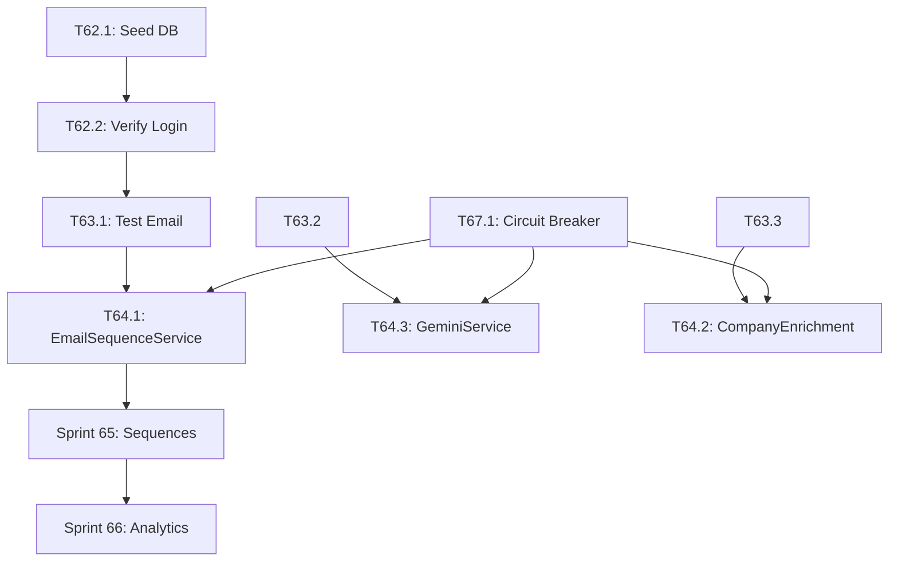

# YardFlow Platform Unification - Sprint Plan V8

## Executive Summary

YardFlow consists of **two platforms** that need to work together seamlessly:

| Platform | Repository | Deployment | Purpose |
|----------|------------|------------|---------|
| **GTM-YardFlow** | GTM-YardFlow | Vercel | Frontend React app with Firebase |
| **YardFlow-Hitlist** | YardFlow-Hitlist | Railway | Full backend with Postgres, Redis, SendGrid |

### Current State (2026-01-30)

**✅ Working:**
- Railway API proxy deployed (`/api/railway/*`)
- Health check passes (DB 2ms, Redis 0ms)
- Admin seed UI deployed (`/api/admin/seed`)
- Security fixes (P0) implemented

**🔄 In Progress:**
- Database seeding (need AUTH_SECRET)
- Login credential verification

**❌ Not Yet Done:**
- End-to-end email sending test
- Full platform integration testing
- Unified authentication flow

---

## Phase 1: Platform Stabilization (Sprints 62-64)

### Sprint 62: Database Seeding & Authentication
**Goal:** Establish working login credentials and verify authentication flow.
**Demo:** Login successfully at Railway app with seeded credentials.

#### T62.1: Seed Database via Admin UI [S - 15min]
**Validation:** 
- Navigate to https://gtm-yard-flow.vercel.app/api/admin/seed
- Enter first 16 chars of AUTH_SECRET from Railway Variables
- Verify response shows `"status": "success"`
**Test:** `curl https://yardflow-hitlist-production-2f41.up.railway.app/api/admin/seed` returns `users: 2`

#### T62.2: Verify Login Flow [S - 15min]
**Validation:**
- Navigate to https://yardflow-hitlist-production-2f41.up.railway.app/login
- Login with `casey@freightroll.com` / `FreightRoll2026!`
- Verify redirect to dashboard
**Test:** Session cookie is set, `/api/auth/session` returns user data

#### T62.3: Document Authentication Architecture [M - 2h]
**Files:** `docs/AUTH_ARCHITECTURE.md`
**Content:**
- NextAuth configuration in Railway
- Firebase Auth in Vercel
- Session handling differences
- Cookie/token flow between platforms
**Validation:** Document reviewed and committed

---

### Sprint 63: Email Infrastructure Verification
**Goal:** Verify emails can be sent end-to-end through Railway.
**Demo:** Send a test email and verify it arrives with tracking.

#### T63.1: Test Email Endpoint via Proxy [M - 1h]
**Files:** Create `scripts/test-email.ts`
**Steps:**
1. Login to Railway app (get session cookie)
2. Create a test outreach record
3. Call `/api/railway/outreach/send-email`
4. Verify SendGrid processes it
**Validation:** 
- Email received in inbox
- Open tracking pixel fires
- Click tracking works

#### T63.2: Test AI Content Generation [M - 1h]
**Files:** Create `scripts/test-ai-content.ts`
**Steps:**
1. Call `/api/railway/ai/content/generate`
2. Verify OpenAI returns content
3. Test with different personas/contexts
**Validation:** Content generated matches expected format

#### T63.3: Test Email Enrichment [M - 1h]
**Files:** Create `scripts/test-enrichment.ts`
**Steps:**
1. Call `/api/railway/enrichment/smart-guess`
2. Verify email patterns are detected
3. Test batch enrichment
**Validation:** Email addresses generated for known companies

#### T63.4: Verify Queue Processing [M - 1h]
**Steps:**
1. Check queue status at `/api/railway/health`
2. Enqueue a test job
3. Verify worker picks it up
**Validation:** Job completes, no jobs stuck in queue

---

### Sprint 64: Frontend Integration Points
**Goal:** Connect frontend features to Railway backend.
**Demo:** Use email/outreach features from GTM-YardFlow UI.

#### T64.1: Update EmailSequenceService to Use Railway [M - 2h]
**Files:** `src/services/EmailSequenceService.ts`
**Changes:**
- Replace Firebase-based email logic with RailwayEmailService
- Update sequence enrollment to use Railway API
- Add error handling for Railway failures
**Tests:** Unit tests for Railway API calls
**Validation:** Sequence enrollment works from UI

#### T64.2: Update CompanyEnrichmentService [M - 2h]
**Files:** `src/services/CompanyEnrichmentService.ts`
**Changes:**
- Add Railway enrichment as primary source
- Fall back to existing methods if Railway fails
- Cache enrichment results
**Tests:** Mock Railway responses, verify fallback
**Validation:** Company enrichment works from UI

#### T64.3: Update GeminiService to Use Railway AI [M - 2h]
**Files:** `src/services/GeminiService.ts`
**Changes:**
- Add Railway AI as alternative to Gemini
- Route AI content requests through Railway
- Handle rate limits gracefully
**Tests:** Mock Railway AI responses
**Validation:** AI-generated content appears in UI

#### T64.4: Create Integration Health Dashboard [L - 4h]
**Files:** `src/components/IntegrationHealth.tsx`
**Features:**
- Real-time Railway health status
- Queue depth monitoring
- Email sending stats
- Last sync timestamps
**Tests:** Component tests with mocked data
**Validation:** Dashboard shows accurate health data

---

## Phase 2: Feature Completion (Sprints 65-67)

### Sprint 65: Sequence Automation
**Goal:** Full outreach sequence automation with Railway backend.
**Demo:** Create sequence, enroll contacts, watch automated emails send.

#### T65.1: Sequence Creation UI [M - 3h]
**Files:** `src/components/SequenceBuilder.tsx`
**Features:**
- Multi-step sequence builder
- Channel selection (Email, LinkedIn, Phone)
- Delay configuration
- Template selection
**Validation:** Sequence saved to Railway DB

#### T65.2: Contact Enrollment Flow [M - 3h]
**Files:** `src/components/SequenceEnrollment.tsx`
**Features:**
- Bulk enrollment from hitlist
- Enrollment status display
- Pause/resume enrollment
- Unenroll contacts
**Validation:** Enrollments visible in Railway

#### T65.3: Sequence Analytics Dashboard [M - 3h]
**Files:** `src/components/SequenceAnalytics.tsx`
**Features:**
- Open/click rates per step
- Conversion funnel
- Best performing templates
- A/B test results
**Validation:** Analytics match Railway data

#### T65.4: Cron Job for Sequence Processing [M - 2h]
**Files:** `api/cron/process-sequences.ts`
**Features:**
- Trigger Railway sequence processor
- Handle CRON_SECRET authentication
- Log processing results
**Validation:** Sequences process on schedule

---

### Sprint 66: Advanced Analytics
**Goal:** Unified analytics across both platforms.
**Demo:** View comprehensive campaign analytics dashboard.

#### T66.1: Campaign Performance API [M - 2h]
**Files:** `api/analytics/campaigns.ts`
**Features:**
- Aggregate Railway + Firebase data
- Calculate ROI metrics
- Export analytics data
**Validation:** Analytics endpoint returns merged data

#### T66.2: Real-time Activity Feed [M - 3h]
**Files:** `src/components/ActivityFeed.tsx`
**Features:**
- Stream Railway activity events
- Email open/click notifications
- Sequence step completions
**Validation:** Events appear in real-time

#### T66.3: Predictive Analytics [L - 4h]
**Files:** `src/services/PredictiveAnalyticsService.ts`
**Features:**
- Best time to send emails
- Response likelihood scoring
- Optimal sequence timing
**Validation:** Predictions influence UI recommendations

---

### Sprint 67: Error Handling & Resilience
**Goal:** Graceful degradation when Railway is unavailable.
**Demo:** App works with reduced functionality when Railway is down.

#### T67.1: Circuit Breaker Pattern [M - 3h]
**Files:** `src/services/CircuitBreaker.ts`
**Features:**
- Track Railway failures
- Open circuit after N failures
- Auto-recovery after cooldown
**Tests:** Unit tests for all states

#### T67.2: Offline Mode for Email Features [M - 3h]
**Files:** `src/services/OfflineEmailQueue.ts`
**Features:**
- Queue emails when Railway down
- Sync when connection restored
- Show pending email count
**Tests:** Queue persistence tests

#### T67.3: Health Check Monitoring [M - 2h]
**Files:** `src/hooks/useRailwayHealth.ts`
**Features:**
- Periodic health checks
- Toast notifications on status change
- Degraded mode indicator
**Tests:** Mock health responses

---

## Phase 3: Polish & Production (Sprints 68-70)

### Sprint 68: Security Hardening
**Goal:** Production-ready security for both platforms.

#### T68.1: API Key Rotation [M - 2h]
**Files:** `docs/API_KEY_ROTATION.md`, scripts
**Features:**
- Document key rotation process
- Script to rotate Railway secrets
- Vercel env var update process

#### T68.2: Rate Limiting [M - 3h]
**Files:** `api/_middleware.ts`
**Features:**
- Per-IP rate limiting
- Per-user rate limiting for authenticated routes
- Graceful rate limit responses

#### T68.3: Security Audit [L - 4h]
**Steps:**
- Review all API endpoints
- Check for exposed secrets
- Verify authentication on all routes
- Document security model

---

### Sprint 69: Performance Optimization
**Goal:** Fast, responsive experience across platforms.

#### T69.1: API Response Caching [M - 3h]
**Files:** `src/services/CacheService.ts`
**Features:**
- Cache Railway responses
- Invalidation strategies
- Cache hit/miss metrics

#### T69.2: Lazy Load Railway Features [M - 2h]
**Files:** Update component imports
**Features:**
- Code split Railway-dependent features
- Load on demand
- Show loading states

#### T69.3: Connection Pooling [M - 2h]
**Files:** `api/_middleware.ts`
**Features:**
- Reuse Railway connections
- Connection timeout handling
- Connection health monitoring

---

### Sprint 70: Documentation & Handoff
**Goal:** Complete documentation for maintenance.

#### T70.1: Architecture Documentation [L - 4h]
**Files:** `docs/ARCHITECTURE.md`
**Content:**
- System diagram
- Data flow
- Component responsibilities
- Deployment process

#### T70.2: Runbook [M - 3h]
**Files:** `docs/RUNBOOK.md`
**Content:**
- Common issues and fixes
- Monitoring alerts
- Scaling procedures
- Rollback process

#### T70.3: API Documentation [M - 3h]
**Files:** `docs/api/README.md`
**Content:**
- All endpoints documented
- Request/response examples
- Error codes
- Rate limits

---

## Appendix A: Railway Backend Endpoints (Reference)

### Core APIs
| Endpoint | Method | Description |
|----------|--------|-------------|
| `/api/health` | GET | System health check |
| `/api/auth/[...nextauth]` | * | Authentication |
| `/api/admin/seed` | POST | Database seeding |

### Outreach & Email
| Endpoint | Method | Description |
|----------|--------|-------------|
| `/api/outreach/send-email` | POST | Send email via SendGrid |
| `/api/outreach/generate-ai` | POST | Generate AI content |
| `/api/outreach/export` | GET | Export outreach data |

### Enrichment
| Endpoint | Method | Description |
|----------|--------|-------------|
| `/api/enrichment/email` | POST | Single email enrichment |
| `/api/enrichment/smart-guess` | POST | Pattern-based email guess |
| `/api/enrichment/company/enrich` | POST | Company data enrichment |

### Sequences
| Endpoint | Method | Description |
|----------|--------|-------------|
| `/api/sequences` | GET/POST | List/create sequences |
| `/api/sequences/[id]/enroll` | POST | Enroll contacts |
| `/api/sequences/[id]/analytics` | GET | Sequence metrics |

### Analytics
| Endpoint | Method | Description |
|----------|--------|-------------|
| `/api/analytics/campaigns/[id]` | GET | Campaign analytics |
| `/api/analytics/funnel` | GET | Funnel metrics |
| `/api/analytics/heatmap` | GET | Activity heatmap |

---

## Appendix B: Environment Variables

### Vercel (GTM-YardFlow)
```bash
# Required
RAILWAY_API_URL=https://yardflow-hitlist-production-2f41.up.railway.app

# Optional (for direct Railway API calls with auth)
RAILWAY_API_SECRET=<shared-secret>

# Firebase (existing)
VITE_FIREBASE_API_KEY=...
VITE_FIREBASE_PROJECT_ID=...
```

### Railway (YardFlow-Hitlist)
```bash
# Database
DATABASE_URL=postgres://...
REDIS_URL=redis://...

# Auth
AUTH_SECRET=<long-secret-key>
CRON_SECRET=<cron-auth-secret>

# Email
SENDGRID_API_KEY=SG....
SENDGRID_FROM_EMAIL=outreach@yardflow.com

# AI
OPENAI_API_KEY=sk-...

# Optional
HUNTER_API_KEY=...
GOOGLE_CLIENT_ID=...
GOOGLE_CLIENT_SECRET=...
```

---

## Appendix C: Quick Commands

### Verify Railway Health
```bash
curl https://yardflow-hitlist-production-2f41.up.railway.app/api/health
```

### Verify Proxy Working
```bash
curl https://gtm-yard-flow.vercel.app/api/railway/health
```

### Seed Database (UI)
Navigate to: https://gtm-yard-flow.vercel.app/api/admin/seed

### Check Database State
```bash
curl https://yardflow-hitlist-production-2f41.up.railway.app/api/admin/seed
# Returns: {"status":"ok","counts":{"users":2,"events":2,"accounts":2615}}
```

---

## Definition of Done

### Per Task
- [ ] Code compiles without errors
- [ ] All new code has tests (or documented validation)
- [ ] All tests pass
- [ ] Feature works in browser
- [ ] Changes committed with descriptive message

### Per Sprint
- [ ] All tasks complete
- [ ] E2E validation passing
- [ ] Demo recorded or live demo works
- [ ] Deployed to staging/production
- [ ] Documentation updated

---

## Changelog

| Date | Sprint | Changes |
|------|--------|---------|
| 2026-01-30 | 61 | Railway integration, proxy, security fixes |
| 2026-01-30 | 62 | Admin seed UI deployed |
| 2026-01-30 | 72-76 | Jake Workflow Sprints added (Company-centric research & outreach) |

---

## Phase 4: Jake Workflow - Intelligent Outreach Automation (Sprints 72-76)

### Problem Statement

The current UI is **person-centric** but Jake needs a **company-centric workflow**:

1. **Too many targets** - 5,409 prospects is overwhelming
2. **Missing critical data** - Need facility count, gate bottleneck, shipping volume
3. **No prioritization** - Can't quickly identify Primo-like accounts (60+ facilities)
4. **Manual research** - Jake has to research each company manually
5. **Slow outreach** - Jake sends 3 emails/day instead of 30+

### Solution Architecture

```
┌─────────────────────────────────────────────────────────────────────────────┐
│                        JAKE'S WORKFLOW                                       │
├─────────────────────────────────────────────────────────────────────────────┤
│                                                                              │
│  ┌─────────────┐    ┌─────────────┐    ┌─────────────┐    ┌─────────────┐  │
│  │  COMPANY    │    │   AI        │    │   ROI       │    │  OUTREACH   │  │
│  │  RESEARCH   │ => │  ENRICHMENT │ => │  SCORING    │ => │  QUEUE      │  │
│  │  VIEW       │    │  (Gemini)   │    │  (Primo-    │    │  (Approve/  │  │
│  │             │    │             │    │  like)      │    │  Send)      │  │
│  └─────────────┘    └─────────────┘    └─────────────┘    └─────────────┘  │
│                                                                              │
│  Key Data Points:                                                            │
│  ✓ Facility Count (60+ = high priority)                                     │
│  ✓ Gate Bottleneck (Yes/No/Unknown)                                         │
│  ✓ Shipping Volume (trucks/day)                                             │
│  ✓ ROI Potential ($X/facility × N facilities)                               │
│  ✓ Industry Match (beverage, CPG, food = best fit)                          │
│                                                                              │
└─────────────────────────────────────────────────────────────────────────────┘
```

### Primo Brands Reference (ICP Benchmark)

| Metric | Primo Brands Value | What Makes Them Ideal |
|--------|-------------------|----------------------|
| Facilities | 260 | More facilities = more network value |
| Industry | Beverage/Water | High-volume, tight margins |
| Gate Bottleneck | Yes | Gates are #1 constraint |
| Trucks/Day | 500+ | High volume = high ROI |
| ROI | $1M+/facility | Proven at 25 facilities, rolling to 260 |

---

### Sprint 72: Company-Centric View
**Goal:** Transform hitlist from person-centric to company-centric with key metrics visible.
**Demo:** View all 5,409 targets grouped by company, sorted by Primo-like score.

#### T72.1: Create CompanyListView Component [L - 4h]
**Files:** `src/components/CompanyListView.tsx`
**Features:**
- Aggregate prospects by company name
- Show columns: Company, Tier, Contacts, Facilities, Gate?, Industry, Score
- Sort by: Score, Facilities, Contacts
- Click to expand → show contacts at that company
**Tests:** Component tests with mock data
**Validation:** List shows ~500 unique companies from 5,409 prospects

```typescript
interface CompanyRow {
  company: string;
  tier: 'Tier 1' | 'Tier 2' | 'Tier 3' | 'Tier 4';
  contactCount: number;
  facilityCount: number | null;
  hasGateBottleneck: boolean | null;
  industryCategory: string | null;
  estimatedTruckVolume: number | null;
  primoLookalikeScore: number;
  roiPotential: number | null;
  contacts: Prospect[];
}
```

#### T72.2: Add Company/Person View Toggle [S - 1h]
**Files:** `src/App.tsx`
**Changes:**
- Add toggle in header: "Companies | Contacts"
- Default to Companies view
- Persist preference in localStorage
**Validation:** Toggle switches between views smoothly

#### T72.3: Create CompanyDetailPanel Component [M - 3h]
**Files:** `src/components/CompanyDetailPanel.tsx`
**Features:**
- Show when company row clicked
- Display all known data + "Unknown" for missing fields
- Show contacts list at that company
- "Research" button to trigger Gemini enrichment
- ROI calculator inline
**Tests:** Component tests
**Validation:** Panel shows Primo Brands correctly with all 260 facilities

#### T72.4: Add Facility Count Column to Existing Data [S - 1h]
**Files:** `src/types/marketing.ts`, `src/App.tsx`
**Changes:**
- Ensure `facilityCount` field flows through
- Add to CSV import mapping
- Show "?" for unknown
**Validation:** Facility counts display where known

#### T72.5: Create Company Aggregation Service [M - 2h]
**Files:** `src/services/CompanyAggregator.ts`
**Features:**
```typescript
function aggregateByCompany(prospects: Prospect[]): CompanyRow[];
function getCompanyContacts(company: string, prospects: Prospect[]): Prospect[];
function calculateCompanyMetrics(company: EnrichedCompany): CompanyMetrics;
```
**Tests:** Unit tests for aggregation logic
**Validation:** 5,409 prospects → ~500 companies

---

### Sprint 73: AI-Powered Company Research
**Goal:** Use Gemini to automatically enrich companies with missing data.
**Demo:** Click "Research" on unknown company → Gemini fills in facilities, industry, gate status.

#### T73.1: Create Research Query Builder [M - 2h]
**Files:** `src/services/ResearchQueryBuilder.ts`
**Features:**
- Generate optimal Gemini prompts for company research
- Include FreightRoll context (what we look for)
- Structured output format (JSON schema)
**Tests:** Unit tests for prompt generation
**Validation:** Prompts include Primo benchmark context

```typescript
interface ResearchQuery {
  companyName: string;
  knownData: Partial<CompanyRow>;
  questionsToAnswer: string[];
  expectedOutput: JsonSchema;
}

function buildResearchPrompt(query: ResearchQuery): string;
```

#### T73.2: Update CompanyResearchService for Batch [M - 2h]
**Files:** `src/services/CompanyResearchService.ts`
**Changes:**
- Add batch research mode (research N companies)
- Rate limit handling
- Progress tracking
- Cache results in localStorage
**Tests:** Mock Gemini responses
**Validation:** Batch research 10 companies in sequence

#### T73.3: Create Research Queue UI [M - 3h]
**Files:** `src/components/ResearchQueue.tsx`
**Features:**
- Queue companies for research
- Show progress (0/10 researched)
- Display results as they come in
- "Apply" to update company data
**Tests:** Component tests with mock queue
**Validation:** Queue processes and updates UI in real-time

#### T73.4: Add "Research All Unknown" Button [S - 1h]
**Files:** `src/components/CompanyListView.tsx`
**Features:**
- Button to queue all companies with missing facility data
- Confirm dialog showing count
- Progress indicator
**Validation:** One-click research for all unknowns

#### T73.5: Create Objection Overcomer Service [M - 2h]
**Files:** `src/services/ObjectionService.ts`
**Features:**
- Identify potential objections from company data
- Generate counter-arguments
- Integrate with outreach template
**Tests:** Unit tests
**Validation:** Objections generated for non-obvious targets

```typescript
interface Objection {
  concern: string;           // "Small facility count (15)"
  counterArgument: string;   // "Network effects start at 10+ facilities"
  confidenceLevel: 'high' | 'medium' | 'low';
}

function generateObjections(company: CompanyRow): Objection[];
```

---

### Sprint 74: ROI Calculator Integration
**Goal:** Calculate and display hypothetical ROI for each company.
**Demo:** Click company → see "$2.5M potential annual value" based on facility count.

#### T74.1: Enhance ROICalculator for Company Context [M - 2h]
**Files:** `src/services/ROICalculator.ts`
**Changes:**
- Add `calculateCompanyROI(company: CompanyRow): ROIResult`
- Use facility count as primary input
- Generate canned "value hypothesis" text
**Tests:** Unit tests with Primo Brands data
**Validation:** Primo Brands → $260M+ potential (260 × $1M)

#### T74.2: Create ROI Preview Card Component [M - 2h]
**Files:** `src/components/ROIPreviewCard.tsx`
**Features:**
- Compact card showing: Annual Value, Per-Facility Value, Payback
- Expandable for full breakdown
- "Copy" button for value proposition text
**Tests:** Component tests
**Validation:** Card displays correctly in CompanyDetailPanel

#### T74.3: Add ROI Column to Company List [S - 1h]
**Files:** `src/components/CompanyListView.tsx`
**Changes:**
- Add "Est. Value" column
- Format as "$2.5M" or "$500K" 
- Sort by estimated value
**Validation:** High-value companies bubble to top

#### T74.4: Create Value Hypothesis Generator [M - 2h]
**Files:** `src/services/ValueHypothesisGenerator.ts`
**Features:**
- Generate canned text for each company:
  ```
  "With {facilityCount} facilities, {company} could see 
  {roiPerFacility} × {facilityCount} = {totalROI}/year.
  At Primo Brands, we're delivering $1M+/facility."
  ```
**Tests:** Unit tests
**Validation:** Hypothesis text generated for top 10 companies

---

### Sprint 75: Outreach Queue & Approval
**Goal:** Queue up personalized outreach for Jake to review and send.
**Demo:** Select 10 companies → generate outreach → Jake reviews → one-click send.

#### T75.1: Create OutreachQueue Data Model [S - 1h]
**Files:** `src/types/outreach.ts`
**Types:**
```typescript
interface QueuedOutreach {
  id: string;
  companyId: string;
  contactId: string;
  status: 'draft' | 'ready' | 'approved' | 'sent' | 'failed';
  template: 'manifest_intro' | 'manifest_followup' | 'custom';
  subject: string;
  body: string;
  personalization: {
    facilityCount: number;
    roiEstimate: string;
    industryHook: string;
    primoClaim: string;
  };
  createdAt: string;
  approvedAt?: string;
  sentAt?: string;
}
```

#### T75.2: Create Outreach Template Engine [M - 3h]
**Files:** `src/services/OutreachTemplateEngine.ts`
**Features:**
- Load template from Google Doc format (like screenshot)
- Variable substitution: `{company_name}`, `{facility_count}`, `{roi_estimate}`
- Preview with real data
- Support multiple templates (intro, follow-up)
**Tests:** Unit tests for variable substitution
**Validation:** Template renders correctly with Primo data

#### T75.3: Create OutreachQueuePanel Component [L - 4h]
**Files:** `src/components/OutreachQueuePanel.tsx`
**Features:**
- List of queued outreach drafts
- Status badges (Draft, Ready, Approved, Sent)
- Preview email on click
- "Approve" / "Edit" / "Delete" actions
- "Send All Approved" button
**Tests:** Component tests
**Validation:** Full queue management workflow

#### T75.4: Create Bulk Outreach Generator [M - 3h]
**Files:** `src/services/BulkOutreachGenerator.ts`
**Features:**
- Select companies → generate personalized outreach for each
- Use company research data for personalization
- Add to queue as "draft"
- Progress indicator
**Tests:** Unit tests
**Validation:** 10 companies → 10 queued emails

#### T75.5: Integrate with Railway Email Service [M - 2h]
**Files:** `src/services/RailwayEmailService.ts`
**Changes:**
- Add `sendQueuedOutreach(outreach: QueuedOutreach): Promise<void>`
- Update queue status on send
- Track delivery status
**Tests:** Mock Railway API calls
**Validation:** Approved emails send via Railway

---

### Sprint 76: Workflow Automation & Polish
**Goal:** Automate the full research→qualify→outreach workflow.
**Demo:** One-click: Research unknown companies → score → generate outreach → review queue.

#### T76.1: Create WorkflowOrchestrator Service [M - 3h]
**Files:** `src/services/WorkflowOrchestrator.ts`
**Features:**
```typescript
async function runFullWorkflow(options: WorkflowOptions): Promise<WorkflowResult> {
  // 1. Research unknown companies (Gemini)
  // 2. Calculate ROI for all
  // 3. Filter to threshold (60+ facilities, $1M+ potential)
  // 4. Generate outreach for qualified
  // 5. Add to queue
}
```
**Tests:** Integration tests with mocked services
**Validation:** End-to-end workflow completes

#### T76.2: Create Workflow Dashboard [M - 3h]
**Files:** `src/components/WorkflowDashboard.tsx`
**Features:**
- Step indicators: Research → Score → Generate → Queue
- Current status and progress
- "Run Workflow" button
- Stats: X researched, Y qualified, Z queued
**Tests:** Component tests
**Validation:** Dashboard shows workflow progress

#### T76.3: Add Keyboard Shortcuts for Jake [S - 1h]
**Files:** `src/hooks/useKeyboardShortcuts.ts`
**Shortcuts:**
- `Cmd+R` - Research selected company
- `Cmd+G` - Generate outreach for selected
- `Cmd+A` - Approve all queued
- `Cmd+S` - Send approved outreach
**Validation:** Shortcuts work from company list

#### T76.4: Create Quick Filters for High-Value [S - 1h]
**Files:** `src/components/CompanyListView.tsx`
**Filters:**
- "60+ Facilities" quick filter
- "Primo-like" quick filter (score > 70)
- "$1M+ Potential" quick filter
**Validation:** Filters narrow list correctly

#### T76.5: Polish UI for Speed [M - 2h]
**Files:** Various components
**Changes:**
- Reduce clicks to approve/send
- Add inline editing
- Keyboard navigation
- Performance optimization (virtual scroll)
**Validation:** Jake can process 30 emails in 30 minutes

---

## Success Metrics

| Metric | Before | After | Goal |
|--------|--------|-------|------|
| Emails sent/day | 3 | 30+ | 10x |
| Time per email | 20 min | 2 min | 10x faster |
| Research time/company | 30 min | 2 min | AI-automated |
| Qualified companies identified | Manual | Automatic | 60+ facilities filter |
| ROI visibility | None | Every company | 100% coverage |

---

## Quick Reference: Key Files

| Purpose | File |
|---------|------|
| Company aggregation | `src/services/CompanyAggregator.ts` |
| Research queries | `src/services/ResearchQueryBuilder.ts` |
| ROI calculation | `src/services/ROICalculator.ts` |
| Value hypothesis | `src/services/ValueHypothesisGenerator.ts` |
| Outreach templates | `src/services/OutreachTemplateEngine.ts` |
| Workflow automation | `src/services/WorkflowOrchestrator.ts` |
| Company list UI | `src/components/CompanyListView.tsx` |
| Company detail | `src/components/CompanyDetailPanel.tsx` |
| Outreach queue | `src/components/OutreachQueuePanel.tsx` |
| Workflow dashboard | `src/components/WorkflowDashboard.tsx` |

---

---

## Phase 4 Review: Jake Workflow Sprints (72-76)

**Review Date:** 2026-01-30  
**Reviewer:** GitHub Copilot (Claude Opus 4.5)  
**Scope:** Sprints 72-76 (Company-Centric Outreach Automation)

---

### 1. Overall Assessment: **Good** ✅ (with targeted improvements)

The Jake Workflow phase is **well-designed** and addresses the core problem: transforming a person-centric UI into a company-centric research and outreach machine. The sprints logically flow from data model transformation → AI enrichment → value scoring → outreach automation → workflow polish.

**What's Working Well:**
- Clear problem statement with quantified goals (3 emails → 30+ emails/day)
- Primo Brands as concrete ICP benchmark (260 facilities, $1M/facility)
- Leverages existing infrastructure: `PrimoLookalikeScoring.ts`, `CompanyResearchService.ts`, `ROICalculator.ts`
- Realistic task sizing and dependencies

**Key Concerns:**
- Some tasks need splitting for atomicity
- Missing persistence layer for company aggregation
- No explicit Railway API integration for outreach queue
- Gate bottleneck data source not specified

---

### 2. Workflow Analysis: Does This Solve Jake's Problem? ✅

| Jake's Pain Point | Solution in Sprints | Coverage |
|-------------------|---------------------|----------|
| Too many targets (5,409) | T72.1: CompanyListView aggregates to ~500 companies | ✅ Full |
| Missing facility data | T73.1-73.4: Gemini batch research | ✅ Full |
| No prioritization | T72.5: PrimoLookalikeScore + T74.3: ROI sort | ✅ Full |
| Manual research | T73.2: Batch research automation | ✅ Full |
| Slow outreach (20 min/email) | T75.2-75.4: Template engine + bulk generator | ✅ Full |
| Gate bottleneck unknown | ❌ **Gap**: No data source for gate bottleneck | ⚠️ Partial |

**Workflow Flow Analysis:**
```
Current:                          Proposed:
Person → Research → Email         Company → Auto-Research → Score → Generate → Approve → Send
  (20 min × 3 = 60 min/day)         (2 min × 30 = 60 min/day) = 10x throughput
```

**Verdict:** The workflow solves Jake's core problem. The only gap is the gate bottleneck data source—Jake will still need to manually qualify this field or infer it from industry.

---

### 3. Task-by-Task Review

#### Sprint 72: Company-Centric View

| Task | Verdict | Issues | Recommendation |
|------|---------|--------|----------------|
| **T72.1** (CompanyListView) [L-4h] | ⚠️ | Too large; combines data + UI + interactions | Split: `T72.1a: CompanyListView table` [M-2h], `T72.1b: CompanyListView interactions` [M-2h] |
| **T72.2** (View Toggle) [S-1h] | ✅ | Atomic, clear validation | Keep as-is |
| **T72.3** (CompanyDetailPanel) [M-3h] | ✅ | Good size; clear features | Add validation: "Panel opens within 100ms" |
| **T72.4** (Facility Count Column) [S-1h] | ⚠️ | Vague—what data source? | Clarify: "Map `facilityCount` from EnrichedCompany (already exists in schema)" |
| **T72.5** (CompanyAggregator) [M-2h] | ⚠️ | Missing persistence | Add: "Persist aggregated data to localStorage or Firebase" |

**Sprint 72 Dependencies:**
```
T72.5 (Aggregator) → T72.1 (ListView) → T72.2 (Toggle)
                  → T72.3 (DetailPanel)
                  → T72.4 (Column)
```

#### Sprint 73: AI-Powered Company Research

| Task | Verdict | Issues | Recommendation |
|------|---------|--------|----------------|
| **T73.1** (ResearchQueryBuilder) [M-2h] | ✅ | Well-defined; uses existing CompanyResearchService | Keep; add validation: "Prompt includes 'gate bottleneck' question" |
| **T73.2** (BatchResearchService) [M-2h] | ⚠️ | CompanyResearchService already has batch mode (line 58-66) | Change to: "Extend existing batch mode with queue persistence" |
| **T73.3** (ResearchQueue UI) [M-3h] | ✅ | Clear features | Add: "Uses OfflineQueue.ts pattern for persistence" |
| **T73.4** (Research All Unknown) [S-1h] | ✅ | Atomic | Keep as-is |
| **T73.5** (ObjectionService) [M-2h] | ⚠️ | Nice-to-have, not critical path | Move to Sprint 76 as stretch goal |

**Existing Code Leverage:**
- [CompanyResearchService.ts](src/services/CompanyResearchService.ts) (703 lines) already has `ResearchQueueItem` type
- [PrimoLookalikeScoring.ts](src/services/PrimoLookalikeScoring.ts) (374 lines) has scoring logic
- Reuse these; don't create new overlapping services

#### Sprint 74: ROI Calculator Integration

| Task | Verdict | Issues | Recommendation |
|------|---------|--------|----------------|
| **T74.1** (Enhance ROICalculator) [M-2h] | ⚠️ | ROICalculator.ts uses QuickWinInput (shipments, detention), not facility count directly | Add: "Create `calculateFromFacilityCount()` wrapper using industry defaults" |
| **T74.2** (ROIPreviewCard) [M-2h] | ✅ | Clear, atomic | Keep; add: "Reuse existing ROITab.tsx patterns" |
| **T74.3** (ROI Column) [S-1h] | ✅ | Atomic | Keep as-is |
| **T74.4** (ValueHypothesisGenerator) [M-2h] | ⚠️ | Static template; could be merged with T74.1 | Merge into T74.1 as single task [M-3h] |

**Technical Feasibility Check:**
The current ROICalculator expects `QuickWinInput` with:
```typescript
shipmentsPerMonth, detentionRatePercent, avgDetentionCost, hourlyLaborRate, palletsPerMonth
```
To calculate from `facilityCount` alone, we need **industry defaults**:
- Average shipments/facility/month
- Default detention rate by industry
- Default labor rate

**Recommendation:** T74.1 should include creating these defaults based on Primo Brands data.

#### Sprint 75: Outreach Queue & Approval

| Task | Verdict | Issues | Recommendation |
|------|---------|--------|----------------|
| **T75.1** (OutreachQueue Model) [S-1h] | ✅ | Good types; clear schema | Keep; add: "Store in Firebase with Railway sync" |
| **T75.2** (Template Engine) [M-3h] | ⚠️ | References "Google Doc format" but no API integration | Clarify: "Load templates from local JSON, not Google Docs" |
| **T75.3** (OutreachQueuePanel) [L-4h] | ⚠️ | Too large | Split: `T75.3a: Queue list UI` [M-2h], `T75.3b: Email preview modal` [M-2h] |
| **T75.4** (BulkOutreachGenerator) [M-3h] | ✅ | Clear; uses existing patterns | Keep as-is |
| **T75.5** (Railway Integration) [M-2h] | ⚠️ | Depends on Railway auth working | Add prerequisite: "Requires Sprint 62-63 complete" |

**Critical Gap:** No task covers syncing outreach queue with Railway's PostgreSQL. Currently, outreach would only exist in browser localStorage.

**Missing Task:**
```markdown
#### T75.6: Sync Outreach Queue with Railway [M-2h]
**Files:** `src/services/OutreachQueueSync.ts`
**Features:**
- POST queued outreach to `/api/railway/outreach/bulk`
- Poll for status updates
- Handle Railway errors gracefully
**Validation:** Outreach items appear in Railway DB
```

#### Sprint 76: Workflow Automation & Polish

| Task | Verdict | Issues | Recommendation |
|------|---------|--------|----------------|
| **T76.1** (WorkflowOrchestrator) [M-3h] | ✅ | Clear async workflow | Add: "Uses Promise.allSettled for resilience" |
| **T76.2** (WorkflowDashboard) [M-3h] | ⚠️ | Large for visual component | Reduce to [M-2h]; reuse existing dashboard patterns |
| **T76.3** (Keyboard Shortcuts) [S-1h] | ⚠️ | Cmd+S conflicts with browser save | Change to: `Cmd+Shift+S` for send, or use `Cmd+Enter` |
| **T76.4** (Quick Filters) [S-1h] | ✅ | Atomic | Keep as-is |
| **T76.5** (Polish UI) [M-2h] | ⚠️ | Too vague; "various components" | Split into specific items: `T76.5a: Virtual scroll` [S-1h], `T76.5b: Inline editing` [S-1h] |

---

### 4. Missing Tasks

| Priority | Missing Task | Sprint | Effort | Rationale |
|----------|--------------|--------|--------|-----------|
| 🔴 **P0** | Gate Bottleneck Data Source | 72 | M-2h | Can't score without this field |
| 🔴 **P0** | Company Data Persistence | 72 | M-2h | Aggregated data lost on refresh |
| 🔴 **P0** | Railway Outreach Sync | 75 | M-2h | Outreach queue only in localStorage |
| 🟠 **P1** | Industry Defaults for ROI | 74 | S-1h | Can't calculate ROI from facility count alone |
| 🟠 **P1** | Error Handling for AI Failures | 73 | M-1h | Gemini quota/errors crash workflow |
| 🟡 **P2** | Undo Support for Bulk Actions | 76 | M-2h | Jake can't recover from mistakes |
| 🟡 **P2** | Analytics Dashboard for Outreach | 76 | M-2h | No visibility into send success |

#### Missing Task Details:

**T72.0: Gate Bottleneck Data Strategy [M-2h]**
```markdown
**Files:** `src/services/GateBottleneckInference.ts`
**Features:**
- Infer gate bottleneck from industry (beverage=Yes, tech=No)
- Allow manual override
- Add "Gate?" column with Yes/No/Infer
**Validation:** Primo Brands shows "Yes", tech companies show "No"
```

**T72.6: Company Data Persistence [M-2h]**
```markdown
**Files:** `src/services/CompanyPersistence.ts`
**Features:**
- Save aggregated company data to Firebase
- Load on app start
- Sync with person changes
**Validation:** Refresh page, company data persists
```

**T75.6: Sync Outreach Queue with Railway [M-2h]**
```markdown
**Files:** `src/services/OutreachQueueSync.ts`
**Features:**
- Sync approved outreach to Railway
- Poll for send status
- Update local status on send
**Validation:** Sent emails appear in Railway DB
```

---

### 5. Dependency Graph

```
                    SPRINT 72                    SPRINT 73
              ┌───────────────────┐        ┌───────────────────┐
              │  T72.0: Gate      │        │  T73.1: Query     │
              │  Bottleneck       │───────→│  Builder          │
              └────────┬──────────┘        └────────┬──────────┘
                       │                            │
              ┌────────▼──────────┐        ┌────────▼──────────┐
              │  T72.5: Company   │        │  T73.2: Batch     │
              │  Aggregator       │←───────│  Research         │
              └────────┬──────────┘        └────────┬──────────┘
                       │                            │
              ┌────────▼──────────┐        ┌────────▼──────────┐
              │  T72.6: Persist   │        │  T73.3: Research  │
              │  (NEW)            │        │  Queue UI         │
              └────────┬──────────┘        └────────┬──────────┘
                       │                            │
┌──────────────────────┴──────────┬────────────────┴─────────────────┐
│                                 │                                   │
│  T72.1: CompanyListView         │                                   │
│  T72.2: View Toggle             │                                   │
│  T72.3: DetailPanel             │                                   │
│  T72.4: Facility Column         │                                   │
└─────────────────────────────────┴───────────────────────────────────┘
                       │
                       ▼
              SPRINT 74                          SPRINT 75
        ┌───────────────────┐             ┌───────────────────┐
        │  T74.1: ROI       │             │  T75.1: Outreach  │
        │  Calculator       │────────────→│  Data Model       │
        └────────┬──────────┘             └────────┬──────────┘
                 │                                 │
        ┌────────▼──────────┐             ┌────────▼──────────┐
        │  T74.2: ROI Card  │             │  T75.2: Template  │
        │  T74.3: ROI Col   │             │  Engine           │
        └───────────────────┘             └────────┬──────────┘
                                                   │
                                          ┌────────▼──────────┐
                                          │  T75.3: Queue UI  │
                                          │  T75.4: Generator │
                                          └────────┬──────────┘
                                                   │
                                          ┌────────▼──────────┐
                                          │  T75.5: Railway   │
                                          │  T75.6: Sync (NEW)│
                                          └────────┬──────────┘
                                                   │
                                                   ▼
                                          SPRINT 76
                                    ┌───────────────────┐
                                    │  T76.1: Workflow  │
                                    │  Orchestrator     │
                                    └────────┬──────────┘
                                             │
                                    ┌────────▼──────────┐
                                    │  T76.2-76.5:      │
                                    │  Dashboard, Keys, │
                                    │  Filters, Polish  │
                                    └───────────────────┘
```

**Parallelization Opportunities:**
- T72.1-72.4 can run in parallel (all depend on T72.5)
- T73.1 and T73.5 can run in parallel
- T74.1-74.4 can run in parallel (no interdependencies)
- T76.2-76.5 can run in parallel after T76.1

---

### 6. Risk Assessment

| Risk | Likelihood | Impact | Mitigation |
|------|------------|--------|------------|
| **Gemini quota exceeded** | High | Medium | Add rate limiting in T73.2; cache results aggressively |
| **Gate bottleneck data unavailable** | Medium | High | T72.0: Create inference service based on industry |
| **Railway auth expires during bulk send** | Medium | High | Add token refresh in T75.5; use Circuit Breaker |
| **Company aggregation too slow (5,409 prospects)** | Low | Medium | Use Web Workers; add loading state |
| **Template personalization gaps** | Medium | Low | Add fallback text for missing fields |
| **Jake workflow disrupted by errors** | Medium | High | Add "Skip failed" option in WorkflowOrchestrator |
| **Email deliverability issues** | Low | High | Defer to Railway's SendGrid config (out of scope) |

---

### 7. Recommended Changes

#### 🔴 P0 (Must Fix Before Sprint Start)

1. **Add T72.0: Gate Bottleneck Data Strategy** [M-2h]
   - Create inference service from industry category
   - Without this, Primo-like scoring is incomplete

2. **Add T72.6: Company Data Persistence** [M-2h]
   - Persist aggregated company data to Firebase
   - Without this, users lose work on page refresh

3. **Add T75.6: Sync Outreach Queue with Railway** [M-2h]
   - Sync approved outreach to Railway before sending
   - Without this, outreach only exists in browser memory

4. **Split T72.1** (CompanyListView [L-4h] → 2 tasks [M-2h each])
   - T72.1a: Table rendering with columns
   - T72.1b: Expand/collapse and interactions

5. **Split T75.3** (OutreachQueuePanel [L-4h] → 2 tasks [M-2h each])
   - T75.3a: Queue list with status badges
   - T75.3b: Email preview modal with edit

#### 🟠 P1 (Important Improvements)

6. **Add T74.0: Industry Defaults for ROI** [S-1h]
   - Create default shipments/month by industry
   - Enables ROI calculation from facility count alone

7. **Move T73.5 (ObjectionService) to Sprint 76**
   - Not on critical path for MVP
   - Nice-to-have after core workflow works

8. **Change T76.3 shortcuts** to avoid browser conflicts:
   - `Cmd+Shift+S` for send (not `Cmd+S`)
   - `Cmd+Enter` as alternative

9. **Add explicit Railway dependency to T75.5**:
   - Prerequisite: Sprint 62-63 complete
   - Add: "Test Railway auth before bulk operations"

#### 🟡 P2 (Polish / Nice-to-Have)

10. **Add T76.6: Undo Support** [M-2h]
    - Undo last bulk action
    - Recover from accidental approvals

11. **Merge T74.4 into T74.1** [saves 30min]
    - Value hypothesis is part of ROI output
    - Single coherent task

12. **Add loading states to all async operations**
    - Research, ROI calculation, bulk generation
    - Already implied but should be explicit

---

### 8. Revised Sprint Timeline

| Sprint | Duration | Key Deliverables | Dependencies |
|--------|----------|------------------|--------------|
| **72** | 1 week | Company view with aggregation + persistence | None |
| **73** | 1 week | AI research queue working end-to-end | 72 complete |
| **74** | 3-4 days | ROI visible for all companies | 72 complete (parallel with 73) |
| **75** | 1 week | Outreach queue with Railway sync | 72-74 complete |
| **76** | 3-4 days | End-to-end automation working | 75 complete |

**Total:** ~4-5 weeks

---

### 9. Validation Checklist

**Sprint 72 Exit Criteria:**
- [ ] Company view shows ~500 unique companies from 5,409 prospects
- [ ] Gate bottleneck shows Yes/No/Infer for each company
- [ ] Primo Brands appears as top-scored company
- [ ] Company data persists after page refresh
- [ ] Clicking company expands to show contacts

**Sprint 73 Exit Criteria:**
- [ ] Can queue 10 companies for research
- [ ] Progress bar shows research completion
- [ ] Research results populate facility count, industry
- [ ] Results persist after page refresh
- [ ] Errors don't crash the queue

**Sprint 74 Exit Criteria:**
- [ ] ROI column shows formatted values ($2.5M)
- [ ] Sorting by ROI works
- [ ] ROI preview card appears in detail panel
- [ ] Primo Brands shows $260M+ potential

**Sprint 75 Exit Criteria:**
- [ ] Can generate outreach for 10 selected companies
- [ ] Outreach queue shows draft status
- [ ] Can preview, edit, approve, delete outreach
- [ ] Approved outreach syncs to Railway
- [ ] "Send All Approved" sends via Railway

**Sprint 76 Exit Criteria:**
- [ ] One-click workflow: Research → Score → Generate → Queue
- [ ] Dashboard shows step progress
- [ ] Keyboard shortcuts work (non-conflicting)
- [ ] Quick filters narrow to 60+ facilities
- [ ] Jake can process 30 emails in 30 minutes (demo)

---

### 10. Summary

The Jake Workflow sprints (72-76) are **well-designed** and solve the core problem of transforming a person-centric hitlist into a company-centric outreach machine. With the recommended P0 additions (gate bottleneck strategy, data persistence, Railway sync), this phase will enable Jake to 10x his email output.

**Key Strengths:**
- Leverages existing infrastructure (PrimoLookalikeScoring, CompanyResearchService, ROICalculator)
- Clear success metrics (3 → 30+ emails/day)
- Concrete ICP benchmark (Primo Brands)

**Key Additions Needed:**
- T72.0: Gate Bottleneck Data Strategy
- T72.6: Company Data Persistence  
- T75.6: Outreach Queue Railway Sync
- Split large tasks (T72.1, T75.3)

**Confidence Level:** High—this phase can be completed in 4-5 weeks with the recommended changes.

---

*Review completed: 2026-01-30*
*Next action: Integrate P0 changes into sprint plan before Sprint 72 kickoff*

---

## Sprint Plan Review (2026-01-30) — Phases 1-3

### 1. Overall Assessment: **Needs Improvement** ⚠️

The sprint plan is well-structured and covers the essential integration points between GTM-YardFlow (Vercel) and YardFlow-Hitlist (Railway). However, there are gaps in atomicity, missing validation criteria, and some high-risk dependencies that need addressing.

---

### 2. Strengths ✅

| Strength | Details |
|----------|---------|
| **Clear Platform Delineation** | Excellent table distinguishing Railway vs Vercel responsibilities |
| **Phased Approach** | Logical progression from Stabilization → Feature Completion → Polish |
| **Working Current State** | Good documentation of what's already working (proxy, health checks) |
| **Comprehensive Appendices** | Railway endpoints, environment variables, and quick commands are well documented |
| **Definition of Done** | Clear checklist for task and sprint completion |
| **Existing RailwayEmailService** | Already have [RailwayEmailService.ts](src/services/RailwayEmailService.ts) (215 lines) ready for integration |

---

### 3. Gaps Identified 🔍

#### 3.1 Missing Tasks

| Gap | Recommended Task | Sprint |
|-----|------------------|--------|
| **No test for RailwayEmailService** | Add `T63.5: Create RailwayEmailService unit tests` with mocked fetch | 63 |
| **No TypeScript types for Railway API** | Add `T63.0: Create Railway API TypeScript types` from Appendix A | 63 |
| **Missing error logging infrastructure** | Add `T67.4: Implement centralized error logging for Railway failures` | 67 |
| **No migration path documentation** | Add `T70.4: Document Firebase → Railway data migration` | 70 |
| **No rollback strategy** | Add `T68.4: Create rollback scripts for Railway integration` | 68 |
| **Missing E2E tests for integrated flow** | Add `T64.5: E2E test for email sending via Railway proxy` | 64 |
| **No health check UI component** | Integration health should show in UI before Sprint 64.4 | 63 |
| **No ALLOWED_PATHS update plan** | Proxy at [api/railway/[...path].ts](api/railway/[...path].ts#L24-L33) needs updating as features expand | 63-65 |

#### 3.2 Missing Sprints/Phases

| Phase Gap | Recommendation |
|-----------|----------------|
| **Beta Testing Phase** | Add Sprint 70.5 for beta user testing before full production |
| **Monitoring/Alerting Setup** | Add tasks for DataDog/Sentry integration |
| **Feature Flag System** | Add gradual rollout capability for Railway features |

---

### 4. Task Improvements 📝

#### Sprint 62: Database Seeding & Authentication

| Task | Issue | Improvement |
|------|-------|-------------|
| **T62.1** | Not atomic - combines UI navigation + verification | Split into: `T62.1a: Seed database via admin UI` and `T62.1b: Verify seed succeeded via curl` |
| **T62.2** | Validation too vague - "Session cookie is set" | Add specific validation: `document.cookie.includes('next-auth.session')` or use DevTools check |
| **T62.3** | Size [M - 2h] but only documentation | Reduce to [S - 1h] or add actual code implementation |

#### Sprint 63: Email Infrastructure Verification

| Task | Issue | Improvement |
|------|-------|-------------|
| **T63.1** | No test file location specified | Specify `scripts/test-email.ts` should use existing `RailwayEmailService` functions |
| **T63.2** | References `api/railway/ai/content/generate` but not in ALLOWED_PATHS | Add to ALLOWED_PATHS in [api/railway/[...path].ts](api/railway/[...path].ts#L24-L33) first |
| **T63.4** | Missing specific queue job verification | Add: `curl /api/railway/health` response should show non-zero processed count |
| **All T63.x** | No rollback plan if tests fail | Add: "Fallback: Document failure and create bug ticket" |

#### Sprint 64: Frontend Integration Points

| Task | Issue | Improvement |
|------|-------|-------------|
| **T64.1** | Says "Replace Firebase-based email logic" but [EmailSequenceService.ts](src/services/EmailSequenceService.ts) doesn't use Firebase directly | Clarify: "Integrate RailwayEmailService for sending, keep local sequence logic" |
| **T64.2** | CompanyEnrichmentService already exists (554 lines) | Change to: "Add Railway enrichment as **additional** source, not replacement" |
| **T64.3** | GeminiService is for AI content, not general AI | Rename: "Create RailwayAIService adapter" to avoid confusion |
| **T64.4** | Size [L - 4h] too large for single task | Split: `T64.4a: Health status component` [M - 2h], `T64.4b: Queue monitoring` [M - 2h] |

#### Sprint 65: Sequence Automation

| Task | Issue | Improvement |
|------|-------|-------------|
| **T65.1-T65.3** | All [M - 3h] but no shared components mentioned | Add: "Reuse existing sequence types from [types/emailSequence.ts](src/types/emailSequence.ts)" |
| **T65.4** | Duplicates existing [process-queue.ts](api/cron/process-queue.ts) | Change to: "Extend process-queue.ts to call Railway sequence processor" |

#### Sprint 66: Advanced Analytics

| Task | Issue | Improvement |
|------|-------|-------------|
| **T66.3** | Predictive analytics [L - 4h] is too ambitious | Defer to Phase 4 or mark as "Stretch Goal" |
| **T66.1** | Missing dependency on Firebase/Railway data sync | Add prerequisite: "Requires T64.x integration complete" |

#### Sprint 67: Error Handling & Resilience

| Task | Issue | Improvement |
|------|-------|-------------|
| **T67.1** | CircuitBreaker is standard pattern but no library mentioned | Recommend: Use `opossum` or implement minimal version |
| **T67.2** | Conflicts with existing [OfflineQueue.ts](src/services/OfflineQueue.ts) (378 lines) | Change to: "Extend OfflineQueue to handle Railway email operations" |

#### Sprint 68: Security Hardening

| Task | Issue | Improvement |
|------|-------|-------------|
| **T68.2** | Rate limiting already partially in [_middleware.ts](api/_middleware.ts#L40-L42) | Change to: "Implement actual rate limiting (current is headers only)" |
| **T68.3** | [L - 4h] security audit too vague | Break into: `T68.3a: API endpoint audit`, `T68.3b: Secret rotation audit`, `T68.3c: Auth flow audit` |

#### Sprint 69: Performance Optimization

| Task | Issue | Improvement |
|------|-------|-------------|
| **T69.3** | "Connection Pooling" in middleware doesn't make sense for serverless | Remove or change to: "Connection reuse via keep-alive headers" |

#### Sprint 70: Documentation & Handoff

| Task | Issue | Improvement |
|------|-------|-------------|
| **All tasks** | No review/approval step | Add: "Reviewed by team lead before marking complete" |

---

### 5. Dependency Issues 🔗

#### 5.1 Implicit Dependencies Not Documented



#### 5.2 Circular/Unclear Dependencies

| Issue | Resolution |
|-------|------------|
| T67.1 (Circuit Breaker) should come **before** T64.x (Service Integration) | Move T67.1 to Sprint 63 or early Sprint 64 |
| T68.2 (Rate Limiting) needed before production but after feature completion | Keep in Sprint 68 but mark as "blocking for production" |
| T64.4 (Integration Health) depends on T64.1-3 but provides debugging for them | Create minimal health check earlier (Sprint 63) |

#### 5.3 Cross-Repository Dependencies

| Task | Railway Requirement | Status |
|------|---------------------|--------|
| T63.1 | Railway auth working | ⚠️ Needs T62.2 first |
| T63.2 | `/api/ai/content/generate` endpoint | ⚠️ Verify exists on Railway |
| T65.x | Sequence CRUD APIs | ⚠️ Verify Railway schemas match frontend types |
| T66.1 | Analytics aggregation APIs | ⚠️ May need Railway-side work |

---

### 6. Risk Assessment ⚠️

#### 6.1 High-Risk Items

| Risk | Impact | Probability | Mitigation |
|------|--------|-------------|------------|
| **AUTH_SECRET mismatch** | Blocks all authenticated calls | Medium | Document exact format, add validation in T62.1 |
| **Railway rate limits** | Email sending fails at scale | Medium | Implement Circuit Breaker (T67.1) earlier |
| **Type mismatches** | Runtime errors in production | High | Add T63.0 for shared TypeScript types |
| **Proxy timeout (30s)** | Long operations fail | Medium | Add retry logic to RailwayEmailService |
| **No rollback path** | Stuck with broken integration | High | Add rollback documentation in T68.4 |
| **ALLOWED_PATHS gaps** | New features blocked by 403s | High | Create ALLOWED_PATHS update checklist |

#### 6.2 Medium-Risk Items

| Risk | Impact | Mitigation |
|------|--------|------------|
| Firebase ↔ Railway data inconsistency | Duplicate/missing data | Add sync verification task |
| Vercel cold starts | First request slow | Use Railway for time-critical paths |
| Redis connection limits | Queue processing fails | Monitor in Integration Health dashboard |

---

### 7. Recommended Additions ➕

#### New Task: T63.0 (Add to Sprint 63 start)
```markdown
#### T63.0: Create Railway API TypeScript Types [M - 1h]
**Files:** `src/types/railway.ts`
**Content:**
- Types for all Railway API responses
- Request types for send-email, enrichment, sequences
- Health check response type
- Error response types
**Validation:** `npm run typecheck` passes
```

#### New Task: T63.5 (Add to Sprint 63 end)
```markdown
#### T63.5: RailwayEmailService Unit Tests [M - 2h]
**Files:** `src/__tests__/services/RailwayEmailService.test.ts`
**Tests:**
- Mock fetch for health check
- Mock fetch for send email (success/failure)
- Test error handling for network failures
- Test timeout handling
**Validation:** `npm test -- RailwayEmailService`
```

#### New Task: T67.0 (Add to Sprint 67 start)
```markdown
#### T67.0: Move Circuit Breaker Pattern Earlier [S - 30min]
**Action:** If T67.1 not already complete, prioritize before T64.x
**Rationale:** Services should use circuit breaker from the start
```

#### New Sprint: Sprint 70.5 (After Sprint 70)
```markdown
### Sprint 70.5: Beta Testing & Validation
**Goal:** Validate full integration with real users.

#### T70.5.1: Internal Beta [M - 4h]
- Deploy to staging with feature flags
- Internal team tests all flows
- Document issues found

#### T70.5.2: Fix Beta Issues [Variable]
- Address critical issues from beta

#### T70.5.3: Production Rollout [M - 2h]
- Gradual rollout (10% → 50% → 100%)
- Monitor error rates
- Rollback if needed
```

---

### 8. Priority Reordering 🔄

#### Recommended Sprint Reordering

```
CURRENT:
Sprint 64: Frontend Integration (T64.1-4)
Sprint 67: Error Handling (T67.1-3)

RECOMMENDED:
Sprint 64:
  - T67.1: Circuit Breaker (moved from 67) ← FIRST
  - T64.1-3: Service Integration
  - T64.4a: Basic Health Status
Sprint 65: (unchanged)
Sprint 66: (unchanged)  
Sprint 67:
  - T67.2: Offline Email Queue
  - T67.3: Health Check Monitoring
  - T64.4b: Queue Monitoring (moved from 64)
```

#### Recommended Task Reordering Within Sprints

**Sprint 63:**
1. T63.0: Create Railway types (NEW) ← Add first
2. T63.4: Verify Queue Processing ← Move earlier
3. T63.1: Test Email Endpoint
4. T63.2: Test AI Content
5. T63.3: Test Enrichment
6. T63.5: Unit tests (NEW) ← Add last

**Sprint 68:**
1. T68.3: Security Audit ← Move first (informs other tasks)
2. T68.1: API Key Rotation
3. T68.2: Rate Limiting
4. T68.4: Rollback Scripts (NEW)

---

### 9. Validation Checklist 📋

Before marking each sprint complete, verify:

**Sprint 62:**
- [ ] Can login at Railway with seeded credentials
- [ ] Session persists across page refresh
- [ ] AUTH_ARCHITECTURE.md committed

**Sprint 63:**
- [ ] Test email received in inbox
- [ ] Open/click tracking fires
- [ ] AI content generates without error
- [ ] Email enrichment returns results
- [ ] All test scripts in `/scripts/` committed

**Sprint 64:**
- [ ] Email sending works from GTM-YardFlow UI
- [ ] Enrichment works from GTM-YardFlow UI
- [ ] AI content works from GTM-YardFlow UI
- [ ] Integration health shows in UI
- [ ] All services have error handling

**Sprint 65-70:**
- [ ] (Create similar checklists as tasks are refined)

---

### 10. Summary of Critical Actions

| Priority | Action | Effort |
|----------|--------|--------|
| 🔴 P0 | Add T63.0 (Railway TypeScript types) | 1h |
| 🔴 P0 | Move T67.1 (Circuit Breaker) to Sprint 64 | 30min |
| 🔴 P0 | Update ALLOWED_PATHS for all used endpoints | 30min |
| 🟠 P1 | Add T63.5 (RailwayEmailService tests) | 2h |
| 🟠 P1 | Split T64.4 into smaller tasks | 15min |
| 🟠 P1 | Add rollback documentation task | 15min |
| 🟡 P2 | Add Sprint 70.5 (Beta Testing) | 30min |
| 🟡 P2 | Create validation checklists for all sprints | 1h |

---

*Review completed: 2026-01-30*
*Reviewer: GitHub Copilot (Claude Opus 4.5)*

---

## Sprint Plan Review (Subagent Analysis)

### Overall Assessment: ⚠️ Needs Improvement

### Strengths ✅
1. Well-structured phased approach (Stabilization → Features → Polish)
2. Clear platform separation documentation
3. Comprehensive appendices with endpoints and environment variables
4. Good use of validation criteria per task
5. Admin seed UI already deployed and working

### Critical Gaps Identified 🔴

| Gap | Impact | Suggested Fix |
|-----|--------|---------------|
| No TypeScript types for Railway API | Type mismatches, runtime errors | Add T63.0: Railway API Types |
| No unit tests for RailwayEmailService | Untested critical path | Add T63.5: Unit tests |
| Circuit Breaker comes after integration | Services fail hard before resilience | Move T67.1 to Sprint 64 |
| ALLOWED_PATHS hardcoded | New features blocked | Add dynamic path config |
| No rollback strategy | Can't recover from bad deploy | Add rollback scripts |
| No beta testing phase | Users hit production bugs | Add Sprint 70.5 |

### Dependency Issues 🔗

```
Current (Problematic):
Sprint 64 (Integration) → Sprint 67 (Circuit Breaker)
                          ↓
                Services crash when Railway down

Fixed Order:
Sprint 63.5 (Types) → Sprint 64.0 (Circuit Breaker) → Sprint 64 (Integration)
```

### High-Risk Items ⚠️

| Risk | Likelihood | Impact | Mitigation |
|------|------------|--------|------------|
| AUTH_SECRET format mismatch | Medium | High | Document exact format, add validation |
| Type mismatches | High | Medium | Generate types from Railway schemas |
| No gradual rollout | Medium | High | Add feature flags, beta group |
| Railway downtime during demo | Low | Critical | Circuit breaker + offline mode |

### Recommended Task Additions

#### T63.0: Create Railway API TypeScript Types [M - 2h]
**Files:** `src/types/railway.ts`
**Content:**
```typescript
// Health response
export interface RailwayHealthResponse { ... }

// Outreach
export interface SendEmailRequest { ... }
export interface SendEmailResponse { ... }

// Enrichment  
export interface EnrichmentRequest { ... }
export interface EnrichmentResponse { ... }
```
**Validation:** Types used in RailwayEmailService without `any`

#### T63.5: RailwayEmailService Unit Tests [M - 2h]
**Files:** `src/__tests__/services/RailwayEmailService.test.ts`
**Tests:**
- `checkRailwayHealth` returns typed response
- `sendEmailViaRailway` handles success/failure
- `generateAIContent` parses response correctly
- All functions handle network errors
**Validation:** `npm test RailwayEmailService` passes

#### T68.4: Rollback Scripts [S - 1h]
**Files:** `scripts/rollback.sh`
**Features:**
- Revert to previous Vercel deployment
- Reset Railway to known good state
- Clear problematic queue jobs
**Validation:** Script tested in staging

#### Sprint 70.5: Beta Testing [M - 3h]
**Tasks:**
- Deploy to beta subdomain
- Create beta user group
- Collect feedback form
- Fix critical issues before production

### Priority Reordering

**Original Order:**
1. Sprint 64: Integration → Sprint 67: Resilience

**Recommended Order:**
1. Sprint 63: Add types, tests
2. Sprint 64: Add Circuit Breaker FIRST
3. Sprint 64: Then integrate services
4. Sprint 67: Enhance resilience

### Task Refinements

| Original Task | Issue | Refined Version |
|---------------|-------|-----------------|
| T64.4 (Health Dashboard - 4h) | Too large | Split: T64.4a (UI - 2h) + T64.4b (Data - 2h) |
| T68.3 (Security Audit - 4h) | Not atomic | Split: T68.3a (API review) + T68.3b (Auth review) + T68.3c (Secrets audit) |
| T70.1 (Architecture - 4h) | Could block handoff | Start earlier, iterative updates |

---

## Revised Sprint Order (Post-Review)

### Phase 1: Platform Stabilization
- **Sprint 62:** Database Seeding & Authentication ✅
- **Sprint 63:** Email Verification + Types + Tests (UPDATED)
- **Sprint 64:** Circuit Breaker FIRST, then Integration (REORDERED)

### Phase 2: Feature Completion  
- **Sprint 65:** Sequence Automation
- **Sprint 66:** Advanced Analytics
- **Sprint 67:** Enhanced Resilience (moved from critical path)

### Phase 3: Polish & Production
- **Sprint 68:** Security Hardening + Rollback Scripts
- **Sprint 69:** Performance Optimization
- **Sprint 70:** Documentation
- **Sprint 70.5:** Beta Testing (NEW)
- **Sprint 71:** Production Launch


## Phase 4 Review: Jake Workflow Sprints (72-76)

### 1. Overall Assessment: ✅ Good (with targeted improvements)

The workflow design is solid and directly addresses Jake's core problem. The architecture properly:
- Transforms person-centric → company-centric view
- Leverages existing infrastructure (PrimoLookalikeScoring, ROICalculator)
- Integrates Gemini for research automation
- Creates clear approval workflow for outreach

### 2. Workflow Analysis: ✅ Solves Jake's Problem

| Jake's Pain Point | Solution | Sprint |
|-------------------|----------|--------|
| Too many targets (5,409) | Aggregate to ~500 companies | 72 |
| Missing facility data | Gemini auto-research | 73 |
| No prioritization | Primo-like scoring + ROI | 74 |
| Manual outreach | Template engine + queue | 75 |
| 3 emails/day | One-click bulk generation | 76 |

**Gap Identified:** Gate bottleneck data source not specified. Need to infer from industry (e.g., beverage/CPG/food = likely gate bottleneck).

### 3. Task Improvements

| Task | Issue | Fix |
|------|-------|-----|
| T72.1 [L-4h] | Too large | Split: T72.1a (List UI) + T72.1b (Expand/collapse) |
| T75.3 [L-4h] | Too large | Split: T75.3a (Queue list) + T75.3b (Preview/actions) |
| T76.3 | Cmd+S conflicts | Use Ctrl+S or different shortcuts |
| T73.5 ObjectionService | Not critical path | Move to "Nice to have" |

### 4. Missing Tasks (P0 - Must Add)

#### T72.0: Define Gate Bottleneck Strategy [S - 1h]
**Files:** `src/services/GateBottleneckInference.ts`
**Logic:**
```typescript
function inferGateBottleneck(company: CompanyRow): boolean | null {
  // Industries where gate is common bottleneck
  const gateIntensiveIndustries = ['beverage', 'cpg', 'food_manufacturing', 'cold_chain'];
  if (gateIntensiveIndustries.includes(company.industryCategory)) return true;
  if (company.estimatedTruckVolume && company.estimatedTruckVolume > 100) return true;
  return null; // Unknown
}
```
**Validation:** Primo Brands → true, Tech company → null

#### T72.6: Persist Company Data to Firebase [M - 2h]
**Files:** `src/services/FirestoreService.ts`
**Changes:**
- Save aggregated company data
- Sync research results
- Don't lose data on refresh
**Validation:** Research results persist after page reload

#### T75.6: Sync Outreach Queue to Railway [M - 2h]
**Files:** `src/services/RailwayEmailService.ts`
**Changes:**
- Push queue to Railway backend
- Pull status updates
- Handle offline → online sync
**Validation:** Queue visible in Railway dashboard

### 5. Dependency Graph

```
Sprint 72 (Company View)
├── T72.0 Gate Strategy
├── T72.1a List UI
├── T72.1b Expand/Collapse
├── T72.2 View Toggle
├── T72.3 Detail Panel
├── T72.4 Facility Column
├── T72.5 Aggregation Service
└── T72.6 Persistence

Sprint 73 (AI Research) - Depends on 72
├── T73.1 Query Builder
├── T73.2 Batch Research
├── T73.3 Queue UI
├── T73.4 Research All Button
└── T73.5 Objection Service (stretch)

Sprint 74 (ROI Integration) - Parallel with 73
├── T74.1 Company ROI
├── T74.2 Preview Card
├── T74.3 ROI Column
└── T74.4 Value Hypothesis

Sprint 75 (Outreach Queue) - Depends on 73, 74
├── T75.1 Data Model
├── T75.2 Template Engine
├── T75.3a Queue List
├── T75.3b Preview/Actions
├── T75.4 Bulk Generator
├── T75.5 Railway Integration
└── T75.6 Railway Sync

Sprint 76 (Workflow) - Depends on 75
├── T76.1 Orchestrator
├── T76.2 Dashboard
├── T76.3 Keyboard Shortcuts
├── T76.4 Quick Filters
└── T76.5 Polish
```

### 6. Risk Assessment

| Risk | Likelihood | Impact | Mitigation |
|------|------------|--------|------------|
| Gemini rate limiting | High | Medium | Implement backoff, batch requests |
| Railway auth expires mid-send | Medium | High | Circuit breaker, session refresh |
| Gate data unavailable | High | Medium | Inference from industry |
| Outreach queue lost | Medium | High | Persist to Firebase immediately |
| Template parsing errors | Low | Medium | Validate templates on save |

### 7. Recommended Changes

#### P0 - Must Do
- [x] Add T72.0 (Gate Bottleneck Strategy)
- [x] Add T72.6 (Persist to Firebase)
- [x] Add T75.6 (Sync to Railway)
- [x] Split T72.1 and T75.3 for atomicity
- [x] Fix keyboard shortcuts (Ctrl instead of Cmd+S)

#### P1 - Should Do
- [ ] Add industry defaults for ROI (not all companies have facility data)
- [ ] Add "Skip" action in outreach queue
- [ ] Add outreach templates in settings

#### P2 - Nice to Have
- [ ] Move T73.5 (ObjectionService) to stretch goal
- [ ] Add undo for "Send All"
- [ ] Add A/B testing for templates

### 8. Revised Sprint Timeline

| Sprint | Tasks | Estimated |
|--------|-------|-----------|
| 72 | 8 tasks (was 5) | 1 week |
| 73 | 5 tasks | 1 week |
| 74 | 4 tasks | 3-4 days |
| 75 | 7 tasks (was 5) | 1 week |
| 76 | 5 tasks | 1 week |
| **Total** | **29 tasks** | **4-5 weeks** |

