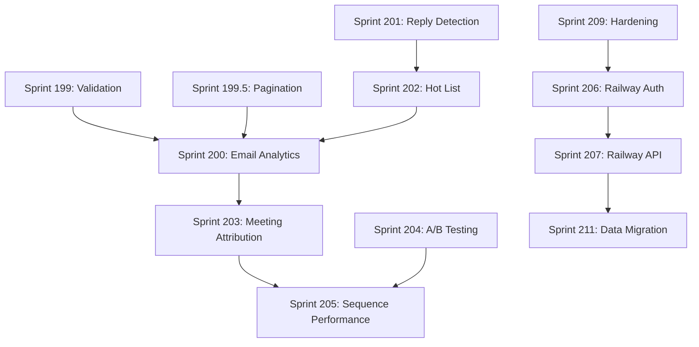

# Sprint Plan Review: Sprints 200-209

> **Reviewed:** January 31, 2026  
> **Reviewer:** Engineering Manager  
> **Status:** Comprehensive gaps identified, reordering recommended

---

## Executive Summary

The sprint plan has **significant overlap with already-completed work** and misses critical gaps. Several features proposed (email stats, sequence performance, error tracking) already exist in the codebase. The cross-repo sprints (206-207) are **correctly identified as blockers** but are ordered too late. Priority should shift to **production hardening before new features**.

---

## Gaps Identified

### 🔴 Critical: Already-Completed Work (Remove or Revise)

These tasks duplicate existing functionality:

| Proposed Task | Already Exists At | Action |
|---------------|-------------------|--------|
| T200.1: useEmailStats hook | `src/hooks/useEmailAnalytics.ts` (T96.2) | **Remove** - hook exists with period filters |
| T200.2: EmailStatsCards | `src/components/EmailStatsCard.tsx` (T96.3) | **Remove** - component exists with rates display |
| T203.1: useMeetingAttribution hook | `src/services/MeetingAttributionService.ts` (Sprint 84) | **Revise** - create hook wrapper for existing service |
| T205.1: SequencePerformanceService | `src/services/SequenceAnalyticsService.ts` (Sprint 4) | **Remove** - 730 LOC service exists |
| T205.2: SequenceLeaderboard | `src/components/SequencePerformancePanel.tsx` (Sprint 84.4) | **Revise** - enhance existing panel |
| T206.2: AuthBridgeService | `src/services/AuthBridge.ts` (T97.0) | **Remove** - 293 LOC service exists with dual-auth |
| T209.1: Error boundary + Sentry | `src/services/ErrorTracking.ts`, `src/components/ErrorBoundary.tsx` | **Remove** - both exist |

### 🟡 Missing Sprints

| Missing Sprint | Description | Priority |
|----------------|-------------|----------|
| **Sprint 199: Data Integrity & Validation** | Input sanitization for all API routes, XSS prevention, Firestore security rules audit | **P0 - Before any new features** |
| **Sprint 199.5: Pagination & Performance** | All list endpoints need cursor pagination; Firestore queries unbounded | **P0 - Scale blocker** |
| **Sprint 210: Monitoring & Alerting Dashboard** | Consolidate health checks, create unified status page | P1 |
| **Sprint 211: Railway Data Migration** | Actually migrate data from Firestore → Postgres | P1 (after 206-207) |
| **Sprint 212: E2E Test Coverage for Railway** | Railway proxy paths lack E2E coverage | P2 |
| **Sprint 213: Audit Logging** | Track admin actions, data access for compliance | P2 |

### 🟡 Missing Tasks (Add to Existing Sprints)

**Sprint 200 (Email Analytics):**
- T200.7: Add pagination to email events queries (Firestore has no OFFSET)
- T200.8: Add caching layer for stats (Redis via Railway or in-memory)
- T200.9: Export analytics to CSV

**Sprint 201 (Reply Detection):**
- T201.7: Out-of-office auto-detection (service exists: `OutOfOfficeDetector.ts`)
- T201.8: Reply sentiment analysis (positive/negative/neutral)
- T201.9: Auto-pause sequence on negative sentiment

**Sprint 202 (Hot List):**
- T202.7: Configurable scoring weights (not hardcoded)
- T202.8: Hot list notifications (push/email digest)

**Sprint 204 (A/B Testing):**
- T204.7: Minimum sample size before declaring winner
- T204.8: Auto-pause losing variant
- T204.9: Bayesian significance calculator (not just p-value)

**Sprint 206 (Railway Auth):**
- T206.7: Token refresh logic (Railway sessions expire)
- T206.8: Graceful degradation when Railway is down
- T206.9: Auth migration dry-run mode

**Sprint 207 (Railway API):**
- T207.7: OpenAPI/Swagger docs generation
- T207.8: Rate limiting per user on Railway side
- T207.9: Request logging with correlation IDs

**Sprint 209 (Production Hardening):**
- T209.7: Implement actual rate limiting (current `_middleware.ts` only sets headers, no enforcement)
- T209.8: Add circuit breaker for Railway calls
- T209.9: Dead letter queue monitoring alerts
- T209.10: Secrets rotation procedure

### 🟡 Tasks That Need Splitting

| Task | Problem | Split Into |
|------|---------|------------|
| T204.2: ABTestingService | Too vague (4h estimate insufficient) | T204.2a: Random variant assignment; T204.2b: Variant tracking in events; T204.2c: Stats aggregation; T204.2d: Winner selection logic |
| T206.1: /api/auth/bridge on Railway | Cross-repo, needs coordination | T206.1a: Define contract in `RAILWAY_CONTRACT.md`; T206.1b: Create Railway endpoint; T206.1c: Vercel integration; T206.1d: E2E test |
| T207.1-5: Railway API endpoints | 5 endpoints in one task | Each endpoint = 1 task with request/response contract, validation, tests |
| T208.5: Bundle analysis | Vague | T208.5a: Run analysis; T208.5b: Split DashboardLayout; T208.5c: Lazy load SequenceBuilder; T208.5d: Remove duplicate Lucide imports |

### 🔴 Hidden Dependencies



**Key Dependencies Not Listed:**
1. **Sprint 202 depends on Sprint 200** - Hot list scoring uses email engagement metrics
2. **Sprint 203 depends on Calendly webhook** - Already exists but needs verification
3. **Sprint 204 depends on Sprint 200** - A/B stats need email analytics aggregation
4. **Sprint 207 blocks Sprint 211** - Can't migrate data without endpoints
5. **Sprint 209 should come BEFORE 206** - Production hardening before auth migration
6. **Feature flags needed** - Each Railway feature needs a flag in `featureFlags.ts`

---

## Improvements by Sprint

### Sprint 200: Email Analytics Dashboard

**Already exists:** `useEmailAnalytics.ts`, `EmailStatsCard.tsx`

**Revise to:**
```markdown
### Sprint 200: Email Analytics Enhancement
- T200.1: Add Firestore fallback when Railway unavailable (dual-source)
- T200.2: Add sparkline trend charts to EmailStatsCard
- T200.3: Create /api/email/stats Vercel endpoint (aggregates Firestore + Railway)
- T200.4: Add comparison mode (this week vs last week)
- T200.5: Add pagination to email_events queries
- T200.6: Tests for dual-source fallback
```

### Sprint 201: Reply Detection & Inbox UI

**Good plan, but missing integration with existing hooks.**

**Improvements:**
```markdown
- T201.1: Create InboxPanel component (use existing useReplyNotifications hook)
- T201.2: Add reply list view with search/filter
- T201.3: Integrate OutOfOfficeDetector.ts for auto-classification
- T201.4: Mark reply as read (update Firestore `email_events` document)
- T201.5: Navigate to prospect detail from inbox
- T201.6: Add reply count to header badge (real-time subscription)
- T201.7: Tests for InboxPanel
```

### Sprint 202: Hot List & Daily Briefing

**Missing scoring customization and notification delivery.**

**Improvements:**
```markdown
- T202.1: Define scoring algorithm (document in ADR)
- T202.2: Create useHotList hook with configurable weights
- T202.3: Create HotListPanel component
- T202.4: Add scoring explanation tooltip (show why score = X)
- T202.5: Create /api/daily-briefing endpoint (returns JSON for email/Slack)
- T202.6: Add hot list to dashboard (integrate with DashboardLayout.tsx)
- T202.7: Tests for scoring edge cases
```

### Sprint 203: Meeting Attribution Dashboard

**Service exists, just needs UI wrapper.**

**Improvements:**
```markdown
- T203.1: Create useMeetingStats hook (wraps MeetingAttributionService)
- T203.2: Create MeetingsAttributionPanel component
- T203.3: Add meetings-per-sequence bar chart (use existing charts/)
- T203.4: Add meetings-per-template breakdown
- T203.5: Add meeting timeline (when booked, when scheduled)
- T203.6: Verify Calendly webhook integration E2E
- T203.7: Tests for attribution logic edge cases
```

### Sprint 204: Template A/B Testing

**Partial implementation exists in `EmailSequenceService.ts`.**

**Improvements:**
```markdown
- T204.1: Create src/types/abTest.ts (formal type definitions)
- T204.2a: Extend ABTest in EmailSequenceService for multi-variant
- T204.2b: Add variant tracking to email_events custom_args
- T204.3: Create ABTestStatsService (aggregates variant performance)
- T204.4: Create TemplateVariantStats component
- T204.5: Implement statistical significance calculator
- T204.6: Add minimum sample size guard
- T204.7: Tests for random assignment distribution
```

### Sprint 205: Sequence Performance Analytics

**SequenceAnalyticsService.ts is 730 LOC - very comprehensive.**

**Revise to:**
```markdown
### Sprint 205: Sequence Analytics UI Integration
- T205.1: Create useSequenceAnalytics hook (wraps SequenceAnalyticsService)
- T205.2: Enhance SequencePerformancePanel with funnel chart
- T205.3: Add step-by-step drop-off visualization
- T205.4: Add time-of-day heatmap (TimeHeatmap component exists)
- T205.5: Add CSV export button (BulkExporter exists)
- T205.6: Tests for UI components
```

### Sprint 206: Railway Auth Bridge

**AuthBridge.ts exists with 293 LOC of dual-auth logic.**

**Revise to:**
```markdown
### Sprint 206: Railway Auth Bridge Completion
- T206.1: Document auth contract in RAILWAY_CONTRACT.md (add section)
- T206.2: Verify Railway /api/auth/bridge endpoint exists
- T206.3: Add token refresh logic to AuthBridge.ts
- T206.4: Add session storage strategy (memory vs localStorage trade-offs)
- T206.5: Add auth migration dry-run feature flag
- T206.6: E2E tests for login/logout/token-refresh flows
```

### Sprint 207: Railway API Endpoints

**Needs contract-first approach.**

**Improvements:**
```markdown
- T207.0: Add all endpoints to RAILWAY_CONTRACT.md with request/response schemas
- T207.1: /api/prospects GET (list with pagination)
- T207.2: /api/prospects POST (create with validation)
- T207.3: /api/prospects/:id GET/PUT/DELETE
- T207.4: /api/enrollments GET (list with filters)
- T207.5: /api/enrollments/:id/pause|resume (state machine transitions)
- T207.6: /api/email/queue/status (BullMQ stats)
- T207.7: Rate limiting middleware on Railway
- T207.8: Request/response logging with correlation IDs
- T207.9: Tests for each endpoint
```

### Sprint 208: Code Cleanup

**Good plan, but needs specifics.**

**Improvements:**
```markdown
- T208.1: Split App.tsx (extract route definitions, context providers)
- T208.2: Audit unused imports (use eslint-plugin-unused-imports)
- T208.3: Add React.lazy for: SequenceBuilder, ImportWizard, ROITab, WarmupDashboard
- T208.4: Remove mock data from: src/data/*.ts (verify not used)
- T208.5a: Run `npm run build -- --analyze` and document findings
- T208.5b: Code-split DashboardLayout tabs
- T208.6: Update ARCHITECTURE.md with current structure
```

### Sprint 209: Production Hardening

**Sentry/ErrorBoundary already exist. Rate limiting is headers-only.**

**Revise to:**
```markdown
### Sprint 209: Production Hardening (PRIORITY)
- T209.1: Implement actual rate limiting (Upstash Redis or Vercel KV)
- T209.2: Add circuit breaker to railway-client.ts
- T209.3: Create /api/health aggregated health check (Firestore + Railway)
- T209.4: Add structured logging (replace console.log with logger.ts)
- T209.5: Add alerting for: failed crons, dead letter queue, bounce rate spikes
- T209.6: Create RUNBOOK.md with incident response procedures
- T209.7: Add secrets rotation procedure
- T209.8: Verify CRON_SECRET matches between Vercel and Railway
```

---

## Additional Recommendations

### 🔐 Security

| Gap | Risk | Recommendation |
|-----|------|----------------|
| No input validation layer | XSS, injection | Add Zod schemas to all API routes |
| Rate limiting is cosmetic | DoS vulnerability | Implement with Upstash Redis (Sprint 209.1) |
| No CSRF protection | Session hijacking | Add CSRF tokens for state-changing operations |
| Firestore rules not audited | Data leakage | Sprint 199: Audit and tighten `firestore.rules` |
| Secrets in feature flags | Exposure risk | Never put secrets in VITE_* (client-side) |

### 🧪 Testing

| Gap | Impact | Recommendation |
|-----|--------|----------------|
| Railway proxy E2E missing | Regression risk | Add `e2e/railway-proxy.spec.ts` |
| No load testing | Unknown capacity | Add k6 scripts for `/api/email/send` |
| A/B test randomization | Statistical bias | Unit test for uniform distribution |
| Webhook E2E tests | Integration failures | Mock SendGrid/Calendly webhooks in Playwright |

### 📖 Documentation

| Gap | Who Needs It | Recommendation |
|-----|--------------|----------------|
| No API docs | Frontend developers | Generate OpenAPI from Zod schemas |
| No ADRs for key decisions | Future maintainers | Add ADRs for: dual-auth, Railway migration, feature flags |
| Runbook missing | On-call engineers | Create `docs/RUNBOOK.md` with: alert → diagnosis → fix |
| Cross-repo setup | New developers | Add `docs/DEV_SETUP.md` with Railway + Vercel local dev |

---

## Priority Changes

### Recommended Sprint Order

```
Current Order:
200 → 201 → 202 → 203 → 204 → 205 → 206 → 207 → 208 → 209

Recommended Order:
┌─────────────────────────────────────────────────────────────┐
│  PHASE 0: PRODUCTION READINESS (Unblocks everything)       │
│  Sprint 199: Data Validation & Security                    │
│  Sprint 209: Production Hardening (MOVED UP)               │
└─────────────────────────────────────────────────────────────┘
                           ↓
┌─────────────────────────────────────────────────────────────┐
│  PHASE 1: RAILWAY FOUNDATION (Cross-repo, long lead time)  │
│  Sprint 206: Railway Auth Bridge                           │
│  Sprint 207: Railway API Endpoints                         │
└─────────────────────────────────────────────────────────────┘
                           ↓
┌─────────────────────────────────────────────────────────────┐
│  PHASE 2: ANALYTICS (User value, independent)              │
│  Sprint 200: Email Analytics Enhancement                   │
│  Sprint 201: Reply Detection & Inbox UI                    │
│  Sprint 202: Hot List & Daily Briefing                     │
│  Sprint 203: Meeting Attribution Dashboard                 │
└─────────────────────────────────────────────────────────────┘
                           ↓
┌─────────────────────────────────────────────────────────────┐
│  PHASE 3: OPTIMIZATION (Builds on analytics)               │
│  Sprint 204: Template A/B Testing                          │
│  Sprint 205: Sequence Performance Analytics                │
└─────────────────────────────────────────────────────────────┘
                           ↓
┌─────────────────────────────────────────────────────────────┐
│  PHASE 4: CLEANUP & MIGRATION                              │
│  Sprint 208: Code Cleanup                                  │
│  Sprint 211: Railway Data Migration                        │
└─────────────────────────────────────────────────────────────┘
```

### Rationale for Reordering

1. **Sprint 209 → Sprint 199.5** - Production hardening before new features. Rate limiting and circuit breakers prevent outages during feature development.

2. **Sprints 206-207 → Earlier** - Railway auth has a long lead time (cross-repo coordination). Start early, run in parallel with analytics.

3. **Sprint 200-203 can parallelize** - Email analytics, inbox, hot list are independent. Assign to different developers.

4. **Sprint 204-205 depend on 200** - A/B testing and sequence analytics need email metrics.

5. **Sprint 208 → End** - Code cleanup is lower risk after features are stable.

---

## Blockers to Resolve Before Starting

| Blocker | Owner | Resolution |
|---------|-------|------------|
| Railway CRON_SECRET alignment | DevOps | Verify `SERVICE_TO_SERVICE_SECRET` matches Railway's `CRON_SECRET` |
| Firestore indexes | Backend | Run `firebase deploy --only firestore:indexes` |
| Feature flags for new features | Frontend | Add `VITE_INBOX_ENABLED`, `VITE_HOTLIST_ENABLED`, etc. |
| Railway endpoint availability | Cross-repo | Confirm `/api/auth/bridge` exists before Sprint 206 |

---

## Success Metrics

| Sprint | Success Criteria |
|--------|------------------|
| 199 | Zero XSS/injection vulnerabilities in security scan |
| 200 | Email stats load in < 500ms, fallback works when Railway down |
| 201 | Reply count badge updates in real-time |
| 202 | Hot list scoring correlates with meeting conversion (validate post-hoc) |
| 203 | 100% meeting attribution to source sequence |
| 204 | A/B tests reach significance within 500 emails |
| 205 | Funnel visualization identifies drop-off step |
| 206 | Auth works with Railway up AND down (fallback) |
| 207 | All Railway endpoints have < 200ms p95 latency |
| 208 | Bundle size reduced by 20%+ |
| 209 | Zero 5xx errors in 24h post-deploy |

---

## Final Verdict

**Rating: 6/10** - Good feature selection but significant rework needed.

**Critical Issues:**
1. ~40% of proposed work already exists
2. Production hardening is too late in the plan
3. Cross-repo coordination underestimated
4. Missing validation/security sprint

**Recommendation:** Revise plan using this review, then re-estimate with actual remaining work.
