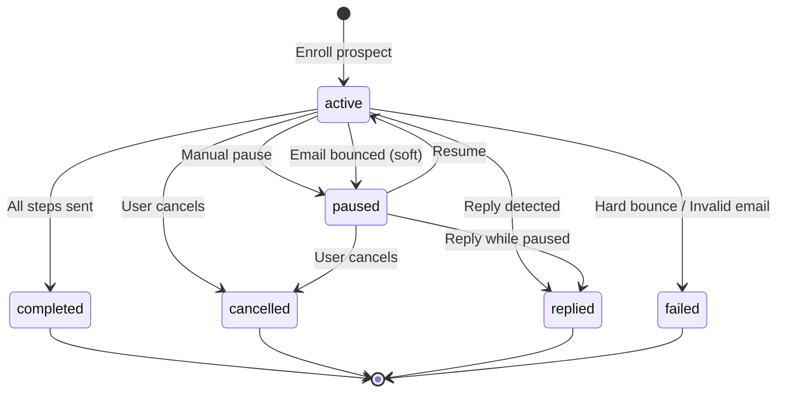

# Enrollment State Machine

Sprint 94: T94.5 - Document Enrollment State Transitions

This document describes the lifecycle of a sequence enrollment in YardFlow.

## Overview

An enrollment represents a prospect's journey through an email sequence. Each enrollment has a status that determines what actions are taken and what transitions are possible.

## States

| State | Description | UI Indicator |
|-------|-------------|--------------|
| `active` | Prospect is receiving sequence emails on schedule | 🟢 Green badge |
| `paused` | Temporarily stopped (manual or automatic) | 🟡 Yellow badge |
| `completed` | All sequence steps sent successfully | ✅ Checkmark |
| `cancelled` | Manually cancelled by user | ⚪ Gray badge |
| `replied` | Prospect replied, sequence auto-stopped | 💬 Chat icon |
| `failed` | Permanent failure (invalid email, too many bounces) | 🔴 Red badge |

## State Diagram



## ASCII State Diagram

```
                        ┌─────────────────────────────────────────────┐
                        │                   active                    │
                        │  (receiving scheduled sequence emails)      │
                        └─────────────────────────────────────────────┘
                           │      │      │      │      │      │
           Manual Pause ───┘      │      │      │      │      └─── User Cancel
           Soft Bounce ───────────┘      │      │      │
                                         │      │      └─────── Hard Bounce
                                         │      │               Invalid Email
                                         │      │                    │
                                         ▼      ▼                    ▼
                        ┌──────────┐   ┌─────────────┐         ┌─────────┐
                        │  paused  │   │  completed  │         │ failed  │
                        │          │   │             │         │         │
                        └──────────┘   └─────────────┘         └─────────┘
                           │   │              │                      │
          Resume ──────────┘   │              │                      │
          User Cancel ─────────┼──────────────┼──────────────────────┘
                               │              │
                               ▼              ▼
                        ┌─────────────────────────────────────┐
                        │            cancelled / end          │
                        └─────────────────────────────────────┘
                        
        ──────── Reply detected (any active/paused state) ────────
                               │
                               ▼
                        ┌─────────────┐
                        │   replied   │
                        └─────────────┘
```

## Transitions

### Entry Transitions

| Trigger | From | To | Notes |
|---------|------|-----|-------|
| User enrolls prospect | (none) | `active` | Creates enrollment with step 0 |
| Bulk enroll | (none) | `active` | Same as single enroll |
| Import with auto-enroll | (none) | `active` | When importing prospects |

### Active State Transitions

| Trigger | From | To | Notes |
|---------|------|-----|-------|
| Manual pause button | `active` | `paused` | User clicks pause |
| Soft bounce (1st/2nd) | `active` | `paused` | Auto-pause, can retry |
| All steps completed | `active` | `completed` | Sequence finished |
| Reply detected | `active` | `replied` | Webhook from email provider |
| Hard bounce | `active` | `failed` | Invalid email address |
| Invalid email (syntax) | `active` | `failed` | Email validation failed |
| User cancels | `active` | `cancelled` | Manual cancellation |

### Paused State Transitions

| Trigger | From | To | Notes |
|---------|------|-----|-------|
| Resume button | `paused` | `active` | User clicks resume |
| Cancel button | `paused` | `cancelled` | User cancels |
| Reply detected | `paused` | `replied` | Reply while paused |

### Terminal States

These states are final - no transitions out:
- `completed` - Success, all emails sent
- `cancelled` - User cancelled
- `replied` - Prospect engaged (success!)
- `failed` - Cannot continue (bad email)

## Edge Cases

### What if a prospect replies while paused?
→ Transition to `replied` immediately. The reply indicates engagement.

### What if there's a soft bounce on the last step?
→ Stay `active`, retry the step. Only mark `completed` after successful send.

### What if the sequence is deleted while prospects are enrolled?
→ Active enrollments transition to `cancelled` with reason "Sequence deleted".

### What if the same prospect is enrolled in multiple sequences?
→ Each enrollment is independent. A prospect can have multiple active enrollments.

### What if a prospect's email is updated while enrolled?
→ Future steps use the new email. In-flight emails continue to old address.

## Implementation Details

### Railway API Endpoints

```
POST   /api/enrollments           - Create enrollment (active)
GET    /api/enrollments           - List enrollments (with filters)
GET    /api/enrollments/:id       - Get single enrollment
POST   /api/enrollments/:id/pause - Pause enrollment
POST   /api/enrollments/:id/resume - Resume enrollment
DELETE /api/enrollments/:id       - Cancel enrollment
```

### Frontend Hook

The `useSequenceEnrollment` hook manages enrollment state:

```typescript
const {
  enrollProspect,    // (prospect, sequenceId) → active
  pauseEnrollment,   // (id, reason) → paused
  resumeEnrollment,  // (id) → active
  cancelEnrollment,  // (id) → cancelled
  getEnrollmentForProspect,
} = useSequenceEnrollment();
```

### Polling vs Real-time

- **Railway (primary):** Polls every 5 seconds for status updates
- **Firestore (fallback):** Real-time listener via `onSnapshot`

When `RAILWAY_ENABLED` is true and `DUAL_WRITE_ENABLED` is false, only Railway polling is used.

## Metrics & Analytics

Track these enrollment metrics:
- Completion rate: `completed / (completed + cancelled + failed)`
- Reply rate: `replied / total_enrolled`
- Bounce rate: `failed / total_enrolled`
- Average steps before reply: `avg(currentStepIndex where status=replied)`

## Related Files

- [src/hooks/useSequenceEnrollment.ts](../src/hooks/useSequenceEnrollment.ts) - Frontend hook
- [src/types/railway.ts](../src/types/railway.ts) - `EnrollmentStatus` type
- [src/types/emailSequence.ts](../src/types/emailSequence.ts) - `EnrollmentStatus` local type
